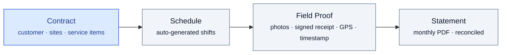
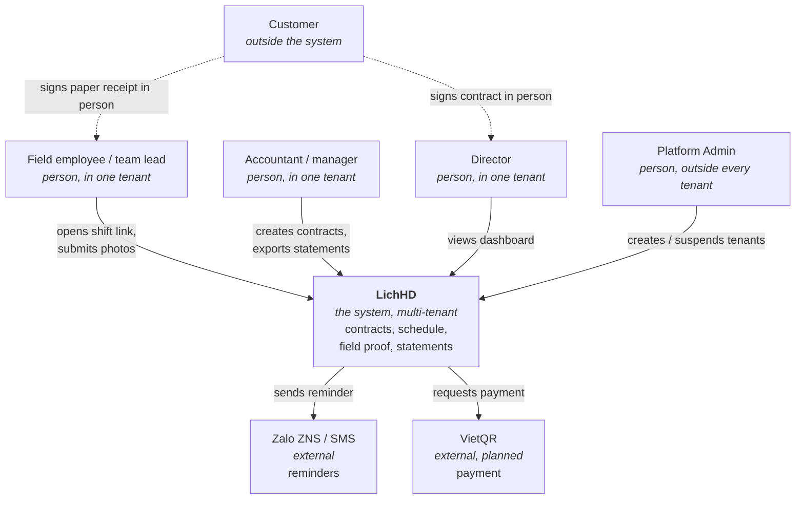
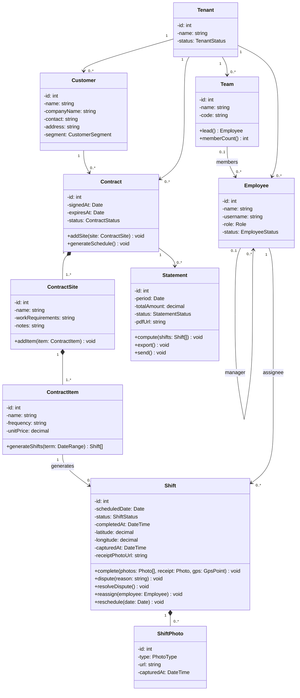
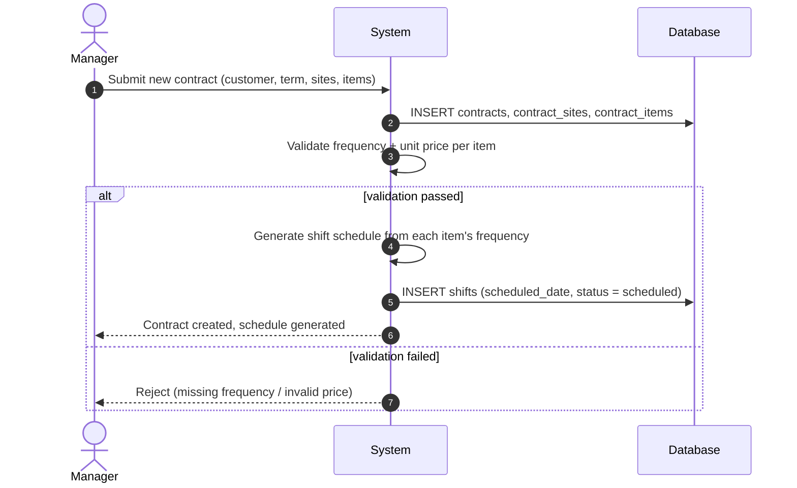
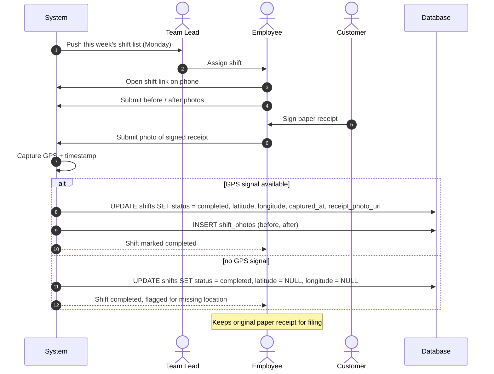
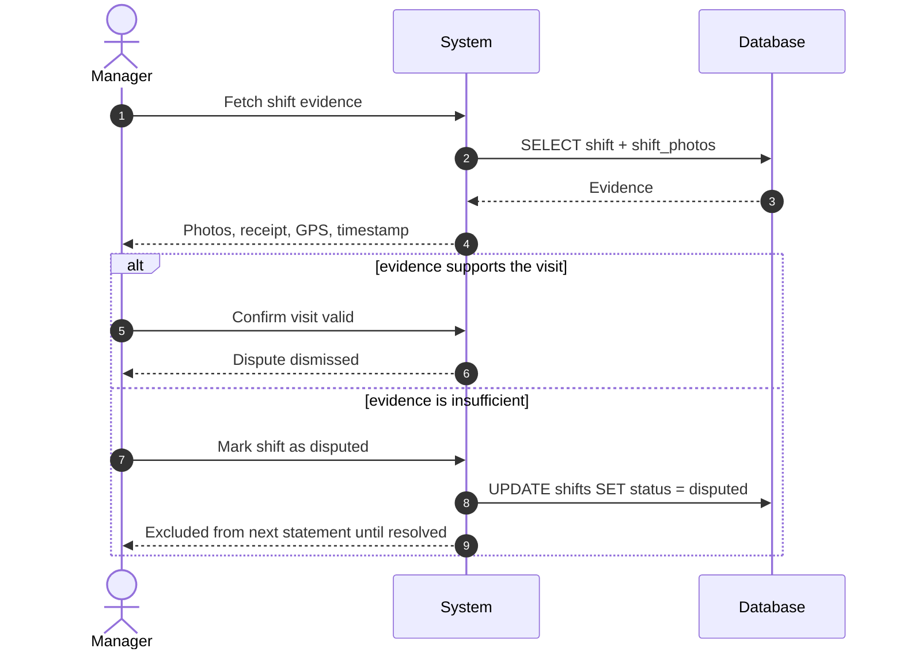
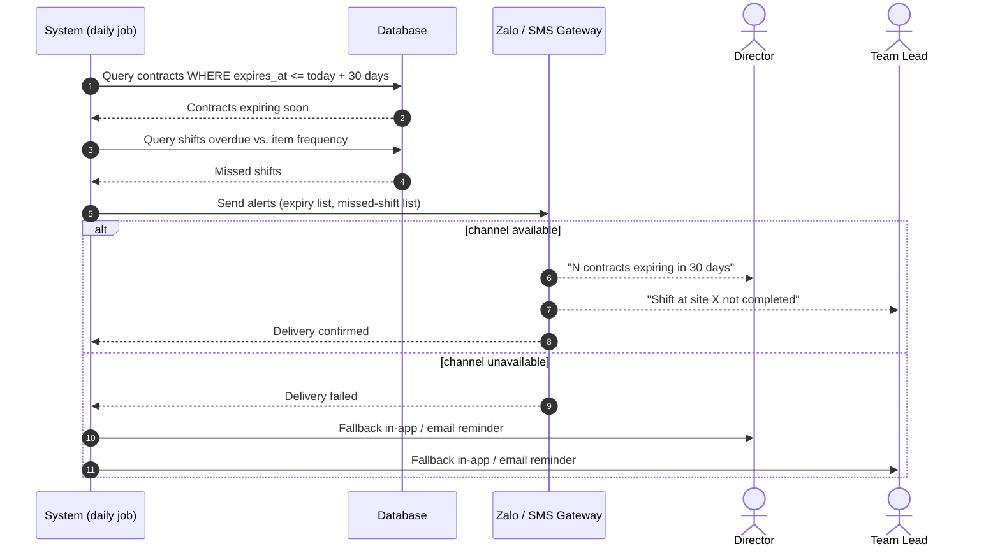
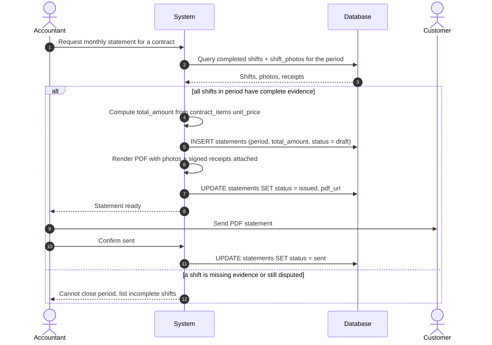

<div align="center">

# LichHD

**Recurring Service Contract Management**

[](#architecture)

</div>

---

## Table of contents

- [What LichHD is](#what-lichhd-is)
- [User stories](#user-stories)
- [The screens](#the-screens)
- [Architecture](#architecture)
- [Success metrics](#success-metrics)
- [Repository layout](#repository-layout)
- [Documentation](#documentation)

---

## What LichHD is

Contract management and scheduling for companies delivering **periodic services** — industrial cleaning, HVAC/elevator maintenance, pest control,
landscaping, fire-safety maintenance, etc. 


Specification: [docs/01-prd.md](docs/01-prd.md).

---

## User stories

| As a... | I want to... | So that... | Acceptance criteria |
|---|---|---|---|
| Team lead | know which shifts my team owes this week without chasing anyone for it | I can assign work the moment the week starts | The week's shift list reaches the team lead by Monday morning, scoped to their own team |
| Employee | leave proof that I actually did the visit | I'm protected if a customer disputes it later | A shift only reaches `completed` once before/after photos and the signed receipt are submitted, with location and time recorded |
| Manager | know a contract is about to expire before it does | I can start the renewal conversation in time | Alert fires once per contract, 30 days before expiry |
| Manager | know a visit was missed before the customer tells me | I can fix it before it becomes a complaint | Alert fires the moment a shift passes its due date uncompleted |
| Accountant | close a contract's month without reassembling evidence by hand | I can send the customer a statement in minutes, not days | One action produces the full PDF; a period with incomplete evidence is blocked and lists exactly which shifts are missing it |
| Director | see the state of every contract without asking staff for a status update | I catch a revenue or delivery problem myself, before it reaches me as a complaint | One view shows active, expiring and disputed contract counts plus projected revenue, current as of the underlying data |

Full user stories: [design-analysis.md §I](docs/02-design-analysis.md#user-stories).

---

## The screens

**1. Director dashboard.**


**2. Create contract with sites and service items.** 


**3. Weekly dispatch and field shift execution.**


**4. Dispute a shift.** 


**5. Alerts: expiring contract and missed shift.**


**6. Month-end statement export.**


Full screen set: [`docs/screenshots/`](docs/screenshots/).

---

## Architecture

### View 1 — System context



Customer sits outside the system boundary: signatures and complaints are recorded
offline by staff. Platform Admin sits outside every tenant: it provisions companies,
never their contracts or shifts.

### View 2 — class diagram

Same domain classes as
[design-analysis.md §III](docs/02-design-analysis.md#iii-class-diagram), design-level
(typed attributes, typed methods).



### View 3 — the core flows

The same five sequence diagrams as
[design-analysis.md §V](docs/02-design-analysis.md#v-sequence-diagrams), each with
its failure branch.

**1. Create contract with sites and service items**



**2. Weekly dispatch and field shift execution**



**3. Dispute a shift**



**4. Alerts: expiring contract and missed shift**



**5. Month-end statement export**



Full architecture: [docs/04-architecture.md](docs/04-architecture.md).

---

## Success metrics

| Metric | Baseline | Target |
|---|---|---|
| Month-end statement closing time | 1.5–3 days | Under 30 minutes |
| Visits with complete photo and signature evidence | Not measurable | ≥ 90% |

Full release criteria: [PRD §8](docs/01-prd.md#8-success-metrics--release-criteria).

---

## Repository layout
```
docs/
│
backend/
├── Controllers/
├── Services/
├── Repositories/
├── Models/
└── Data/
│
frontend/
├── src/
│   ├── assets/
│   │   ├── images/
│   │   ├── icons/
│   │   └── fonts/
│   ├── components/
│   ├── layouts/
│   ├── pages/
│   ├── hooks/
│   ├── services/
│   ├── types/
│   ├── routes/
│   ├── context/
│   └── utils/
├── dist/
└── public/
```

## Documentation

| # | Document | Contents |
|---|---|---|
| 1 | [PRD](docs/01-prd.md) | Problem statement, personas, MVP scope, roadmap, release criteria |
| 2 | [Design Analysis](docs/02-design-analysis.md) | FR/NFR, use cases, class diagram, sequence diagrams |
| 3 | [Functional Spec](docs/03-functional-spec.md) | Function → screens needed → API needed, per FR |
| 4 | [Architecture](docs/04-architecture.md) | arc42 + c4 |
| 5 | [API Specification](docs/05-api.md) | Endpoint contract, field-token submission path, access-control matrix |
| 6 | [API Specification (OpenAPI)](docs/05-api.yaml) | Same contract as OpenAPI 3.0 — paths, schemas, error examples |
| 7 | [Repo Layout](docs/06-repo-layout.md) | Planned source tree by architecture style — stack not yet decided |
| 8 | [Prototype](docs/ui/prototype.html) | Clickable build: login, role-scoped navigation, 22 screens |
| 9 | [ERD](docs/db/erd.md) | Entity-relationship diagram |
| 10 | [SQL Schema](docs/db/schema.sql) | ANSI SQL |

---