<div align="center">

# Contrack

**Recurring Service Contract Management**

[](#architecture)

</div>

## What Contrack is

Contract management and scheduling for companies delivering **periodic services** — industrial cleaning, HVAC/elevator maintenance, pest control,
landscaping, fire-safety maintenance, etc. 

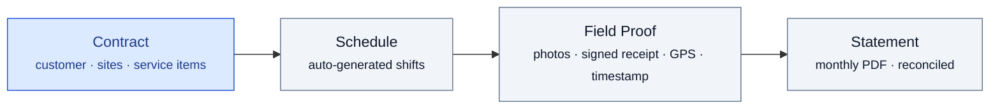
```mermaid
flowchart LR
    C["Contract<br/><small>customer · sites · service items</small>"]
    S["Schedule<br/><small>auto-generated shifts</small>"]
    P["Field Proof<br/><small>photos · signed receipt · GPS · timestamp</small>"]
    T["Statement<br/><small>monthly PDF · reconciled</small>"]

    C --> S --> P --> T

    classDef yours fill:#dbeafe,stroke:#1d4ed8,color:#1e3a8a
    classDef ours fill:#f1f5f9,stroke:#64748b,color:#0f172a
    class C yours
    class S,P,T ours
```

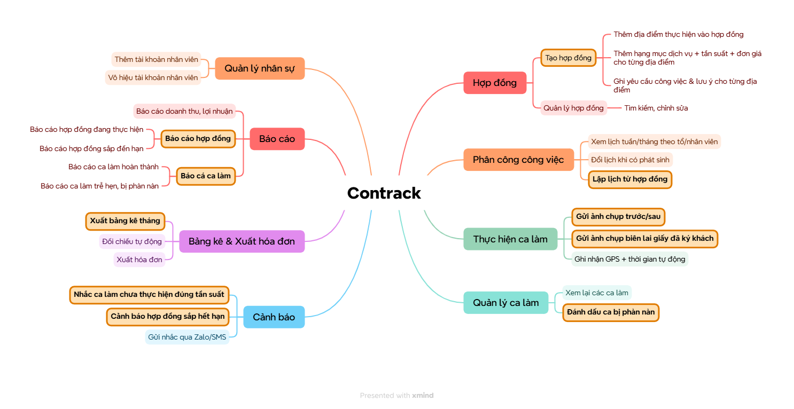

---

## User stories
| ID | As a... | I want to... | So that... | Acceptance criteria |
|---|---|---|---|---|
| US-01 | employee (any role) | sign in with my email and password | I get a session scoped to my tenant, role and row-scope | Given a valid email/password, when I sign in, then I receive a token carrying tenant + role; given the email doesn't exist or the tenant is suspended, when I sign in, then I'm rejected before any password check |
| US-02 | Director | see contract status, projected revenue/profit and this period's shift-completion status in one place | I catch a delivery or revenue problem before it reaches me as a complaint | Given I open the dashboard, when it loads, then active/expiring/disputed contract counts, projected revenue and period profit reflect the current data, filterable by month; given the same load, then the period's scheduled shifts show as completed/overdue/disputed/not-yet-due, with the three completion rates computed only against shifts actually due |
| US-03 | Director | see late/missed shifts by month on the dashboard | I spot a slipping team before it costs a contract | Given I filter the dashboard by month, when it renders, then late/missed shift counts for that month are shown |
| US-04 | Director | see on-time renewal rate and cancellation rate on the dashboard | I know whether retention is improving or slipping | Given I open the dashboard, when it loads, then both rates are computed against the selected month's baseline |
| US-05 | Director | see new contracts signed by month and the profit/loss trend on the dashboard | I see growth and margin together, not in two places | Given I open the dashboard, when it loads, then both trends render for the selected date range, using the same profit/loss numbers as US-08 |
| US-06 | Director | manage employee accounts, roles and manager assignment myself | access always matches who's actually on staff, without waiting on IT | Given I create, edit or deactivate an employee, when they next call the API, then the change already applies — no redeploy, no re-login required |
| US-07 | Director, Accountant | see what's billed against what actually got done, per contract and period | I catch billing drift before it reaches the customer as a dispute | Given a contract and a period, when I open reconciliation, then shifts due by frequency sit next to shifts with complete evidence, for that contract and period only |
| US-08 | Director, Accountant | see profit/loss per contract per month | I catch a bad contract before renewing it | Given a month with recorded costs, when I open the view, then profit/loss = revenue from `contract_items` minus that month's recorded labor/materials/other cost |
| US-09 | Director | still see a profit/loss number for a month the Accountant hasn't closed yet | the dashboard never shows a gap for an unclosed month | Given a contract with no cost recorded for the month, when I open the view, then it shows a clearly marked estimate — trailing 3-month average for that contract, or the tenant's average cost-to-revenue ratio if it has no cost history |
| US-10 | Manager, Director | set up a new contract with its sites and service items in one pass | the shift schedule generates itself instead of me building a calendar by hand | Given a contract with a term, ≥1 site and ≥1 service item, when I save it, then the full set of scheduled shifts is generated immediately; given a site or item is missing frequency or unit price, when I save, then the contract is rejected with the specific field named |
| US-11 | Manager, Director | flag a shift as disputed the moment a customer complains | the complaint is tied to the actual evidence instead of living in someone's memory | Given a completed shift, when I mark it disputed with a reason, then it keeps its photos/receipt/GPS and shows the reason, separate from a normal completed shift |
| US-12 | Manager | know a contract is about to expire before it does | I can start the renewal conversation in time | Given a contract 30 days from `expires_at`, when that threshold is crossed, then one alert fires for that contract via Zalo (ZNS) with SMS fallback, and never fires twice |
| US-13 | Manager | know a visit was missed before the customer tells me | I can fix it before it becomes a complaint | Given a shift past its due date per the contract's frequency, when it's still not completed, then an alert fires the moment it passes due, via Zalo (ZNS) with SMS fallback |
| US-14 | Manager, Director | create or update a customer record, and delete it if I'm Director | the customer directory matches who we actually work with | Given a customer with a non-terminated contract, when a Director tries to delete it, then it's rejected; given no such contract, when a Director deletes it, then it succeeds |
| US-15 | Accountant | close a contract's month without reassembling evidence by hand | I can send the customer a statement in minutes, not days | Given a period where every due shift has complete evidence, when I export, then one action produces the full PDF with photos and signature; given any shift in the period is missing evidence, when I try to export, then it's blocked and the missing shifts are listed |
| US-16 | Accountant | send an exported statement to the customer and mark it sent | I have one record of what was billed and when, without a side spreadsheet | Given a statement already exported as PDF, when I send it, then it's marked sent with a timestamp, and can't be sent twice by accident |
| US-17 | Accountant | record labor and materials costs against a contract each month | the Director's profit/loss numbers are accurate, not guessed | Given I save a cost entry (category, month, amount), when it's saved, then that contract's profit/loss for that month updates immediately |
| US-18 | Team lead | know which shifts my team owes this week without chasing anyone for it | I can assign work the moment the week starts | Given it's Monday, when the week starts, then my team's shift list has already arrived, scoped to my own team only |
| US-19 | Team lead | swap the assignee or date on a shift when someone's out or a site asks to move | the week still gets covered without waiting on a manager | Given a shift not yet completed, when I reassign or reschedule it, then it succeeds; given a shift already completed, when I try the same, then it's rejected |
| US-20 | Employee | leave proof that I actually did the visit | I'm protected if a customer disputes it later | Given I open the shift link on my phone, when I submit before/after photos and the signed-receipt photo, then GPS and timestamp are captured automatically and the shift only reaches `completed` once all three are present |
| US-21 | Platform Admin | onboard a new operating company with its first Director account | a new customer of Contrack itself can start working without me touching the database | Given I create a tenant, when it's saved, then one active Director login exists, scoped to that tenant only |
| US-22 | Platform Admin | suspend or reactivate a tenant | I can cut off a non-paying or offboarded company without deleting their data | Given a suspended tenant, when any of its accounts try to sign in, then they're rejected before password check; given reactivation, when the same account signs in, then it succeeds |
| US-23 | Platform Admin | see tenant counts by status, recent onboarding activity and tenant growth trend | I track platform health without querying the database myself | Given I open the platform dashboard, when it loads, then all three views reflect current tenant data |

---

## The screens

**1. Director dashboard.**


**2. Create contract with sites and service items.** 

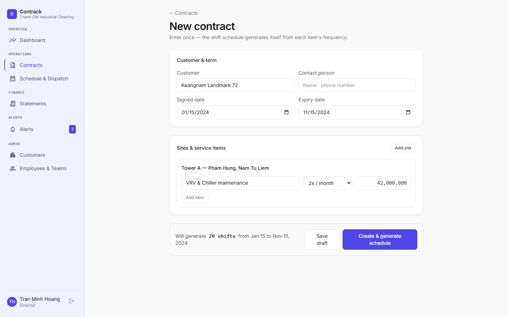
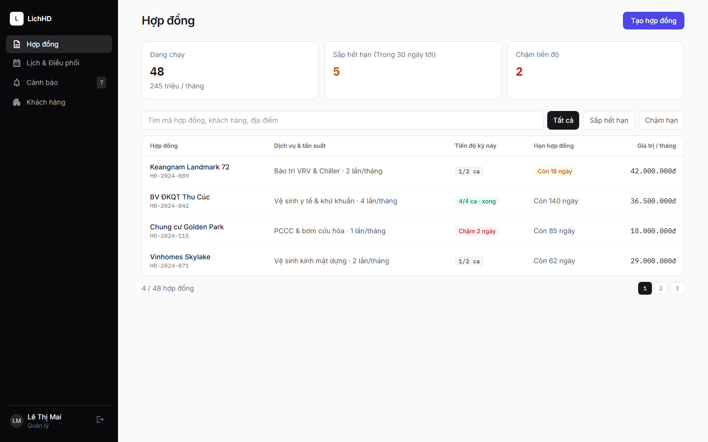

**3. Weekly dispatch and field shift execution.**

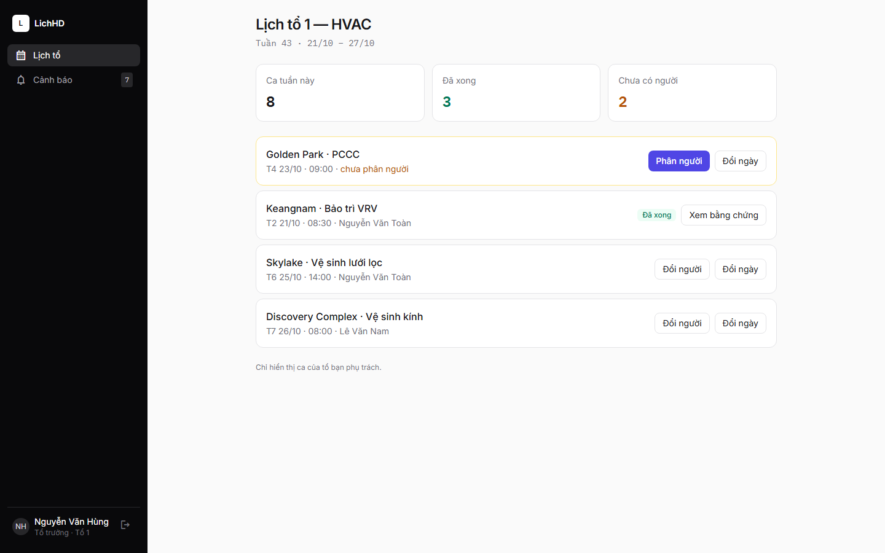
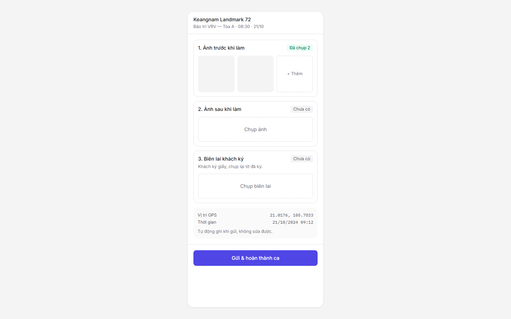

**4. Dispute a shift.** 

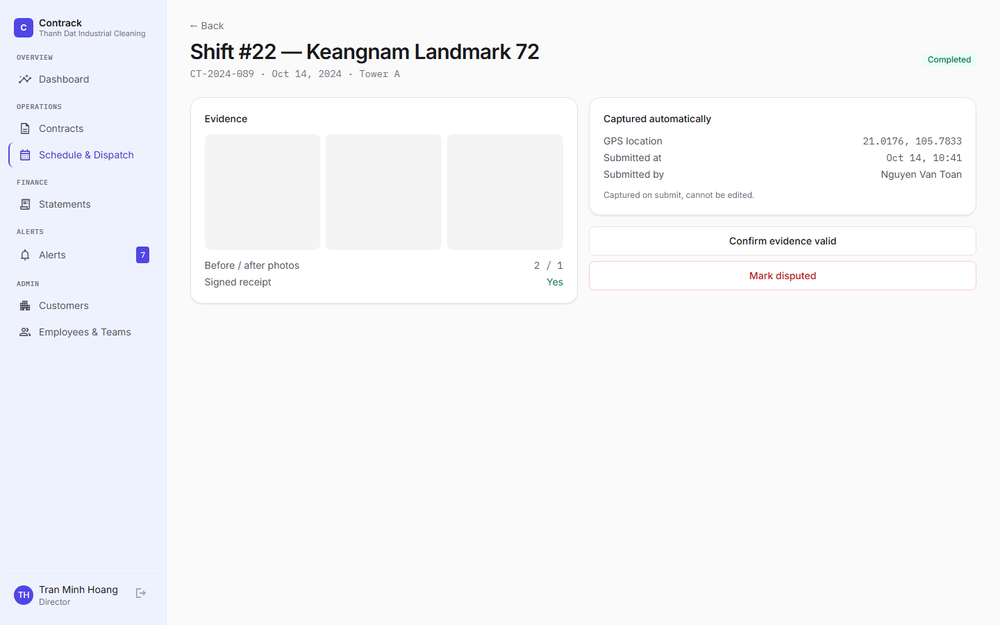
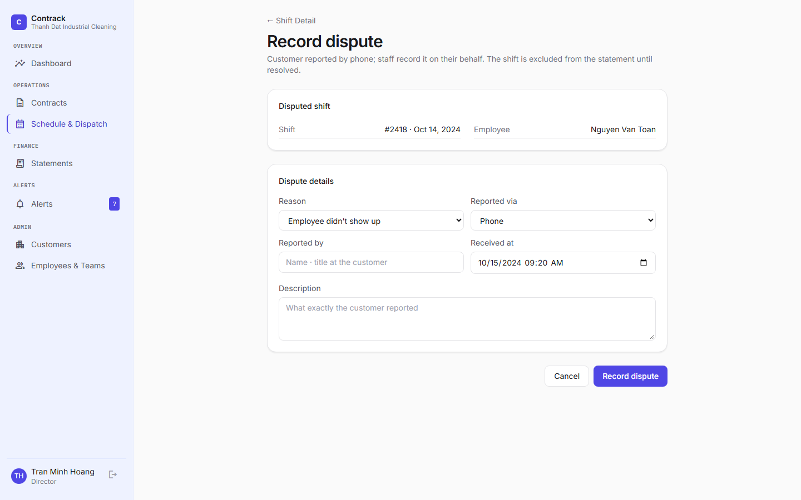

**5. Alerts: expiring contract and missed shift.**

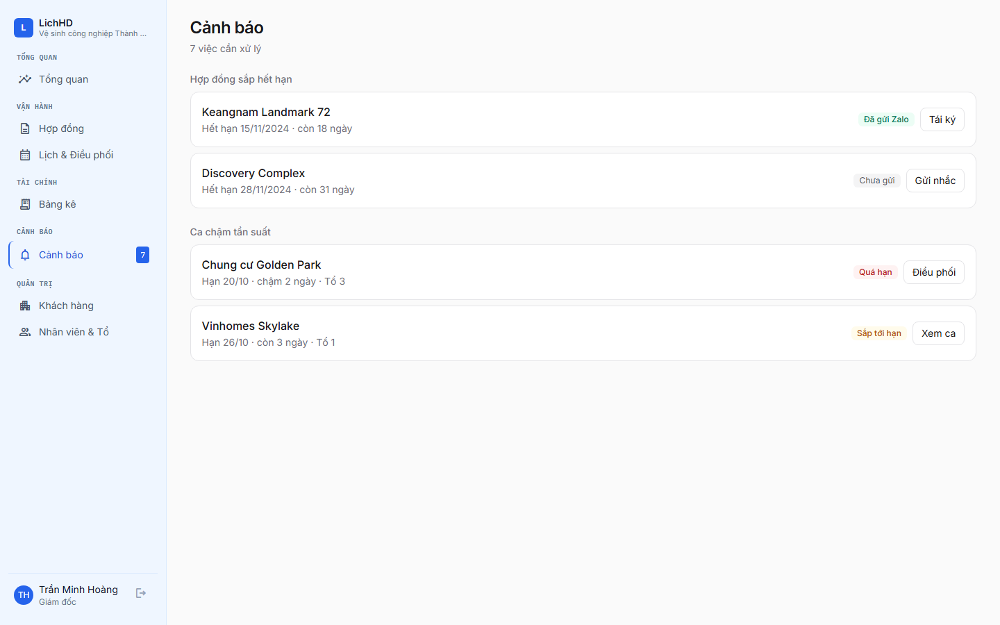

**6. Month-end statement export.**

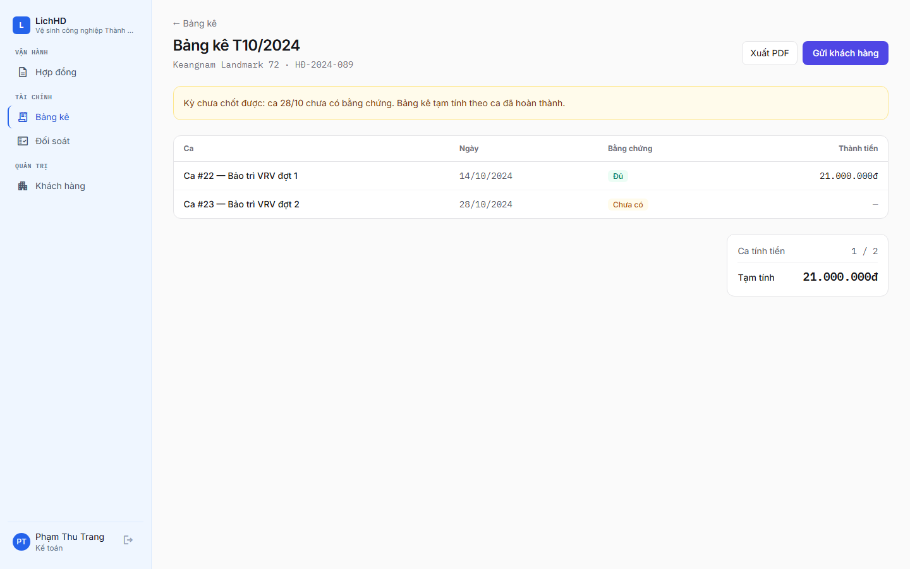

Full screen set: [`docs/screenshots/`](docs/screenshots/).

---

## Architecture

### C4 — Level 1: System context

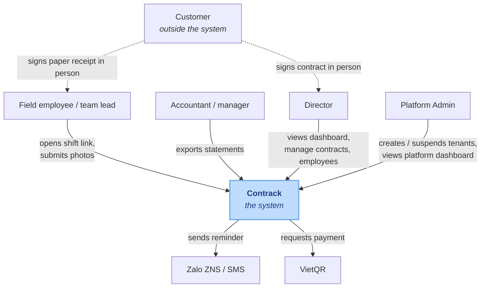
```mermaid
flowchart TB
    customer["Customer<br/><i>outside the system</i>"]
    employee["Field employee / team lead"]
    accountant["Accountant / manager"]
    director["Director"]
    platformadmin["Platform Admin"]

    contrack["<b>Contrack</b><br/><i>the system</i>"]:::system

    zalo["Zalo ZNS / SMS"]
    vietqr["VietQR"]

    customer -.->|"signs contract in person"| director
    customer -.->|"signs paper receipt in person"| employee
    employee -->|"opens shift link,<br/>submits photos"| contrack
    accountant -->|"exports statements"| contrack
    director -->|"views dashboard,<br/>manage contracts, employees"| contrack
    platformadmin -->|"creates / suspends tenants,<br/>views platform dashboard"| contrack

    contrack -->|"sends reminder"| zalo
    contrack -->|"requests payment"| vietqr

    classDef system fill:#bfdbfe,color:#1e3a8a,stroke:#60a5fa,stroke-width:2px
```

### C4 — Level 2: Containers

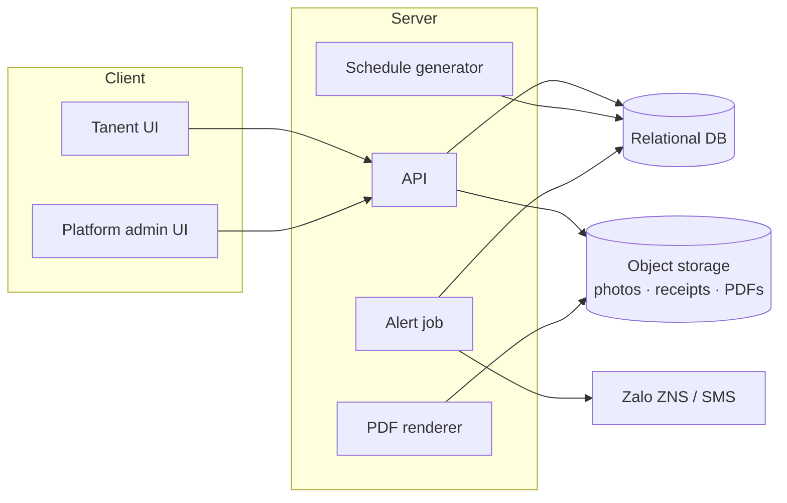
```mermaid
flowchart LR
    subgraph client["Client"]
        tanent_ui["Tanent UI"]
        platform_ui["Platform admin UI"]
    end

    subgraph server["Server"]
        api["API"]
        gen["Schedule generator"]
        alerts["Alert job"]
        pdf["PDF renderer"]
    end

    db[("Relational DB")]
    store[("Object storage<br/>photos · receipts · PDFs")]
    channel["Zalo ZNS / SMS"]

    tanent_ui --> api
    platform_ui --> api
    api --> db
    api --> store
    gen --> db
    alerts --> db
    alerts --> channel
    pdf --> store
```

NestJS (API), ReactJS (client), PostgreSQL (relational DB), S3 (object storage) —
full stack rationale: [docs/03-architecture.md §5.1](docs/03-architecture.md#51-containers-c4---level-2).

### C4 — Level 3: Components

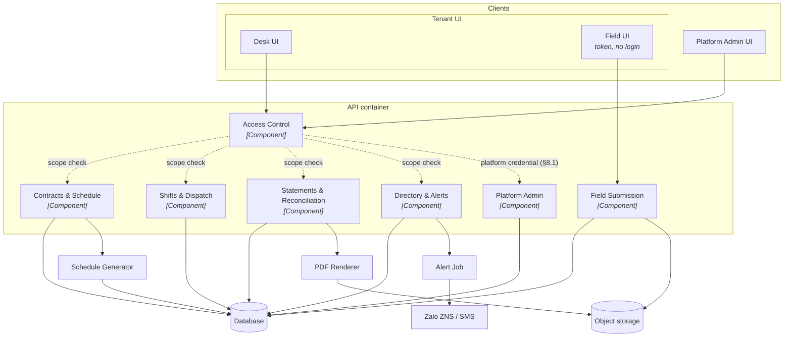
```mermaid
flowchart TB
    subgraph clients["Clients"]
        subgraph tenant_ui2["Tenant UI"]
            desk_ui2["Desk UI"]
            field_ui2["Field UI<br/><i>token, no login</i>"]
        end
        platformadmin_ui2["Platform Admin UI"]
    end

    subgraph apic["API container"]
        auth["Access Control<br/><i>[Component]</i>"]
        contracts["Contracts & Schedule<br/><i>[Component]</i>"]
        shifts["Shifts & Dispatch<br/><i>[Component]</i>"]
        field["Field Submission<br/><i>[Component]</i>"]
        statements["Statements & Reconciliation<br/><i>[Component]</i>"]
        directory["Directory & Alerts<br/><i>[Component]</i>"]
        platform["Platform Admin<br/><i>[Component]</i>"]
    end

    gen["Schedule Generator"]
    alertjob["Alert Job"]
    pdf["PDF Renderer"]
    db[("Database")]
    store[("Object storage")]
    channel["Zalo ZNS / SMS"]

    desk_ui2 --> auth
    field_ui2 --> field
    platformadmin_ui2 --> auth
    auth -.->|"scope check"| contracts
    auth -.->|"scope check"| shifts
    auth -.->|"scope check"| statements
    auth -.->|"scope check"| directory
    auth -.->|"platform credential (§8.1)"| platform

    contracts --> db
    contracts --> gen
    gen --> db
    shifts --> db
    field --> db
    field --> store
    statements --> db
    statements --> pdf
    pdf --> store
    directory --> db
    directory --> alertjob
    platform --> db
    alertjob --> channel
```

### Class diagram

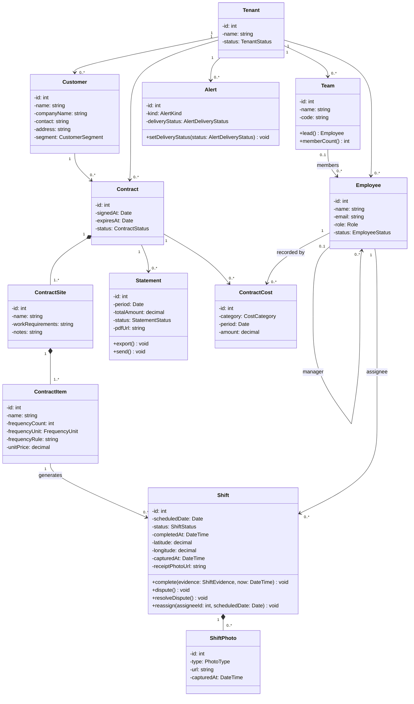
```mermaid
classDiagram
    class Tenant {
        -id: int
        -name: string
        -status: TenantStatus
    }
    class Customer {
        -id: int
        -name: string
        -companyName: string
        -contact: string
        -address: string
        -segment: CustomerSegment
    }
    class Contract {
        -id: int
        -signedAt: Date
        -expiresAt: Date
        -status: ContractStatus
    }
    class ContractSite {
        -id: int
        -name: string
        -workRequirements: string
        -notes: string
    }
    class ContractItem {
        -id: int
        -name: string
        -frequencyCount: int
        -frequencyUnit: FrequencyUnit
        -frequencyRule: string
        -unitPrice: decimal
    }
    class Shift {
        -id: int
        -scheduledDate: Date
        -status: ShiftStatus
        -completedAt: DateTime
        -latitude: decimal
        -longitude: decimal
        -capturedAt: DateTime
        -receiptPhotoUrl: string
        +complete(evidence: ShiftEvidence, now: DateTime) void
        +dispute() void
        +resolveDispute() void
        +reassign(assigneeId: int, scheduledDate: Date) void
    }
    class ShiftPhoto {
        -id: int
        -type: PhotoType
        -url: string
        -capturedAt: DateTime
    }
    class Statement {
        -id: int
        -period: Date
        -totalAmount: decimal
        -status: StatementStatus
        -pdfUrl: string
        +export() void
        +send() void
    }
    class Employee {
        -id: int
        -name: string
        -email: string
        -role: Role
        -status: EmployeeStatus
    }
    class Team {
        -id: int
        -name: string
        -code: string
        +lead() Employee
        +memberCount() int
    }
    class ContractCost {
        -id: int
        -category: CostCategory
        -period: Date
        -amount: decimal
    }
    class Alert {
        -id: int
        -kind: AlertKind
        -deliveryStatus: AlertDeliveryStatus
        +setDeliveryStatus(status: AlertDeliveryStatus) void
    }

    Customer "1" --> "0..*" Contract
    Contract "1" *-- "1..*" ContractSite
    ContractSite "1" *-- "1..*" ContractItem
    ContractItem "1" --> "0..*" Shift : generates
    Shift "1" *-- "0..*" ShiftPhoto
    Contract "1" --> "0..*" Statement
    Contract "1" --> "0..*" ContractCost
    Employee "1" --> "0..*" ContractCost : recorded by
    Employee "1" --> "0..*" Shift : assignee
    Employee "0..1" --> "0..*" Employee : manager
    Team "0..1" --> "0..*" Employee : members
    Tenant "1" --> "0..*" Customer
    Tenant "1" --> "0..*" Employee
    Tenant "1" --> "0..*" Team
    Tenant "1" --> "0..*" Contract
    Tenant "1" --> "0..*" Alert
```

### Sequence Diagrams
**1. Login**

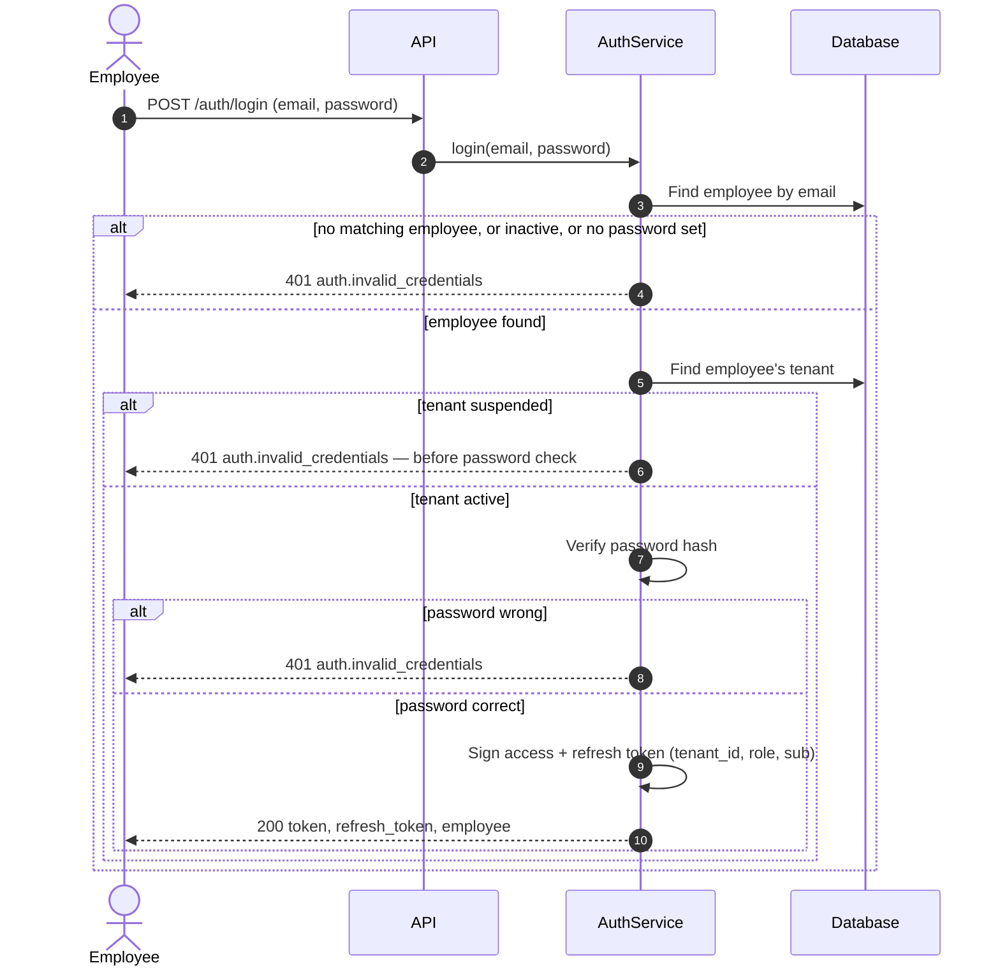
```mermaid
sequenceDiagram
    autonumber
    actor Employee
    participant API
    participant AuthService
    participant DB as Database

    Employee->>API: POST /auth/login (email, password)
    API->>AuthService: login(email, password)
    AuthService->>DB: Find employee by email
    alt no matching employee, or inactive, or no password set
        AuthService-->>Employee: 401 auth.invalid_credentials
    else employee found
        AuthService->>DB: Find employee's tenant
        alt tenant suspended
            AuthService-->>Employee: 401 auth.invalid_credentials — before password check
        else tenant active
            AuthService->>AuthService: Verify password hash
            alt password wrong
                AuthService-->>Employee: 401 auth.invalid_credentials
            else password correct
                AuthService->>AuthService: Sign access + refresh token (tenant_id, role, sub)
                AuthService-->>Employee: 200 token, refresh_token, employee
            end
        end
    end
```

**2. Access Control — a protected request**

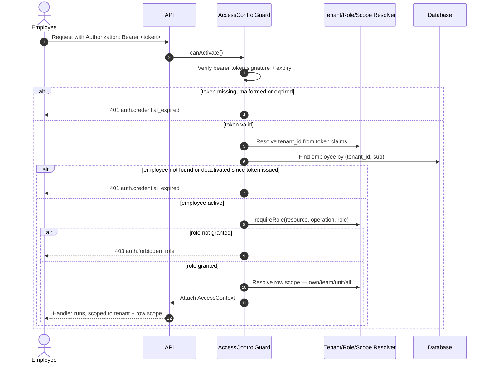
```mermaid
sequenceDiagram
    autonumber
    actor Employee
    participant API
    participant Guard as AccessControlGuard
    participant Resolvers as Tenant/Role/Scope Resolver
    participant DB as Database

    Employee->>API: Request with Authorization: Bearer <token>
    API->>Guard: canActivate()
    Guard->>Guard: Verify bearer token signature + expiry
    alt token missing, malformed or expired
        Guard-->>Employee: 401 auth.credential_expired
    else token valid
        Guard->>Resolvers: Resolve tenant_id from token claims
        Guard->>DB: Find employee by (tenant_id, sub)
        alt employee not found or deactivated since token issued
            Guard-->>Employee: 401 auth.credential_expired
        else employee active
            Guard->>Resolvers: requireRole(resource, operation, role)
            alt role not granted
                Guard-->>Employee: 403 auth.forbidden_role
            else role granted
                Guard->>Resolvers: Resolve row scope — own/team/unit/all
                Guard->>API: Attach AccessContext
                API-->>Employee: Handler runs, scoped to tenant + row scope
            end
        end
    end
```

**3. Create contract with sites and service items**

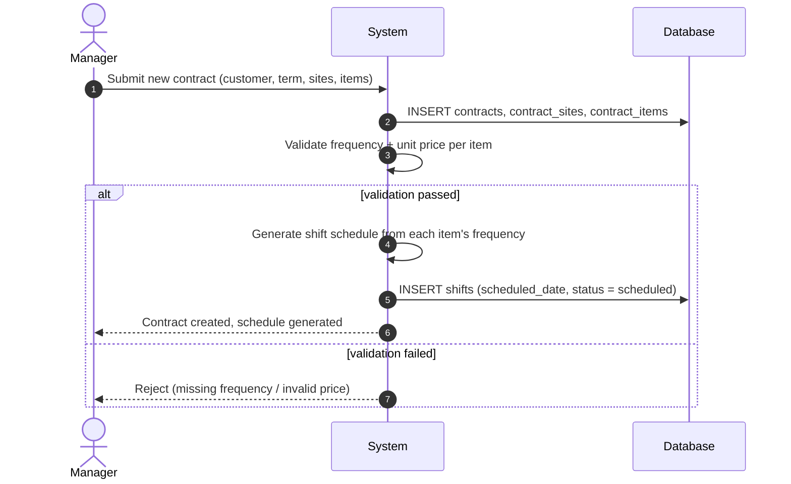
```mermaid
sequenceDiagram
    autonumber
    actor Manager
    participant System
    participant DB as Database

    Manager->>System: Submit new contract (customer, term, sites, items)
    System->>DB: INSERT contracts, contract_sites, contract_items
    System->>System: Validate frequency + unit price per item
    alt validation passed
        System->>System: Generate shift schedule from each item's frequency
        System->>DB: INSERT shifts (scheduled_date, status = scheduled)
        System-->>Manager: Contract created, schedule generated
    else validation failed
        System-->>Manager: Reject (missing frequency / invalid price)
    end
```

**4. Weekly dispatch and field shift execution**

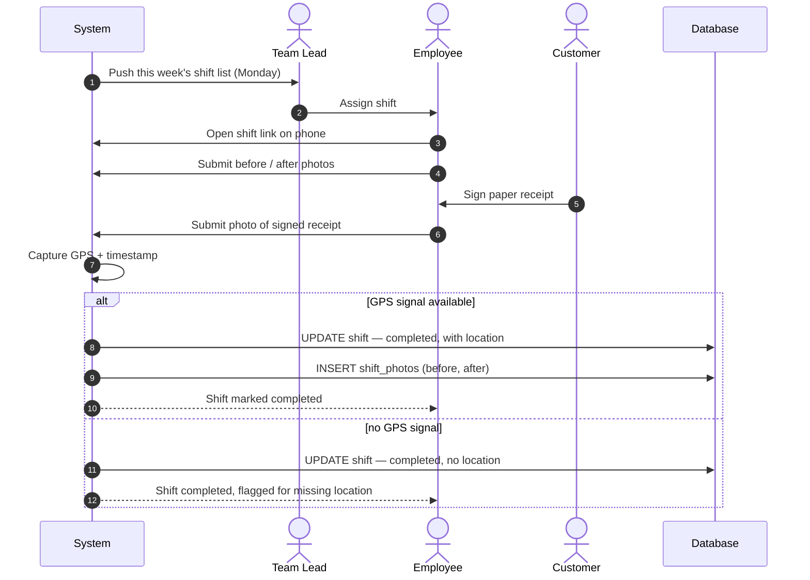
```mermaid
sequenceDiagram
    autonumber
    participant System
    actor TeamLead as Team Lead
    actor Employee
    actor Customer
    participant DB as Database

    System->>TeamLead: Push this week's shift list (Monday)
    TeamLead->>Employee: Assign shift
    Employee->>System: Open shift link on phone
    Employee->>System: Submit before / after photos
    Customer->>Employee: Sign paper receipt
    Employee->>System: Submit photo of signed receipt
    System->>System: Capture GPS + timestamp
    alt GPS signal available
        System->>DB: UPDATE shift — completed, with location
        System->>DB: INSERT shift_photos (before, after)
        System-->>Employee: Shift marked completed
    else no GPS signal
        System->>DB: UPDATE shift — completed, no location
        System-->>Employee: Shift completed, flagged for missing location
    end
```

**5. Dispute a shift**

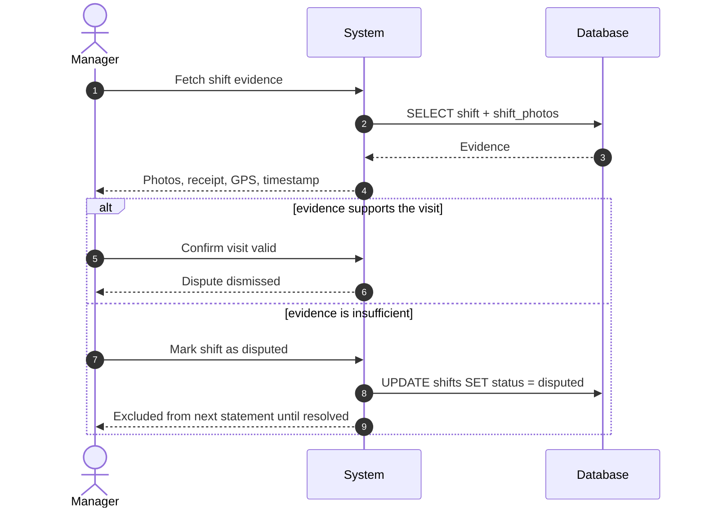
```mermaid
sequenceDiagram
    autonumber
    actor Manager
    participant System
    participant DB as Database

    Manager->>System: Fetch shift evidence
    System->>DB: SELECT shift + shift_photos
    DB-->>System: Evidence
    System-->>Manager: Photos, receipt, GPS, timestamp
    alt evidence supports the visit
        Manager->>System: Confirm visit valid
        System-->>Manager: Dispute dismissed
    else evidence is insufficient
        Manager->>System: Mark shift as disputed
        System->>DB: UPDATE shifts SET status = disputed
        System-->>Manager: Excluded from next statement until resolved
    end
```

**6. Alerts: expiring contract and missed shift**

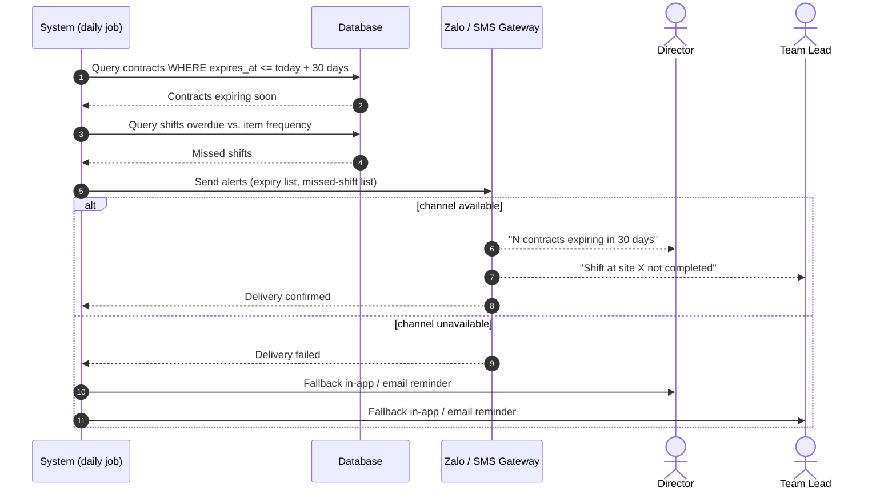
```mermaid
sequenceDiagram
    autonumber
    participant Scheduler as System (daily job)
    participant DB as Database
    participant Channel as Zalo / SMS Gateway
    actor Director
    actor TeamLead as Team Lead

    Scheduler->>DB: Query contracts WHERE expires_at <= today + 30 days
    DB-->>Scheduler: Contracts expiring soon
    Scheduler->>DB: Query shifts overdue vs. item frequency
    DB-->>Scheduler: Missed shifts
    Scheduler->>Channel: Send alerts (expiry list, missed-shift list)
    alt channel available
        Channel-->>Director: "N contracts expiring in 30 days"
        Channel-->>TeamLead: "Shift at site X not completed"
        Channel-->>Scheduler: Delivery confirmed
    else channel unavailable
        Channel-->>Scheduler: Delivery failed
        Scheduler->>Director: Fallback in-app / email reminder
        Scheduler->>TeamLead: Fallback in-app / email reminder
    end
```

**7. Month-end statement export**

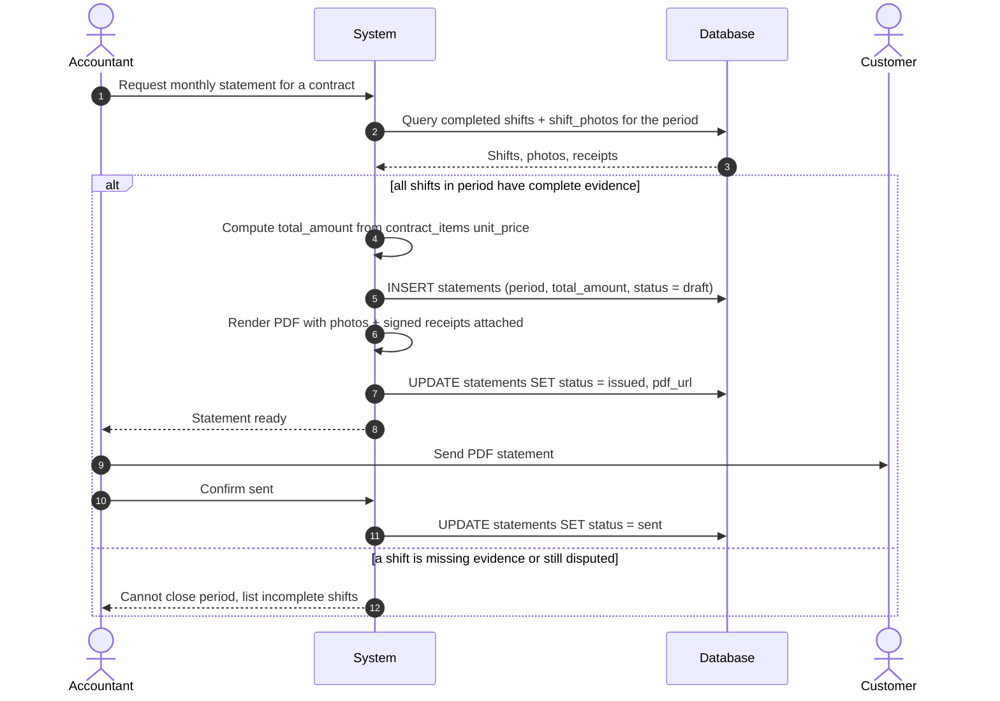
```mermaid
sequenceDiagram
    autonumber
    actor Accountant
    participant System
    participant DB as Database
    actor Customer

    Accountant->>System: Request monthly statement for a contract
    System->>DB: Query completed shifts + shift_photos for the period
    DB-->>System: Shifts, photos, receipts
    alt all shifts in period have complete evidence
        System->>System: Compute total_amount from contract_items unit_price
        System->>DB: INSERT statements (period, total_amount, status = draft)
        System->>System: Render PDF with photos + signed receipts attached
        System->>DB: UPDATE statements SET status = issued, pdf_url
        System-->>Accountant: Statement ready
        Accountant->>Customer: Send PDF statement
        Accountant->>System: Confirm sent
        System->>DB: UPDATE statements SET status = sent
    else a shift is missing evidence or still disputed
        System-->>Accountant: Cannot close period, list incomplete shifts
    end
```

**8. Platform Admin onboards a new tenant**

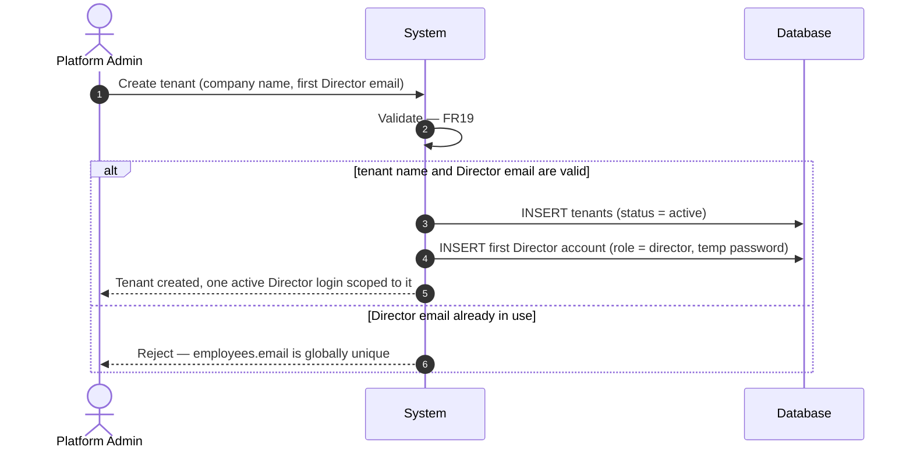
```mermaid
sequenceDiagram
    autonumber
    actor PlatformAdmin as Platform Admin
    participant System
    participant DB as Database

    PlatformAdmin->>System: Create tenant (company name, first Director email)
    System->>System: Validate — FR19
    alt tenant name and Director email are valid
        System->>DB: INSERT tenants (status = active)
        System->>DB: INSERT first Director account (role = director, temp password)
        System-->>PlatformAdmin: Tenant created, one active Director login scoped to it
    else Director email already in use
        System-->>PlatformAdmin: Reject — employees.email is globally unique
    end
```

**9. Platform Admin suspends or reactivates a tenant**

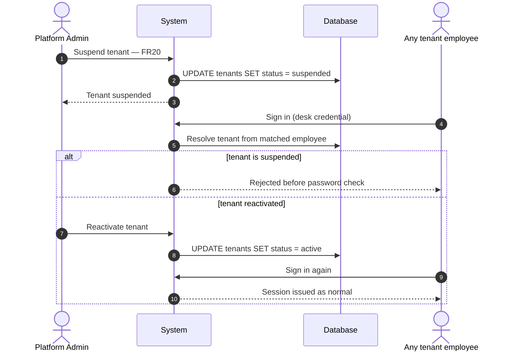
```mermaid
sequenceDiagram
    autonumber
    actor PlatformAdmin as Platform Admin
    participant System
    participant DB as Database
    actor Employee as Any tenant employee

    PlatformAdmin->>System: Suspend tenant — FR20
    System->>DB: UPDATE tenants SET status = suspended
    System-->>PlatformAdmin: Tenant suspended
    Employee->>System: Sign in (desk credential)
    System->>DB: Resolve tenant from matched employee
    alt tenant is suspended
        System-->>Employee: Rejected before password check
    else tenant reactivated
        PlatformAdmin->>System: Reactivate tenant
        System->>DB: UPDATE tenants SET status = active
        Employee->>System: Sign in again
        System-->>Employee: Session issued as normal
    end
```

**10. Team lead reassigns or reschedules a shift**

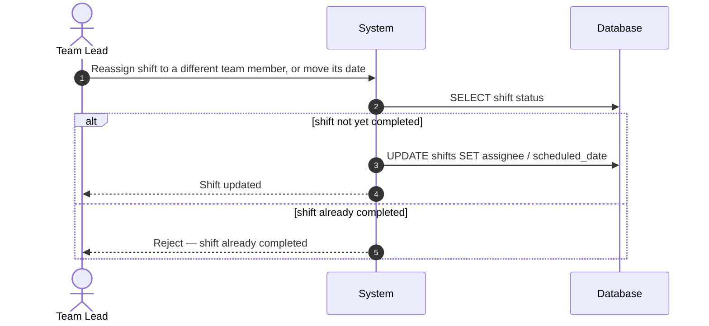
```mermaid
sequenceDiagram
    autonumber
    actor TeamLead as Team Lead
    participant System
    participant DB as Database

    TeamLead->>System: Reassign shift to a different team member, or move its date
    System->>DB: SELECT shift status
    alt shift not yet completed
        System->>DB: UPDATE shifts SET assignee / scheduled_date
        System-->>TeamLead: Shift updated
    else shift already completed
        System-->>TeamLead: Reject — shift already completed
    end
```

**11. Accountant records a cost, profitability updates**

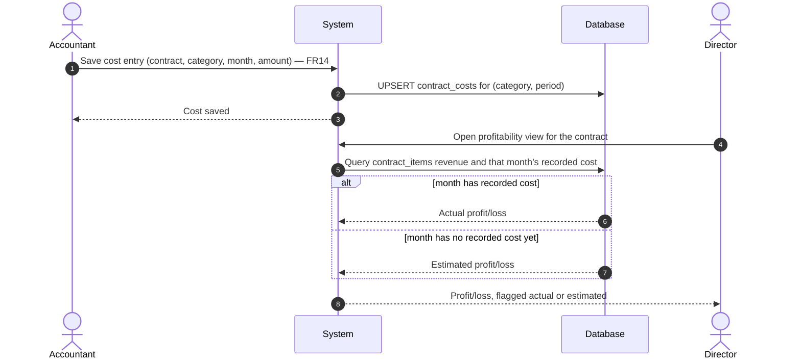
```mermaid
sequenceDiagram
    autonumber
    actor Accountant
    participant System
    participant DB as Database
    actor Director

    Accountant->>System: Save cost entry (contract, category, month, amount) — FR14
    System->>DB: UPSERT contract_costs for (category, period)
    System-->>Accountant: Cost saved
    Director->>System: Open profitability view for the contract
    System->>DB: Query contract_items revenue and that month's recorded cost
    alt month has recorded cost
        DB-->>System: Actual profit/loss
    else month has no recorded cost yet
        DB-->>System: Estimated profit/loss
    end
    System-->>Director: Profit/loss, flagged actual or estimated
```

**12. Reconciliation: shifts due vs. shifts with evidence**

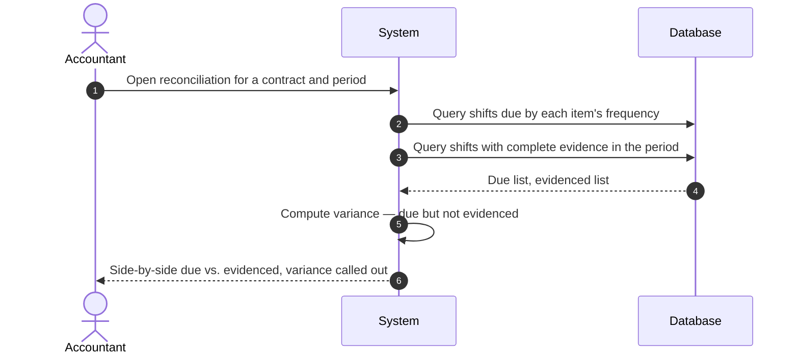
```mermaid
sequenceDiagram
    autonumber
    actor Accountant
    participant System
    participant DB as Database

    Accountant->>System: Open reconciliation for a contract and period
    System->>DB: Query shifts due by each item's frequency
    System->>DB: Query shifts with complete evidence in the period
    DB-->>System: Due list, evidenced list
    System->>System: Compute variance — due but not evidenced
    System-->>Accountant: Side-by-side due vs. evidenced, variance called out
```

Full architecture: [docs/03-architecture.md](docs/03-architecture.md).

---
## Repository layout

```
.
├── docs/
├── backend/
│   ├── controllers/
│   │   ├── auth/
│   │   ├── platform/
│   │   ├── contracts/
│   │   ├── shifts/
│   │   ├── field/
│   │   ├── statements/
│   │   ├── contract-costs/
│   │   ├── alerts/
│   │   ├── dashboard/
│   │   ├── customers/
│   │   ├── employees/
│   │   └── teams/
│   ├── dtos/
│   │   ├── auth/
│   │   ├── platform/
│   │   ├── contracts/
│   │   ├── customers/
│   │   ├── employees/
│   │   ├── teams/
│   │   ├── shifts/
│   │   ├── field/
│   │   ├── statements/
│   │   ├── contract-costs/
│   │   ├── alerts/
│   │   └── dashboard/
│   ├── services/
│   │   ├── auth/
│   │   ├── platform/
│   │   ├── customers/
│   │   ├── employees/
│   │   ├── teams/
│   │   ├── contracts/
│   │   ├── shifts/
│   │   ├── field/
│   │   ├── statements/
│   │   ├── contract-costs/
│   │   ├── alerts/
│   │   ├── dashboard/
│   │   └── access-control/    
│   ├── repositories/
│   │   ├── tenants/
│   │   ├── platform/
│   │   ├── customers/
│   │   ├── employees/
│   │   ├── teams/
│   │   ├── contracts/
│   │   ├── shifts/
│   │   ├── statements/
│   │   ├── contract-costs/
│   │   └── alerts/
│   ├── models/
│   │   ├── tenants/
│   │   ├── employees/
│   │   ├── customers/
│   │   ├── teams/
│   │   ├── contracts/
│   │   ├── shifts/
│   │   ├── statements/
│   │   ├── contract-costs/
│   │   ├── alerts/
│   │   └── platform/
│   ├── data/
│   │   ├── db-context/
│   │   ├── migrations/
│   │   ├── object-storage-client/
│   │   ├── channel-client/
│   │   └── pdf-renderer/
│   ├── utils/
│   └── tests/
│       ├── unit/
│       └── support/
└── frontend/
    ├── src/
    │   ├── assets/
    │   ├── components/
    │   ├── layouts/
    │   ├── pages/
    │   ├── hooks/
    │   ├── services/
    │   ├── types/
    │   ├── routes/
    │   ├── context/
    │   └── utils/
    ├── dist/
    └── public/
```

## Documentation

| # | Document | Contents |
|---|---|---|
| 1 | [Requirements Analysis](docs/01-requirements-analysis.md) | Project overview, User stories (INVEST), Functional requirements, Non-fucntional requirements, Use-case diagrams |
| 2 | [Screens Hierarchy](docs/02-screens-heriarchy.md) | Screens hierarchy, per role |
| 3 | [Architecture](docs/03-architecture.md) | arc42 + c4 |
| 4 | [ERD](docs/04-erd.md) | Entity-relationship diagram |
| 5 | [API Specification (OpenAPI)](docs/05-api.yaml) | OpenAPI 3.0 — paths, schemas, error examples |
| 6 | [Repo Layout](docs/06-repo-layout.md) | Planned source tree for NestJS backend, ReactJS frontend |
| 7 | [Class Diagram](docs/07-class-diagram.md) | Class diagram |
| 8 | [Sequence Diagram](docs/08-sequence-diagram.md) |Sequence diagrams |
| 9 | [Prototype](docs/ui/prototype.html) | UI Prototpye |
| 10 | [SQL Schema](docs/04-schema.sql) | ANSI SQL |
---