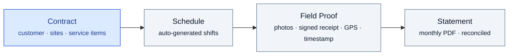
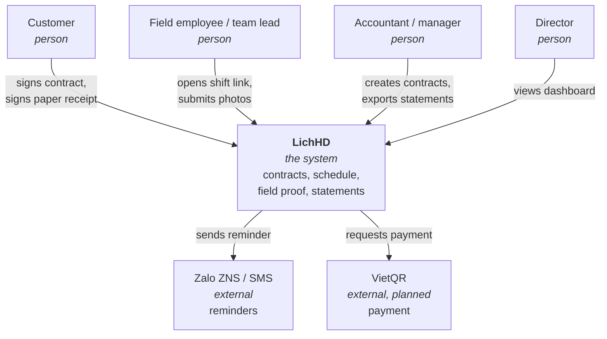
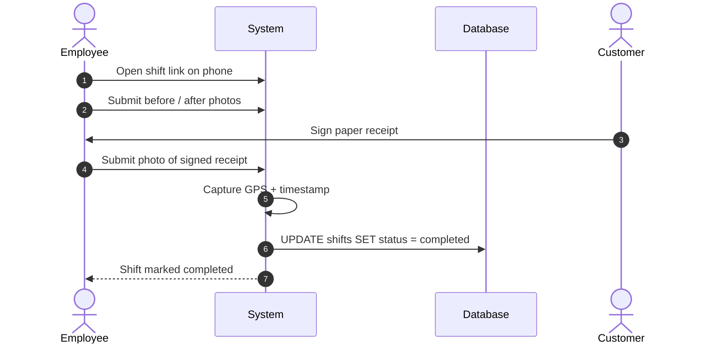
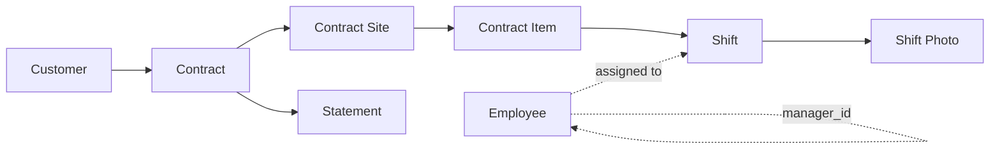
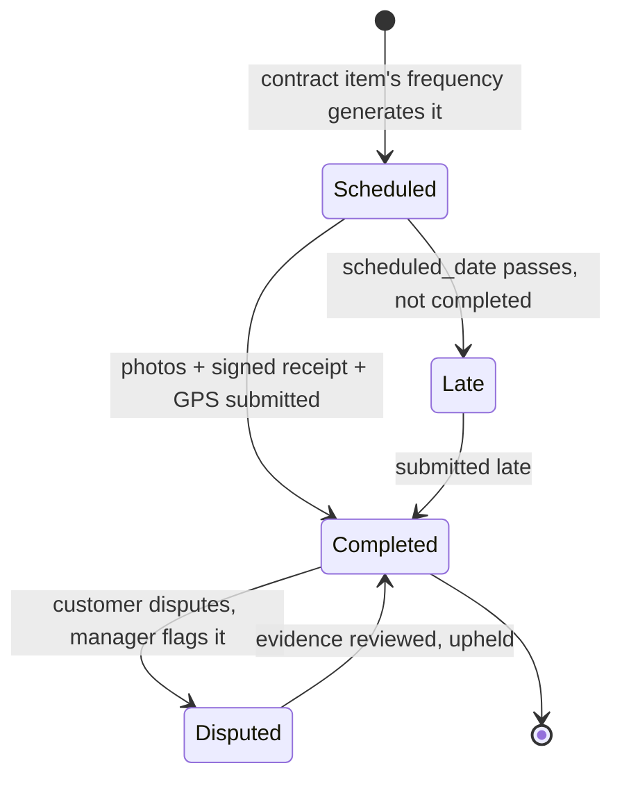

<div align="center">

# LichHD

**Recurring Service Contract Management**

[](#where-the-project-actually-is)
[](docs/design-analysis.md)
[](README.vi.md)

</div>



---

## Table of contents

- [What LichHD is](#what-lichhd-is)
- [The week, before and after](#the-week-before-and-after)
- [Architecture, from simple to complex](#architecture-from-simple-to-complex)
- [Success metrics](#success-metrics)
- [Competitive landscape](#competitive-landscape)
- [Documentation](#documentation)
- [Repository layout](#repository-layout)
- [Where the project actually is](#where-the-project-actually-is)

---

## What LichHD is

LichHD is contract management software for companies that sell **the same service, on a
schedule, for months at a time** — industrial cleaning, HVAC/elevator maintenance, pest
control, landscaping, fire-safety maintenance. Not a to-do list, not a CMMS for tracking
your own equipment, not an ad-hoc job marketplace.

### Overview

```
Recurring service = Contract + Schedule + Field Proof + Statement
```

A contract is signed once, against one or more sites, each with its own service items,
frequency and price. The schedule is generated from that, not typed by hand. Every visit
produces field proof — before/after photos and a photographed, customer-signed paper
receipt, stamped with GPS and time. The statement is built from that proof, not
reconstructed from memory and a Zalo scroll-back.

Full detail: [docs/prd.md](docs/prd.md) · [Bản tiếng Việt](docs/prd.vi.md).

---

## Before and after

**AS-IS**, today, on Excel and Zalo ([PRD §4](docs/prd.md#4-user-flows--design)):

1. Accountant hand-types 24 rows into `Schedule 2025.xlsx` for a 12-month contract.
2. Manager copies this week's rows into a Zalo group every Monday.
3. Team lead reads Zalo, assigns people, they go do the work.
4. Photos land in the Zalo group and scroll away in two weeks.
5. Customer signs a paper confirmation the team lead carries around for days — sometimes loses.
6. Month-end: accountant digs through Zalo and paper to reconstruct a statement.
7. A missed visit surfaces only after the customer has already complained.

**TO-BE**, with LichHD:

1. Sign the contract once — sites, items, frequency, price. The schedule generates itself.
2. Monday morning: this week's shifts are already pushed to each team lead.
3. Employee opens a link on their phone, no app install: before/after photos, customer
   signs the paper receipt, employee photographs it.
4. GPS + timestamp are stamped automatically.
5. One button at month-end: statement + photos + receipt → PDF, sent to the customer.
6. The system flags "5 contracts expire in 30 days" before any of them lapse.

---

## Architecture
Source: [docs/design-analysis.md](docs/design-analysis.md)
### View 1 — who touches the system



### View 2 — one shift, end to end



### View 3 — the data model, layered



Full ERD and SQL Schema: [db/erd.md](db/erd.md) · [db/schema.sql](db/schema.sql).

### View 4 — the life of a shift


---

## Success metrics

| Metric | Today | With LichHD |
|---|---|---|
| Time to close the month-end statement | 1.5–3 days | Under 30 minutes |
| Visits with complete photo + signature evidence | Whatever Zalo didn't lose | ≥ 90% |

Full release criteria: [PRD §8](docs/prd.md#8-success-metrics--release-criteria).

---

## Competitive landscape

| Software category | Serves whom | Why it doesn't fit |
|---|---|---|
| CMMS (SpeedMaint, Vietsoft…) | Factories maintaining their own assets | Asset-centric, not customer-contract-centric |
| International field service (Jobber, Swept, MaintainX) | Service contractors | Right model, built for ad-hoc jobs — weak on long fixed-frequency contracts, no Vietnamese/Zalo/VietQR |
| B2C marketplaces (bTaskee, JupViec) | Individual consumers | Wrong business model entirely |
| **LichHD** | Recurring-service companies, 10–80 staff, 20–150 contracts | Contract-centric from the start |

Source: [PRD §1](docs/prd.md#1-introduction--purpose).

---

## Documentation

| # | Document | What it answers |
|---|---|---|
| 1 | [PRD](docs/prd.md) · [tiếng Việt](docs/prd.vi.md) | Problem, users, MVP scope, roadmap, release criteria |
| 2 | [Design Analysis](docs/design-analysis.md) · [tiếng Việt](docs/design-analysis.vi.md) | Functional/non-functional requirements, use cases by role, every sequence, mermaid |
| 3 | [Wireframe](docs/wireframe.html) | All 10 MVP screens, single self-contained HTML file |
| 4 | [ERD](db/erd.md) | Entity-relationship diagram, mermaid |
| 5 | [SQL Schema](db/schema.sql) | ANSI SQL, single-tenant, lookup tables instead of ENUM |

---

## Repository layout

```
docs/
├── prd.md                 # PRD — English (primary)
├── prd.vi.md               # PRD — Vietnamese
├── design-analysis.md      # FR/NFR, use cases, sequence diagrams
├── wireframe.html           # single-file HTML wireframe, 10 screens
└── mindmap.pdf
db/
├── schema.sql               # ANSI SQL schema
└── erd.md                   # mermaid ERD
```

---
