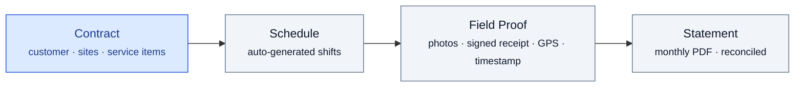
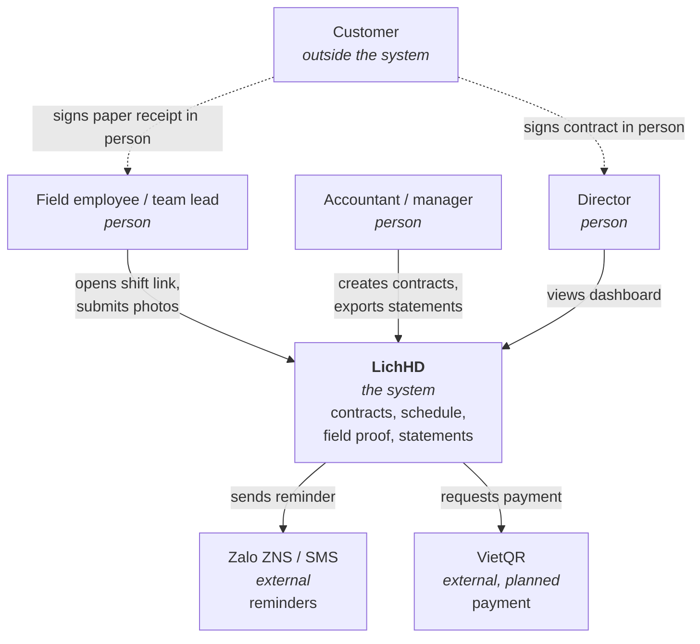
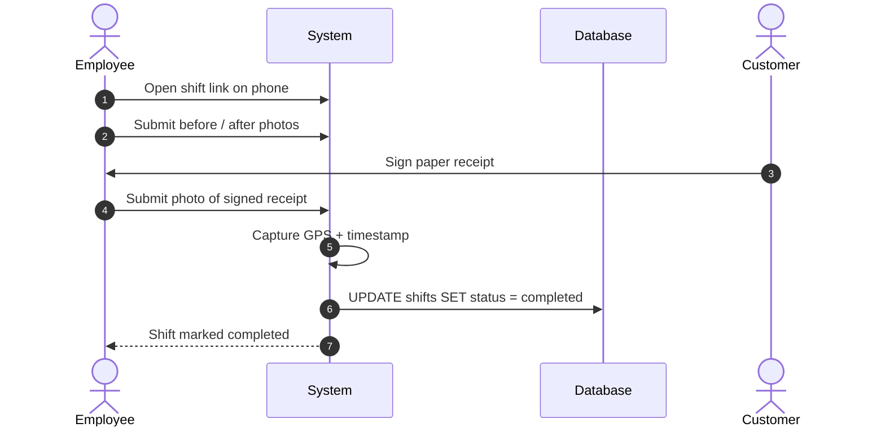
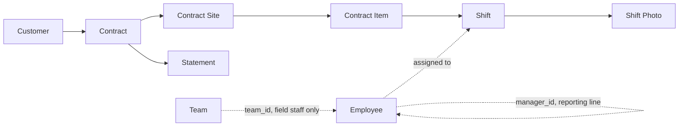
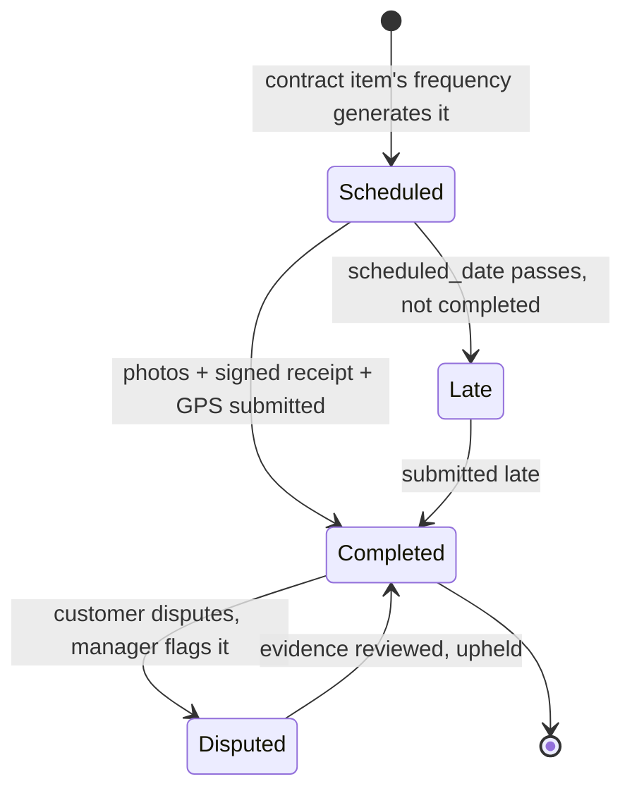

<div align="center">

# LichHD

**Recurring Service Contract Management**

[](#architecture)

</div>

---

## Table of contents

- [What LichHD is](#what-lichhd-is)
- [Before and after](#before-and-after)
- [The screens](#the-screens)
- [Architecture](#architecture)
- [Success metrics](#success-metrics)
- [Competitive landscape](#competitive-landscape)
- [Documentation](#documentation)
- [Repository layout](#repository-layout)

---

## What LichHD is

Contract management for companies delivering **the same service on a fixed frequency
over a contract term** — industrial cleaning, HVAC/elevator maintenance, pest control,
landscaping, fire-safety maintenance. The recurring contract is the primary entity;
schedule, field evidence and statements derive from it.



One contract covers one or more sites; each site carries service items with a frequency
and unit price. Shifts are generated from item frequency. Each completed shift records
before/after photos, a photographed customer-signed receipt, GPS coordinates and a
timestamp. Monthly statements are computed from completed shifts and exported as PDF
with the evidence attached.

Specification: [docs/01-prd.md](docs/01-prd.md).

---

## Before and after

**AS-IS** — Excel and Zalo ([PRD §4](docs/01-prd.md#4-user-flows--design)):

1. Accountant types 24 schedule rows per 12-month contract into a spreadsheet.
2. Manager posts the week's rows to a Zalo group each Monday.
3. Team lead assigns staff from the Zalo message.
4. Evidence photos age out of the Zalo group.
5. Signed paper receipts are held in the field until delivered to the office.
6. Month-end statements are reconstructed from Zalo history and paper records.
7. Missed visits surface on customer complaint.

**TO-BE** — LichHD:

1. Contract entered once — sites, items, frequency, unit price; shifts generated from frequency.
2. Weekly shift list pushed to each team lead.
3. Employee opens a shift link on a phone, no install; submits before/after photos and
   the photographed signed receipt.
4. GPS and timestamp recorded on submission, non-editable thereafter.
5. Statement exported as PDF with attached evidence.
6. Expiry alert at 30 days; missed-frequency alert on overdue shifts.

---

## The screens

[`docs/ui/wireframe.html`](docs/ui/wireframe.html) — 17 screens, 5 roles, single
self-contained HTML file, no build step. Role is selected from the top bar;
navigation, identity and reachable screens follow the role.

[`docs/ui/prototype.html`](docs/ui/prototype.html) — the same screens wired as an
application: login, role-scoped navigation, and the create and assign forms the
inventory has no place for. 22 screens.

**Contract-derived scheduling.** Each row carries its service frequency and
current-period progress against it.


**Field evidence capture.** Before/after photos, photographed signed receipt, GPS and
timestamp recorded by the system on submission.

![The LichHD field execution screen on a phone. A header reads Keangnam Landmark 72, VRV maintenance, Tòa A, 08:30 on 21/10. Three numbered steps follow: before photos, marked two captured; after photos, marked not yet; and the customer-signed receipt, marked not yet, with a note to have the customer sign the paper and photograph it. A grey panel below shows GPS 21.0176, 105.7833 and the time 21/10/2024 09:12, noted as recorded automatically on submission and not editable. A single button reads "Gửi & hoàn thành ca".](docs/screenshots/wireframe/employee/field.png)

**Role-scoped access**, per the use cases in
[the design analysis](docs/02-design-analysis.md#ii-use-cases). Employee scope: assigned
shifts and the field screen only; contracts, statements and dashboard are neither
listed nor reachable.


### Every screen

| Role | Screens |
|---|---|
| Director | [dashboard](docs/screenshots/wireframe/director/dashboard.png) · [contracts](docs/screenshots/wireframe/director/contracts.png) · [contract detail](docs/screenshots/wireframe/director/contract-detail.png) · [new contract](docs/screenshots/wireframe/director/new-contract.png) · [schedule](docs/screenshots/wireframe/director/schedule.png) · [shift detail](docs/screenshots/wireframe/director/shift-detail.png) · [dispute](docs/screenshots/wireframe/director/dispute.png) · [billing](docs/screenshots/wireframe/director/billing.png) · [statement](docs/screenshots/wireframe/director/statement-preview.png) · [reconcile](docs/screenshots/wireframe/director/reconcile.png) · [alerts](docs/screenshots/wireframe/director/alerts.png) · [customers](docs/screenshots/wireframe/director/customers.png) · [employees](docs/screenshots/wireframe/director/employees.png) |
| Manager | [contracts](docs/screenshots/wireframe/manager/contracts.png) · [contract detail](docs/screenshots/wireframe/manager/contract-detail.png) · [schedule](docs/screenshots/wireframe/manager/schedule.png) · [shift detail](docs/screenshots/wireframe/manager/shift-detail.png) · [new contract](docs/screenshots/wireframe/manager/new-contract.png) · [dispute](docs/screenshots/wireframe/manager/dispute.png) · [alerts](docs/screenshots/wireframe/manager/alerts.png) · [customers](docs/screenshots/wireframe/manager/customers.png) |
| Accountant | [billing](docs/screenshots/wireframe/accountant/billing.png) · [statement](docs/screenshots/wireframe/accountant/statement-preview.png) · [reconcile](docs/screenshots/wireframe/accountant/reconcile.png) · [contracts](docs/screenshots/wireframe/accountant/contracts.png) · [contract detail](docs/screenshots/wireframe/accountant/contract-detail.png) · [shift detail](docs/screenshots/wireframe/accountant/shift-detail.png) · [customers](docs/screenshots/wireframe/accountant/customers.png) |
| Team lead | [team shifts](docs/screenshots/wireframe/team_lead/team-shifts.png) · [shift detail](docs/screenshots/wireframe/team_lead/shift-detail.png) · [field execution](docs/screenshots/wireframe/team_lead/field.png) · [alerts](docs/screenshots/wireframe/team_lead/alerts.png) |
| Employee | [my shifts](docs/screenshots/wireframe/employee/my-shifts.png) · [field execution](docs/screenshots/wireframe/employee/field.png) |

---

## Architecture

Four views for orientation. Mechanisms, decisions and open questions:
[docs/03-architecture.md](docs/03-architecture.md) · endpoint and access-control contract:
[docs/04-api.md](docs/04-api.md).

### View 1 — who touches the system



Customer sits outside the system boundary: signatures and complaints are recorded offline by staff.

### View 2 — one shift, end to end



### View 3 — the data model, layered



Team membership and reporting line are separate columns: `team_id` scopes what a
team lead sees and is `NULL` for desk staff, `manager_id` is the reporting chain.

Full ERD and SQL Schema: [db/erd.md](db/erd.md) · [db/schema.sql](db/schema.sql).

### View 4 — the life of a shift


---

## Success metrics

| Metric | Baseline | Target |
|---|---|---|
| Month-end statement closing time | 1.5–3 days | Under 30 minutes |
| Visits with complete photo and signature evidence | Not measurable | ≥ 90% |

Full release criteria: [PRD §8](docs/01-prd.md#8-success-metrics--release-criteria).

---

## Competitive landscape

| Category | Target user | Gap for this segment |
|---|---|---|
| CMMS (SpeedMaint, Vietsoft…) | Factories maintaining owned assets | Asset-centric, not customer-contract-centric |
| International field service (Jobber, Swept, MaintainX) | Service contractors | Built for ad-hoc jobs; weak on fixed-frequency long-term contracts; no Vietnamese, Zalo or VietQR |
| B2C marketplaces (bTaskee, JupViec) | Individual consumers | Different business model |
| **LichHD** | Recurring-service companies, 10–80 staff, 20–150 contracts | — |

Source: [PRD §1](docs/01-prd.md#1-introduction--purpose).

---

## Documentation

| # | Document | Contents |
|---|---|---|
| 1 | [PRD](docs/01-prd.md) | Problem statement, personas, MVP scope, roadmap, release criteria |
| 2 | [Design Analysis](docs/02-design-analysis.md) | FR/NFR, use cases per role, sequence diagrams |
| 3 | [Architecture](docs/03-architecture.md) | arc42-structured — constraints, solution strategy, building blocks, deployment, decisions, quality requirements, risks |
| 4 | [API Specification](docs/04-api.md) | Endpoint contract, field-token submission path, access-control matrix |
| 5 | [Wireframe](docs/ui/wireframe.html) | 17 screens, 5 roles, single self-contained HTML file |
| 6 | [Prototype](docs/ui/prototype.html) | Clickable build: login, role-scoped navigation, 22 screens |
| 7 | [ERD](db/erd.md) | Entity-relationship diagram |
| 8 | [SQL Schema](db/schema.sql) | ANSI SQL |

---

## Repository layout

```
docs/                        # → docs/README.md
├── 00-mindmap.pdf
├── 01-prd.md                 # PRD — English (primary)
├── 02-design-analysis.md     # FR/NFR, use cases, sequence diagrams
├── 03-architecture.md        # arc42: constraints, decisions, quality, risks
├── 04-api.md                 # endpoint contract, access-control matrix
├── ui/
│   ├── wireframe.html        # single-file HTML wireframe, 17 screens, 5 roles
│   └── prototype.html        # clickable prototype: login, role-scoped flows, 22 screens
└── screenshots/wireframe/    # captures, one folder per role → screenshots/README.md
db/                          # → db/README.md
├── schema.sql               # ANSI SQL schema, 16 tables
└── erd.md                   # mermaid ERD
scripts/
└── capture-wireframe.sh     # headless Chrome capture of every screen
```

---
