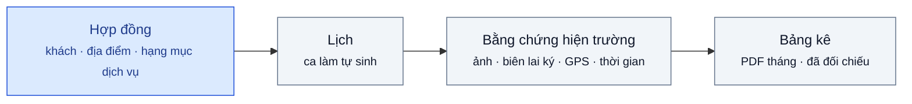
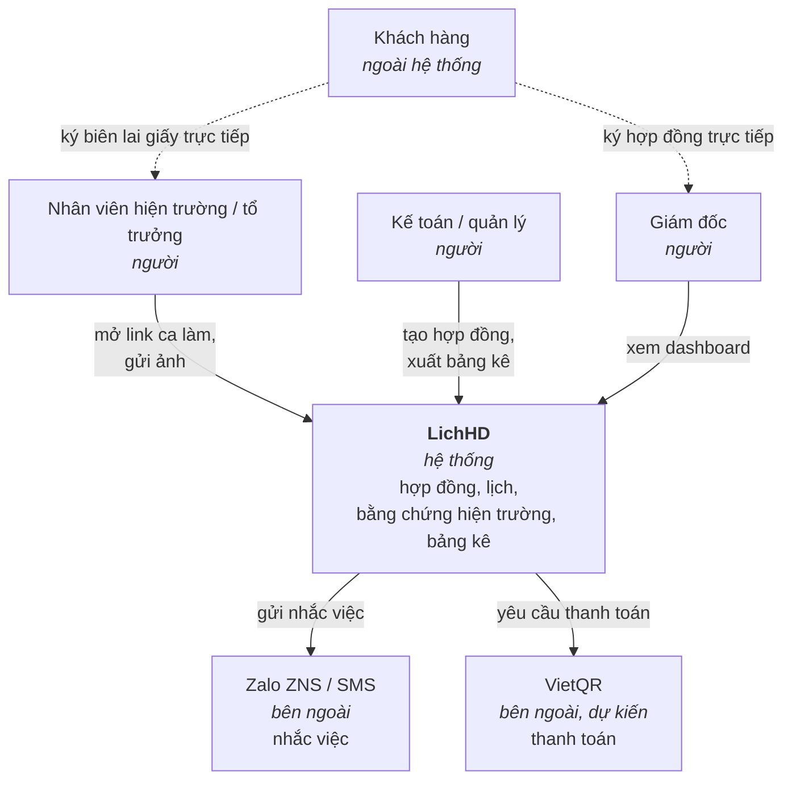
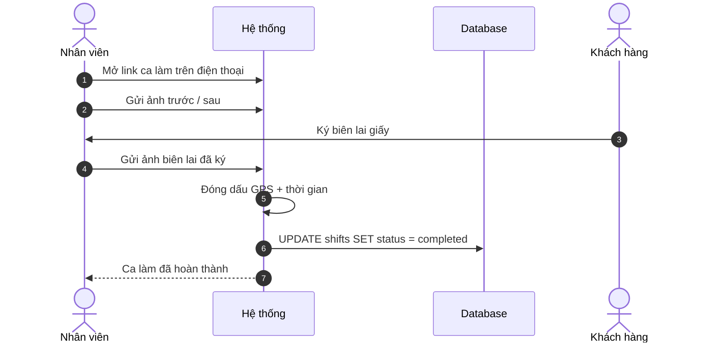
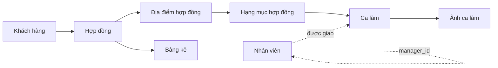
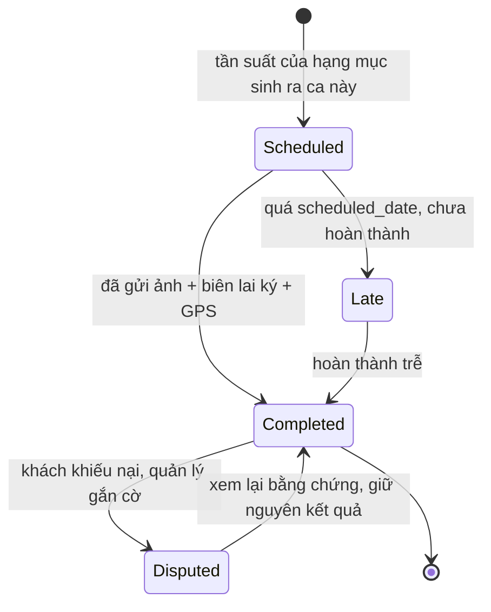

<div align="center">

# LichHD

**Quản lý Hợp đồng Dịch vụ Định kỳ**

[](#kiến-trúc)
[](README.md)

</div>

---

## Mục lục

- [LichHD là gì](#lichhd-là-gì)
- [Trước và sau](#trước-và-sau)
- [Giao diện](#giao-diện)
- [Kiến trúc](#kiến-trúc)
- [Chỉ số thành công](#chỉ-số-thành-công)
- [Bối cảnh cạnh tranh](#bối-cảnh-cạnh-tranh)
- [Tài liệu](#tài-liệu)
- [Cấu trúc repo](#cấu-trúc-repo)

---

## LichHD là gì

Phần mềm quản lý hợp đồng cho công ty cung cấp **cùng một dịch vụ theo tần suất cố định
trong suốt thời hạn hợp đồng** — vệ sinh công nghiệp, bảo trì điều hòa/thang máy, diệt côn
trùng, chăm sóc cây xanh, bảo trì PCCC. Hợp đồng định kỳ là thực thể trung tâm; lịch, bằng
chứng hiện trường và bảng kê đều dẫn xuất từ nó.



Một hợp đồng gồm một hoặc nhiều địa điểm; mỗi địa điểm có các hạng mục dịch vụ kèm tần suất
và đơn giá. Ca làm sinh ra từ tần suất hạng mục. Mỗi ca hoàn thành ghi nhận ảnh trước/sau,
ảnh chụp biên lai khách đã ký, tọa độ GPS và thời gian. Bảng kê tháng tính từ các ca đã hoàn
thành, xuất PDF kèm bằng chứng.

Đặc tả: [docs/prd.vi.md](docs/prd.vi.md) · [English version](docs/prd.md).

---

## Trước và sau

**AS-IS** — Excel và Zalo ([PRD mục 4](docs/prd.vi.md#4-luồng-người-dùng--thiết-kế)):

1. Kế toán gõ 24 dòng lịch cho mỗi hợp đồng 12 tháng vào bảng tính.
2. Quản lý đăng lịch tuần lên nhóm Zalo mỗi thứ Hai.
3. Tổ trưởng phân người dựa trên tin nhắn Zalo.
4. Ảnh bằng chứng trôi khỏi nhóm Zalo theo thời gian.
5. Biên lai giấy đã ký giữ ngoài hiện trường cho tới khi mang về văn phòng.
6. Bảng kê cuối tháng dựng lại từ lịch sử Zalo và chứng từ giấy.
7. Ca bỏ sót chỉ lộ ra khi khách khiếu nại.

**TO-BE** — LichHD:

1. Hợp đồng nhập một lần — địa điểm, hạng mục, tần suất, đơn giá; ca sinh từ tần suất.
2. Danh sách ca tuần đẩy tới từng tổ trưởng.
3. Nhân viên mở link ca trên điện thoại, không cài app; gửi ảnh trước/sau và ảnh biên lai
   đã ký.
4. GPS và thời gian ghi khi gửi, không sửa được sau đó.
5. Bảng kê xuất PDF kèm bằng chứng.
6. Cảnh báo hết hạn ở mốc 30 ngày; cảnh báo chậm tần suất với ca quá hạn.

---

## Giao diện

[`docs/wireframe.html`](docs/wireframe.html) — 17 màn hình, 5 vai trò, một file HTML
độc lập, không cần build. Vai trò chọn ở thanh trên cùng; menu, danh tính và danh
sách màn được mở đổi theo vai trò. Deep link: `wireframe.html#<vai-trò>/<màn>`.
Ảnh dưới đây do [`scripts/capture-wireframe.sh`](scripts/capture-wireframe.sh) chụp
— Chrome headless ở 1440×900, màn khung điện thoại ở 560px.

**Lịch dẫn xuất từ hợp đồng.** Mỗi dòng mang tần suất dịch vụ và tiến độ kỳ hiện tại
so với tần suất đó.


**Thu thập bằng chứng hiện trường.** Ảnh trước/sau, ảnh biên lai đã ký, GPS và thời
gian do hệ thống ghi khi gửi.


**Phân quyền theo vai trò**, theo use case trong
[tài liệu phân tích thiết kế](docs/design-analysis.vi.md#ii-use-case). Phạm vi vai trò
nhân viên: ca được giao và màn hiện trường; hợp đồng, bảng kê và dashboard không hiển
thị và cũng không mở được.


### Toàn bộ màn hình

| Vai trò | Màn hình |
|---|---|
| Giám đốc | [tổng quan](docs/screenshots/wireframe/director/dashboard.png) · [hợp đồng](docs/screenshots/wireframe/director/contracts.png) · [chi tiết hợp đồng](docs/screenshots/wireframe/director/contract-detail.png) · [tạo hợp đồng](docs/screenshots/wireframe/director/new-contract.png) · [lịch điều phối](docs/screenshots/wireframe/director/schedule.png) · [chi tiết ca](docs/screenshots/wireframe/director/shift-detail.png) · [ca khiếu nại](docs/screenshots/wireframe/director/dispute.png) · [bảng kê](docs/screenshots/wireframe/director/billing.png) · [bảng kê chi tiết](docs/screenshots/wireframe/director/statement-preview.png) · [đối soát](docs/screenshots/wireframe/director/reconcile.png) · [cảnh báo](docs/screenshots/wireframe/director/alerts.png) · [khách hàng](docs/screenshots/wireframe/director/customers.png) · [nhân viên](docs/screenshots/wireframe/director/employees.png) |
| Quản lý | [hợp đồng](docs/screenshots/wireframe/manager/contracts.png) · [chi tiết hợp đồng](docs/screenshots/wireframe/manager/contract-detail.png) · [lịch điều phối](docs/screenshots/wireframe/manager/schedule.png) · [chi tiết ca](docs/screenshots/wireframe/manager/shift-detail.png) · [tạo hợp đồng](docs/screenshots/wireframe/manager/new-contract.png) · [ca khiếu nại](docs/screenshots/wireframe/manager/dispute.png) · [cảnh báo](docs/screenshots/wireframe/manager/alerts.png) · [khách hàng](docs/screenshots/wireframe/manager/customers.png) |
| Kế toán | [bảng kê](docs/screenshots/wireframe/accountant/billing.png) · [bảng kê chi tiết](docs/screenshots/wireframe/accountant/statement-preview.png) · [đối soát](docs/screenshots/wireframe/accountant/reconcile.png) · [hợp đồng](docs/screenshots/wireframe/accountant/contracts.png) · [chi tiết hợp đồng](docs/screenshots/wireframe/accountant/contract-detail.png) · [chi tiết ca](docs/screenshots/wireframe/accountant/shift-detail.png) · [khách hàng](docs/screenshots/wireframe/accountant/customers.png) |
| Tổ trưởng | [lịch tổ](docs/screenshots/wireframe/team_lead/team-shifts.png) · [chi tiết ca](docs/screenshots/wireframe/team_lead/shift-detail.png) · [thực hiện hiện trường](docs/screenshots/wireframe/team_lead/field.png) · [cảnh báo](docs/screenshots/wireframe/team_lead/alerts.png) |
| Nhân viên | [ca của tôi](docs/screenshots/wireframe/employee/my-shifts.png) · [thực hiện hiện trường](docs/screenshots/wireframe/employee/field.png) |

---

## Kiến trúc
Bốn góc nhìn để nắm tổng thể. Cơ chế, quyết định thiết kế và câu hỏi còn mở:
[docs/architecture.md](docs/architecture.md) · đặc tả endpoint và phân quyền:
[docs/api.md](docs/api.md).

### Góc nhìn 1 — ai chạm vào hệ thống



Khách hàng nằm ngoài biên hệ thống: chữ ký và khiếu nại do nhân sự ghi nhận ngoài phần mềm.

### Góc nhìn 2 — một ca làm, từ đầu đến cuối



### Góc nhìn 3 — mô hình dữ liệu, theo lớp



ERD và SQL Schema đầy đủ: [db/erd.md](db/erd.md) · [db/schema.sql](db/schema.sql).

### Góc nhìn 4 — vòng đời một ca làm


---

## Chỉ số thành công

| Chỉ số | Hiện trạng | Mục tiêu |
|---|---|---|
| Thời gian chốt bảng kê cuối tháng | 1,5–3 ngày | Dưới 30 phút |
| Tỷ lệ ca có đủ bằng chứng ảnh và chữ ký | Không đo được | ≥ 90% |

Đầy đủ tiêu chí phát hành: [PRD mục 8](docs/prd.vi.md#8-chỉ-số-thành-công--tiêu-chí-phát-hành).

---

## Bối cảnh cạnh tranh

| Nhóm | Người dùng mục tiêu | Khoảng trống với phân khúc này |
|---|---|---|
| CMMS (SpeedMaint, Vietsoft…) | Nhà máy bảo trì tài sản sở hữu | Xoay quanh thiết bị, không xoay quanh hợp đồng khách hàng |
| Field Service quốc tế (Jobber, Swept, MaintainX) | Nhà thầu dịch vụ | Thiết kế cho việc ad-hoc; yếu ở hợp đồng tần suất cố định dài hạn; không có tiếng Việt, Zalo hay VietQR |
| Sàn B2C (bTaskee, JupViec) | Người tiêu dùng cá nhân | Khác mô hình kinh doanh |
| **LichHD** | Công ty dịch vụ định kỳ, 10–80 nhân viên, 20–150 hợp đồng | — |

Bảng đầy đủ: [PRD mục 1](docs/prd.vi.md#1-giới-thiệu--mục-đích).

---

## Tài liệu

| # | Tài liệu | Nội dung |
|---|---|---|
| 1 | [PRD](docs/prd.vi.md) · [English](docs/prd.md) | Bài toán, người dùng, phạm vi MVP, lộ trình, tiêu chí phát hành |
| 2 | [Design Analysis](docs/design-analysis.vi.md) · [English](docs/design-analysis.md) | FR/NFR, use case theo vai trò, sequence diagram |
| 3 | [Architecture](docs/architecture.md) *(EN)* | Phân rã thành phần và tiêu chí công nghệ, quyết định thiết kế, vấn đề xuyên suốt, câu hỏi còn mở |
| 4 | [API Specification](docs/api.md) *(EN)* | Đặc tả endpoint, luồng nộp bằng chứng bằng token, ma trận phân quyền |
| 5 | [Wireframe](docs/wireframe.html) | 17 màn hình, 5 vai trò, 1 file HTML độc lập |
| 6 | [ERD](db/erd.md) | Sơ đồ quan hệ thực thể |
| 7 | [SQL Schema](db/schema.sql) | ANSI SQL, single-tenant, bảng lookup thay ENUM |

---

## Cấu trúc repo

```
docs/                        # → docs/README.md
├── prd.md                   # PRD — tiếng Anh (chính)
├── prd.vi.md                # PRD — tiếng Việt
├── design-analysis.md       # FR/NFR, use case, sequence diagram — tiếng Anh
├── design-analysis.vi.md    # FR/NFR, use case, sequence diagram — tiếng Việt
├── architecture.md          # thành phần, quyết định thiết kế, câu hỏi mở
├── api.md                   # đặc tả endpoint, ma trận phân quyền
├── wireframe.html           # wireframe 1 file HTML, 17 màn hình, 5 vai trò
├── screenshots/wireframe/   # ảnh chụp, mỗi vai trò một thư mục → screenshots/README.md
└── mindmap.pdf
db/                          # → db/README.md
├── schema.sql               # ANSI SQL schema, 16 bảng
└── erd.md                   # ERD mermaid
scripts/
└── capture-wireframe.sh     # chụp toàn bộ màn bằng Chrome headless
```

---
