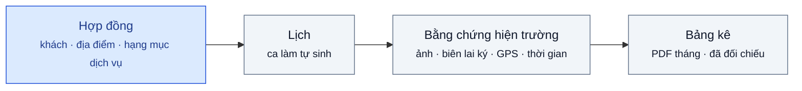
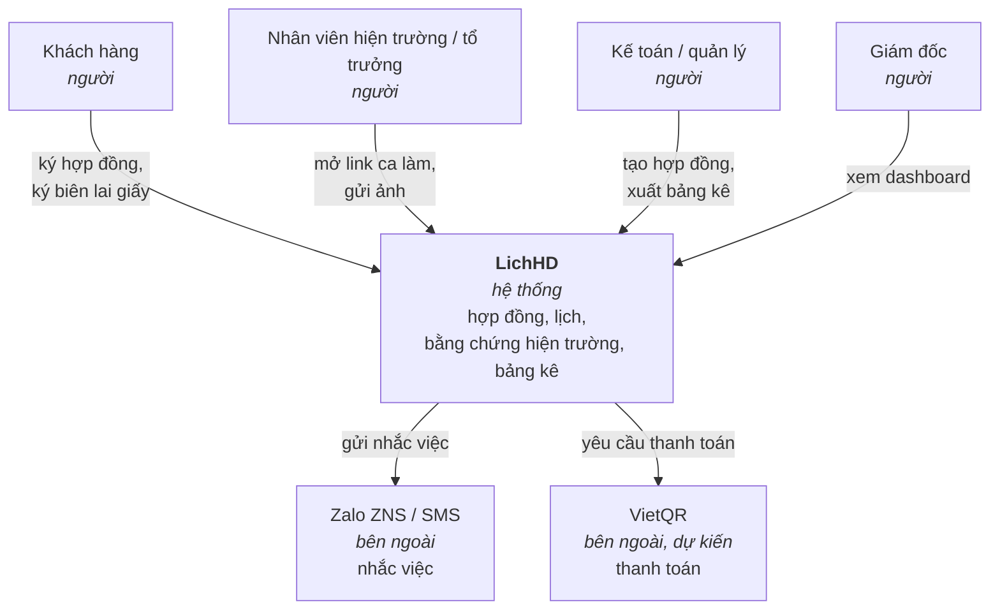
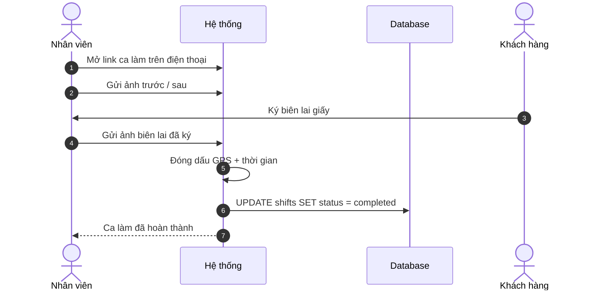
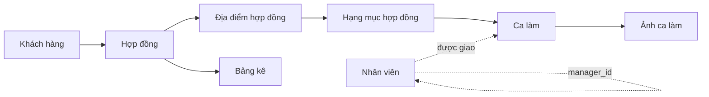
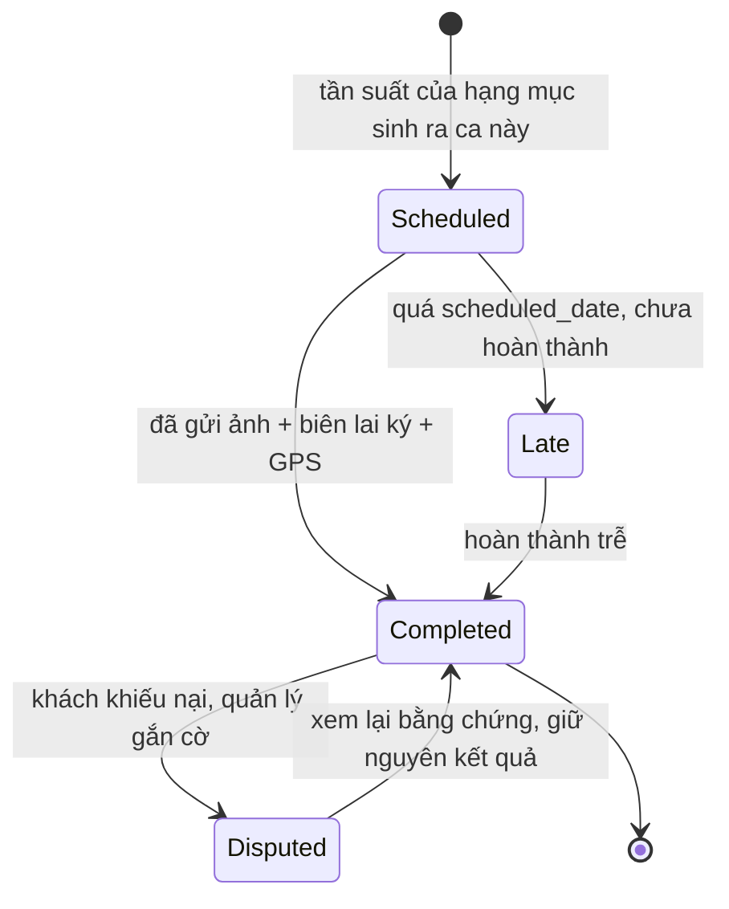

<div align="center">

# LichHD

**Quản lý Hợp đồng Dịch vụ Định kỳ**

[](#dự-án-đang-ở-đâu)
[](docs/design-analysis.vi.md)
[](README.md)

</div>



---

## Mục lục

- [LichHD là gì](#lichhd-là-gì)
- [Trước và sau](#trước-và-sau)
- [Kiến trúc](#kiến-trúc)
- [Chỉ số thành công](#chỉ-số-thành-công)
- [Bối cảnh cạnh tranh](#bối-cảnh-cạnh-tranh)
- [Tài liệu](#tài-liệu)
- [Cấu trúc repo](#cấu-trúc-repo)
- [Dự án đang ở đâu](#dự-án-đang-ở-đâu)

---

## LichHD là gì

LichHD là phần mềm quản lý hợp đồng cho công ty bán **cùng một dịch vụ, theo lịch cố định,
kéo dài nhiều tháng** — vệ sinh công nghiệp, bảo trì điều hòa/thang máy, diệt côn trùng,
chăm sóc cây xanh, bảo trì PCCC. Không phải to-do list, không phải CMMS để theo dõi thiết bị
của chính công ty, không phải sàn việc vặt ad-hoc.

### Tổng quan

```
Dịch vụ định kỳ = Hợp đồng + Lịch + Bằng chứng hiện trường + Bảng kê
```

Hợp đồng ký một lần, cho một hoặc nhiều địa điểm, mỗi địa điểm có hạng mục dịch vụ, tần suất
và đơn giá riêng. Lịch sinh ra từ đó, không gõ tay. Mỗi lần thực hiện tạo ra bằng chứng hiện
trường — ảnh trước/sau và ảnh chụp biên lai giấy đã được khách ký, đóng dấu GPS và thời gian.
Bảng kê được dựng từ bằng chứng đó, không phải dựng lại từ trí nhớ và lịch sử chat Zalo.

Chi tiết đầy đủ: [docs/prd.vi.md](docs/prd.vi.md) · [English version](docs/prd.md).

---

## Trước và sau

**AS-IS**, hiện tại, chạy bằng Excel và Zalo ([PRD mục 4](docs/prd.vi.md#4-luồng-người-dùng--thiết-kế)):

1. Kế toán gõ tay 24 dòng vào `Lịch 2025.xlsx` cho hợp đồng 12 tháng.
2. Quản lý copy lịch tuần này vào nhóm Zalo mỗi sáng thứ Hai.
3. Tổ trưởng đọc Zalo, phân người, đi làm.
4. Ảnh gửi vào nhóm Zalo rồi trôi mất sau 2 tuần.
5. Khách ký giấy xác nhận, tổ trưởng giữ nhiều ngày — có khi làm mất.
6. Cuối tháng: kế toán lục Zalo và giấy để dựng lại bảng kê.
7. Một lần bỏ sót chỉ lộ ra khi khách đã phàn nàn.

**TO-BE**, với LichHD:

1. Ký hợp đồng một lần — địa điểm, hạng mục, tần suất, đơn giá. Lịch tự sinh.
2. Sáng thứ Hai: lịch tuần này đã được đẩy sẵn cho từng tổ trưởng.
3. Nhân viên mở link trên điện thoại, không cần cài app: chụp ảnh trước/sau, khách ký biên
   lai giấy, nhân viên chụp lại.
4. GPS + thời gian được đóng dấu tự động.
5. Một nút cuối tháng: bảng kê + ảnh + biên lai → PDF, gửi khách.
6. Hệ thống báo "5 hợp đồng hết hạn trong 30 ngày" trước khi hợp đồng nào hết hạn.

---

## Kiến trúc
Nguồn: [docs/design-analysis.vi.md](docs/design-analysis.vi.md)
### Góc nhìn 1 — ai chạm vào hệ thống



### Góc nhìn 2 — một ca làm, từ đầu đến cuối



### Góc nhìn 3 — mô hình dữ liệu, theo lớp



ERD và SQL Schema đầy đủ: [db/erd.md](db/erd.md) · [db/schema.sql](db/schema.sql).

### Góc nhìn 4 — vòng đời một ca làm


---

## Chỉ số thành công

| Chỉ số | Hiện tại | Với LichHD |
|---|---|---|
| Thời gian chốt bảng kê cuối tháng | 1,5–3 ngày | Dưới 30 phút |
| Tỷ lệ ca làm có đủ bằng chứng ảnh + chữ ký | Tùy Zalo có làm mất hay không | ≥ 90% |

Đầy đủ tiêu chí phát hành: [PRD mục 8](docs/prd.vi.md#8-chỉ-số-thành-công--tiêu-chí-phát-hành).

---

## Bối cảnh cạnh tranh

| Loại phần mềm | Phục vụ ai | Vì sao không hợp |
|---|---|---|
| CMMS (SpeedMaint, Vietsoft…) | Nhà máy tự bảo trì tài sản của mình | Xoay quanh thiết bị, không xoay quanh hợp đồng khách hàng |
| Field Service quốc tế (Jobber, Swept, MaintainX) | Nhà thầu dịch vụ | Đúng mô hình, nhưng thiết kế cho việc ad-hoc — yếu ở hợp đồng tần suất cố định dài hạn, không có tiếng Việt/Zalo/VietQR |
| Sàn B2C (bTaskee, JupViec) | Người tiêu dùng cá nhân | Sai mô hình kinh doanh |
| **LichHD** | Công ty dịch vụ định kỳ, 10–80 nhân viên, 20–150 hợp đồng | Hợp đồng là đơn vị trung tâm, ngay từ đầu |

Bảng đầy đủ: [PRD mục 1](docs/prd.vi.md#1-giới-thiệu--mục-đích).

---

## Tài liệu

| # | Tài liệu | Trả lời câu hỏi gì |
|---|---|---|
| 1 | [PRD](docs/prd.vi.md) · [English](docs/prd.md) | Vấn đề, người dùng, phạm vi MVP, lộ trình, tiêu chí phát hành |
| 2 | [Design Analysis](docs/design-analysis.vi.md) · [English](docs/design-analysis.md) | Yêu cầu chức năng/phi chức năng, use case theo vai trò, toàn bộ sequence diagram (mermaid) |
| 3 | [Wireframe](docs/wireframe.html) | Đủ 10 màn hình MVP, 1 file HTML độc lập |
| 4 | [ERD](db/erd.md) | Sơ đồ quan hệ thực thể, mermaid |
| 5 | [SQL Schema](db/schema.sql) | ANSI SQL, single-tenant, bảng lookup thay ENUM |

---

## Cấu trúc repo

```
docs/
├── prd.md                  # PRD — tiếng Anh (chính)
├── prd.vi.md                # PRD — tiếng Việt
├── design-analysis.md       # FR/NFR, use case, sequence diagram — tiếng Anh
├── design-analysis.vi.md    # FR/NFR, use case, sequence diagram — tiếng Việt
├── wireframe.html            # wireframe 1 file HTML, 10 màn hình
└── mindmap.pdf
db/
├── schema.sql                # ANSI SQL schema
└── erd.md                    # ERD mermaid
```

---
