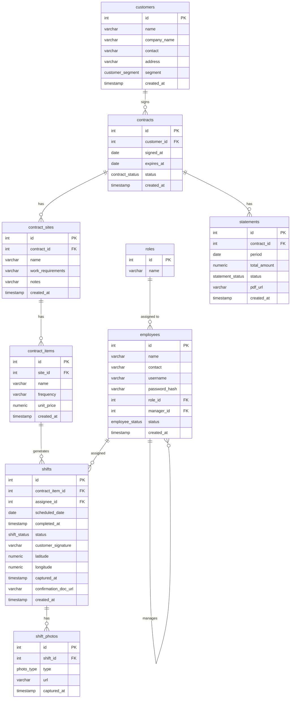

# ERD

```mermaid
erDiagram
    roles ||--o{ employees : "assigned to"
    employees ||--o{ employees : "manages"
    customers ||--o{ contracts : "signs"
    contracts ||--o{ contract_sites : "has"
    contract_sites ||--o{ contract_items : "has"
    contract_items ||--o{ shifts : "generates"
    employees ||--o{ shifts : "assigned"
    shifts ||--o{ shift_photos : "has"
    contracts ||--o{ statements : "has"

    roles {
        int id PK
        varchar name
    }

    customers {
        int id PK
        varchar name
        varchar company_name
        varchar contact
        varchar address
        customer_segment segment
        timestamp created_at
    }

    employees {
        int id PK
        varchar name
        varchar contact
        varchar username
        varchar password_hash
        int role_id FK
        int manager_id FK
        employee_status status
        timestamp created_at
    }

    contracts {
        int id PK
        int customer_id FK
        date signed_at
        date expires_at
        contract_status status
        timestamp created_at
    }

    contract_sites {
        int id PK
        int contract_id FK
        varchar name
        varchar work_requirements
        varchar notes
        timestamp created_at
    }

    contract_items {
        int id PK
        int site_id FK
        varchar name
        varchar frequency
        numeric unit_price
        timestamp created_at
    }

    shifts {
        int id PK
        int contract_item_id FK
        int assignee_id FK
        date scheduled_date
        timestamp completed_at
        shift_status status
        varchar customer_signature
        numeric latitude
        numeric longitude
        timestamp captured_at
        varchar confirmation_doc_url
        timestamp created_at
    }

    shift_photos {
        int id PK
        int shift_id FK
        photo_type type
        varchar url
        timestamp captured_at
    }

    statements {
        int id PK
        int contract_id FK
        date period
        numeric total_amount
        statement_status status
        varchar pdf_url
        timestamp created_at
    }
```
