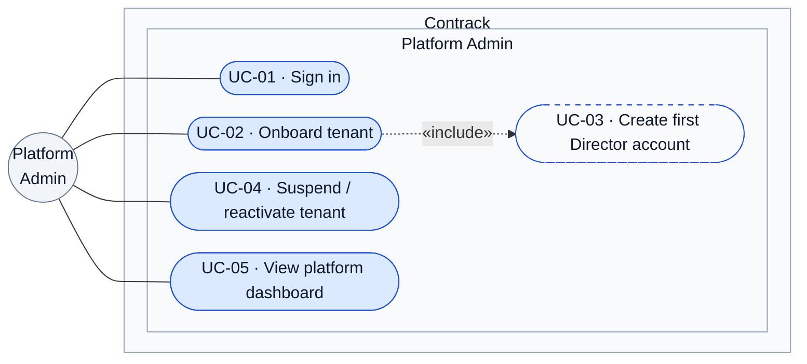
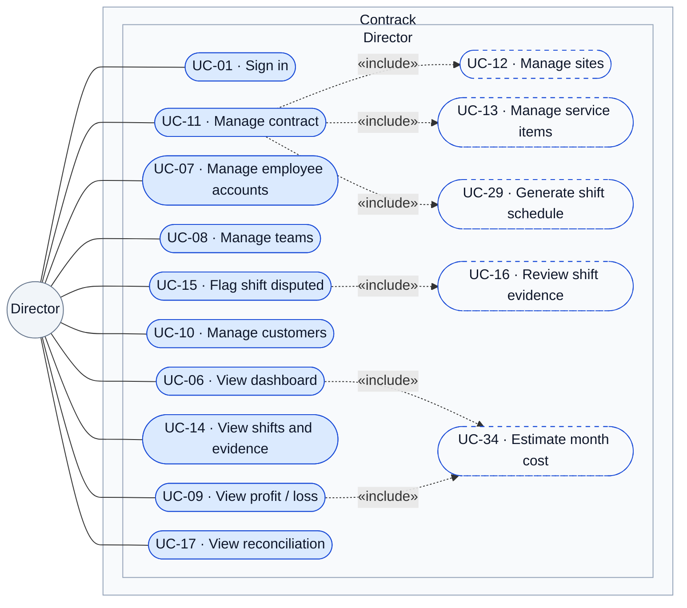
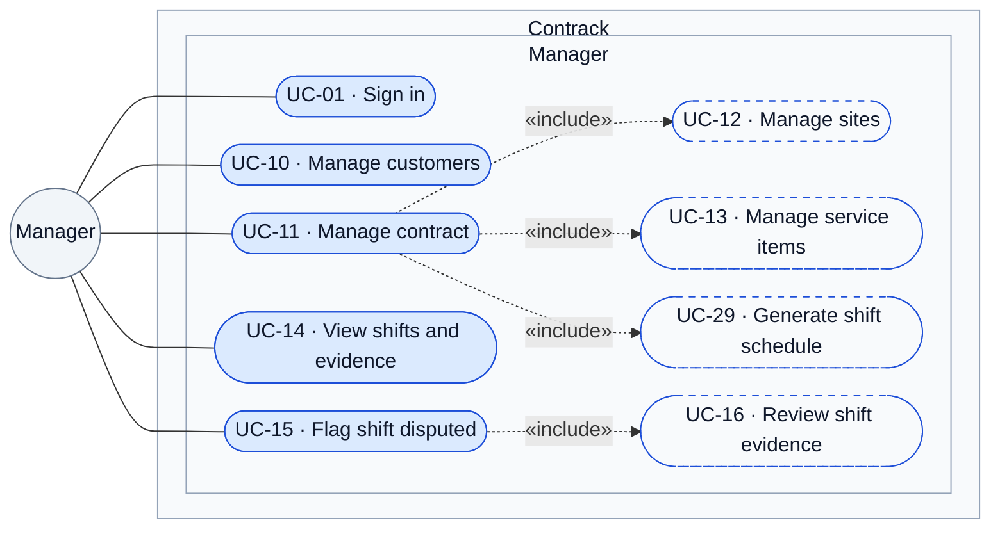
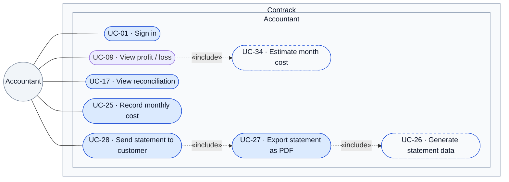
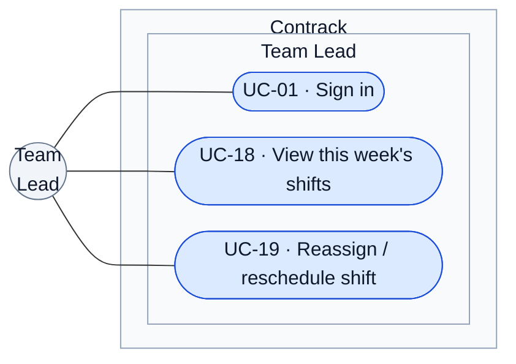
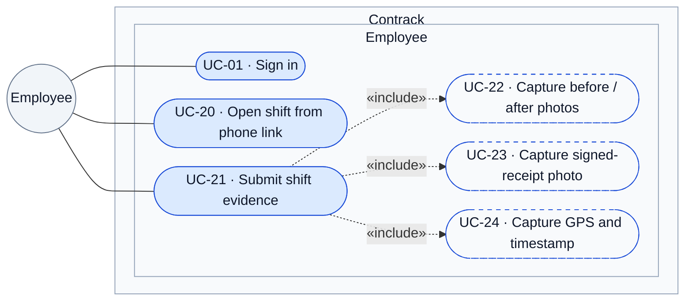
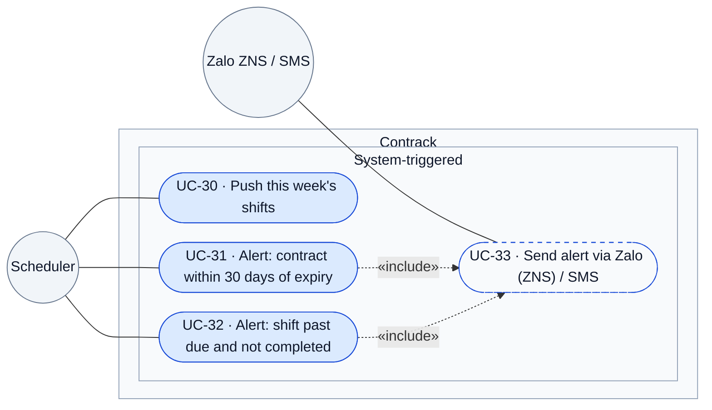

# Contrack — Requirements Analysis

### Overview

Contrack is recurring service contract management software for companies delivering
periodic services — industrial cleaning, HVAC/elevator maintenance, pest control,
landscaping, fire-safety maintenance. Many companies run schedules in Excel and coordinate over Zalo: visits get missed with
no warning, there's no proof of work when a customer disputes a visit, and closing the
month-end statement takes an accountant days of manual reconciliation. Contracts
nearing expiry go untracked until they're already lost.

Contrack replaces that with one system: a contract's schedules are generated, field staff submit photo/GPS/timestamp proof on completion, and the month-end statement exports in minutes instead of days.

### User Stories
| ID | As a... | I want to... | So that... | Acceptance criteria |
|---|---|---|---|---|
| US-01 | employee (any role) | sign in with my email and password | I get a session scoped to my tenant, role and row-scope | Given a valid email/password, when I sign in, then I receive a token carrying tenant + role; given the email doesn't exist or the tenant is suspended, when I sign in, then I'm rejected before any password check |
| US-02 | Director | see contract status, projected revenue/profit and this period's shift-completion status in one place | I catch a delivery or revenue problem before it reaches me as a complaint | Given I open the dashboard, when it loads, then active/expiring/disputed contract counts, projected revenue and period profit reflect the current data, filterable by month; given the same load, then the period's scheduled shifts show as completed/overdue/disputed/not-yet-due, with the three completion rates computed only against shifts actually due |
| US-03 | Director | see late/missed shifts by month on the dashboard | I spot a slipping team before it costs a contract | Given I filter the dashboard by month, when it renders, then late/missed shift counts for that month are shown |
| US-04 | Director | see on-time renewal rate and cancellation rate on the dashboard | I know whether retention is improving or slipping | Given I open the dashboard, when it loads, then both rates are computed against the selected month's baseline |
| US-05 | Director | see new contracts signed by month and the profit/loss trend on the dashboard | I see growth and margin together, not in two places | Given I open the dashboard, when it loads, then both trends render for the selected date range, using the same profit/loss numbers as US-08 |
| US-06 | Director | manage employee accounts, roles and manager assignment myself | access always matches who's actually on staff, without waiting on IT | Given I create, edit or deactivate an employee, when they next call the API, then the change already applies — no redeploy, no re-login required |
| US-07 | Director, Accountant | see what's billed against what actually got done, per contract and period | I catch billing drift before it reaches the customer as a dispute | Given a contract and a period, when I open reconciliation, then shifts due by frequency sit next to shifts with complete evidence, for that contract and period only |
| US-08 | Director, Accountant | see profit/loss per contract per month | I catch a bad contract before renewing it | Given a month with recorded costs, when I open the view, then profit/loss = revenue from `contract_items` minus that month's recorded labor/materials/other cost |
| US-09 | Director | still see a profit/loss number for a month the Accountant hasn't closed yet | the dashboard never shows a gap for an unclosed month | Given a contract with no cost recorded for the month, when I open the view, then it shows a clearly marked estimate — trailing 3-month average for that contract, or the tenant's average cost-to-revenue ratio if it has no cost history |
| US-10 | Manager, Director | set up a new contract with its sites and service items in one pass | the shift schedule generates itself instead of me building a calendar by hand | Given a contract with a term, ≥1 site and ≥1 service item, when I save it, then the full set of scheduled shifts is generated immediately; given a site or item is missing frequency or unit price, when I save, then the contract is rejected with the specific field named |
| US-11 | Manager, Director | flag a shift as disputed the moment a customer complains | the complaint is tied to the actual evidence instead of living in someone's memory | Given a completed shift, when I mark it disputed with a reason, then it keeps its photos/receipt/GPS and shows the reason, separate from a normal completed shift |
| US-12 | Manager | know a contract is about to expire before it does | I can start the renewal conversation in time | Given a contract 30 days from `expires_at`, when that threshold is crossed, then one alert fires for that contract via Zalo (ZNS) with SMS fallback, and never fires twice |
| US-13 | Manager | know a visit was missed before the customer tells me | I can fix it before it becomes a complaint | Given a shift past its due date per the contract's frequency, when it's still not completed, then an alert fires the moment it passes due, via Zalo (ZNS) with SMS fallback |
| US-14 | Manager, Director | create or update a customer record, and delete it if I'm Director | the customer directory matches who we actually work with | Given a customer with an active contract, when a Director tries to delete it, then it's rejected; given no such contract, when a Director deletes it, then it succeeds |
| US-15 | Accountant | close a contract's month without reassembling evidence by hand | I can send the customer a statement in minutes, not days | Given a period where every due shift has complete evidence, when I export, then one action produces the full PDF with photos and signature; given any shift in the period is missing evidence, when I try to export, then it's blocked and the missing shifts are listed |
| US-16 | Accountant | send an exported statement to the customer and mark it sent | I have one record of what was billed and when, without a side spreadsheet | Given a statement already exported as PDF, when I send it, then it's marked sent with a timestamp, and can't be sent twice by accident |
| US-17 | Accountant | record labor and materials costs against a contract each month | the Director's profit/loss numbers are accurate, not guessed | Given I save a cost entry (category, month, amount), when it's saved, then that contract's profit/loss for that month updates immediately |
| US-18 | Team lead | know which shifts my team owes this week without chasing anyone for it | I can assign work the moment the week starts | Given it's Monday, when the week starts, then my team's shift list has already arrived, scoped to my own team only |
| US-19 | Team lead | swap the assignee or date on a shift when someone's out or a site asks to move | the week still gets covered without waiting on a manager | Given a shift not yet completed, when I reassign or reschedule it, then it succeeds; given a shift already completed, when I try the same, then it's rejected |
| US-20 | Employee | leave proof that I actually did the visit | I'm protected if a customer disputes it later | Given I open the shift link on my phone, when I submit before/after photos and the signed-receipt photo, then GPS and timestamp are captured automatically and the shift only reaches `completed` once all three are present |
| US-21 | Platform Admin | onboard a new operating company with its first Director account | a new customer of Contrack itself can start working without me touching the database | Given I create a tenant, when it's saved, then one active Director login exists, scoped to that tenant only |
| US-22 | Platform Admin | suspend or reactivate a tenant | I can cut off a non-paying or offboarded company without deleting their data | Given a suspended tenant, when any of its accounts try to sign in, then they're rejected before password check; given reactivation, when the same account signs in, then it succeeds |
| US-23 | Platform Admin | see tenant counts by status, recent onboarding activity and tenant growth trend | I track platform health without querying the database myself | Given I open the platform dashboard, when it loads, then all three views reflect current tenant data |
| US-24 | Director | create, rename or delete a team | field staff are organized into the group a team lead actually dispatches, not left as one undifferentiated pool | Given a name and a code unique within my tenant, when I save a team, then it's created; given a team that still has members, when I try to delete it, then it's rejected |

### Functional Requirements

| # | Role | Requirement |
|---|---|---|
| FR1 | Director, Accountant, Manager, Team Lead, Employee | Sign in with an email and password; the session carries the account's tenant, role and row scope for every later request |
| FR2 | Director | View dashboard: active/expiring/disputed contract counts, projected revenue, late/missed shifts by month, on-time renewal rate, cancellation rate, new contracts signed by month, profit/loss trend — filterable by month |
| FR3 | Director | Read, create, update or deactivate employee accounts, including role and manager assignment; deactivation is a soft delete — the account and its shift/cost history are retained |
| FR4 | Director, Accountant | View profit/loss per contract per month: revenue from `contract_items` minus that month's recorded or estimated cost |
| FR5 | Manager, Director | Create a contract for a customer with a signed date and expiry date. Update/delete: Director only |
| FR6 | Manager, Director | Add one or more sites to a contract. Update/delete: Director only |
| FR7 | Manager, Director | Add service items to a site (name, frequency, unit price). Update/delete: Director only |
| FR8 | Manager, Director | Mark a shift as disputed and record the reason |
| FR9 | Manager, Director | Create or update a customer record (name, contact, address, segment). Delete: Director only, blocked while the customer holds an active contract |
| FR10 | Accountant | Generate a monthly statement per contract from its completed shifts |
| FR11 | Accountant | Export a statement as PDF with photos and receipts attached |
| FR12 | Accountant | Send an exported statement to the customer, marking it sent |
| FR13 | Accountant, Director | View reconciliation: shifts due by frequency vs. shifts with complete evidence, per contract per period |
| FR14 | Accountant | Record or update a contract's monthly cost (category: labor, materials, other) |
| FR15 | Team Lead | Reassign or reschedule a shift when a conflict arises |
| FR16 | Employee | Open an assigned shift via a phone link, no app install |
| FR17 | Employee | Submit before/after photos for a shift |
| FR18 | Employee | Submit the signed paper receipt photo as evidence |
| FR19 | Platform Admin | Create a new tenant (operating company) with its first Director account | 
| FR20 | Platform Admin | Suspend or reactivate a tenant; a suspended tenant's accounts can't sign in |
| FR21 | Platform Admin | View platform dashboard: tenant counts by status, recent onboarding activity, tenant growth trend |
| FR22 | System | Auto-generate the shift schedule from each service item's frequency |
| FR23 | System | Auto-push the current week's shifts to each team lead |
| FR24 | System | Capture GPS coordinates and timestamp automatically on submission |
| FR25 | System | Alert when a contract is within 30 days of expiry |
| FR26 | System | Alert when a shift has not been completed at the contract's required frequency |
| FR27 | System | Send alerts via Zalo (ZNS) and/or SMS |
| FR28 | System | Estimate a contract's month cost when the Accountant hasn't recorded it yet — trailing 3-month average of that contract's own recorded costs, or the tenant's average cost-to-revenue ratio if the contract has no recorded cost history — so FR2/FR4 never show a gap for an unclosed month |
| FR29 | Director | Create, rename or delete a team (name, code unique per tenant); delete blocked while the team still has members |

### Non-Functional Requirements

| # | Category | Requirement |
|---|---|---|
| NFR1 | Performance | Field pages (photo capture) must load on weak 3G/4G connections at job sites |
| NFR2 | Integrity | Evidence data (photos, GPS, timestamp) is non-editable once captured |
| NFR3 | Security | Role-based access control: director, accountant, manager, team lead, employee |
| NFR4 | Retention | Photos and signed receipts retained at least 12 months |
| NFR5 | Portability | Statements exportable as PDF; raw data exportable as CSV/Excel |
| NFR6 | Scalability | Multi-tenant deployment — one shared deployment serves many operating companies (tenants); a tenant's data is never readable or writable by another tenant |
| NFR7 | Usability | No native app install; access via a shared web link on any phone |

### Use Cases

The use-case view of the user stories and FRs above. Each use case carries a `UC-nn` id and is
traced back to its user story and FR in [§ Use case traceability](#use-case-traceability) —
FR1–FR29 and US-01–US-24 all appear there.

How to read it — one diagram per role:

- **One diagram per role**: Platform Admin, Director, Manager, Accountant, Team Lead, Employee and
  System-triggered each get their own diagram, so a role reads its own view standalone. Inside each
  diagram the actor outside the boundary links to every use case it performs; the use cases stack in
  one vertical column, and each `«include»` target sits in a column to the right of its base use
  case. A use case two roles share (`UC-01`, `UC-09`, `UC-10`, `UC-11`,
  `UC-14`, `UC-15`, `UC-17`) carries the same id in every diagram that shows it; the requirement
  tables above and the traceability table below name who may perform it, and under which rule.
- **`«include»`** (dashed) means the base use case always performs the included one: a contract is
  never saved without its sites, items and generated schedule (FR5–FR7, FR22); evidence is never
  submitted without photos, receipt and GPS/timestamp (FR17, FR18, FR24); a statement is never
  exported without its data (FR10, FR11); a dashboard never leaves an unclosed month blank — it
  estimates it (FR28).
- **Duplicated system use cases**: `UC-29 · Generate shift schedule` and `UC-34 · Estimate month
  cost` have no actor of their own — the system computes them when a role use case includes them.
  Each role diagram therefore carries its own dashed duplicate of the system use cases it reaches
  (`UC-29` in Director and Manager, `UC-34` in Director and Accountant), so every `«include»` arrow
  resolves inside one diagram instead of crossing role boundaries.
- **`System-triggered`** is the one area no role owns — and the only one with two actors:
  `Scheduler` for the clock-driven use cases (FR23, FR25, FR26) and `Zalo ZNS / SMS` as the delivery
  gateway (FR27). `UC-29` and `UC-34` are not drawn here: they are triggered by the role use cases
  that include them, so they live as duplicates in those role diagrams.
- **Team Lead's `UC-18`** arrives pushed by the Scheduler (`UC-30`, FR23) — a runtime trigger, not an
  `«include»`, so no arrow connects the two.
- **Role rules** live in the traceability table: where a role owns only part of a use case, the
  table names the boundary (Manager creates and edits a contract, only Director deletes it, FR5).

#### Platform Admin

#### Director

#### Manager

#### Accountant

#### Team Lead

#### Employee

#### System-triggered

#### Use case traceability

Ids match the diagrams above: a use case two roles perform keeps one id and appears in every role
diagram that shows it, and a use case a role diagram reaches only through `«include»` appears there
as the dashed duplicate noted above. A `—` in the FR column means the use case is the surface a screen
`02-screens-heriarchy.md` gives a role rather than an FR of its own; every other row traces to
both a US# and an FR#.

| # | Use case | User story | FR | Actor(s) and rule |
|---|---|---|---|---|
| UC-01 | Sign in | US-01 | FR1 | Every role, Platform Admin included; the session carries the tenant, role and row scope of the account; an unknown email or a suspended tenant is refused before the password check (US-22) |
| UC-02 | Onboard tenant | US-21 | FR19 | Platform Admin; saving creates exactly one active Director login for the new tenant (`«include»` UC-03) |
| UC-03 | Create first Director account | US-21 | FR19 | Included by UC-02; scoped to the new tenant only |
| UC-04 | Suspend / reactivate tenant | US-22 | FR20 | Platform Admin; a suspended tenant's accounts are refused before the password check, reactivation lets them sign in again |
| UC-05 | View platform dashboard | US-23 | FR21 | Platform Admin; tenant counts by status, recent onboarding activity, tenant growth trend |
| UC-06 | View dashboard | US-02, US-03, US-04, US-05 | FR2 | Director; contract counts, projected revenue, late/missed shifts by month, on-time renewal and cancellation rates, new contracts signed and the profit/loss trend — filterable by month, completion rates computed only against shifts actually due (`«include»` UC-34) |
| UC-07 | Manage employee accounts | US-06 | FR3 | Director; create, read, update or deactivate with role and manager assignment; deactivation is a soft delete — the shift and cost history survive |
| UC-08 | Manage teams | US-24 | FR29 | Director; code unique per tenant; delete blocked while the team still has members |
| UC-09 | View profit / loss | US-08, US-09 | FR4 | Director, Accountant; per contract per month = `contract_items` revenue minus that month's recorded cost (`«include»` UC-34) |
| UC-10 | Manage customers | US-14 | FR9 | Manager, Director create and update; delete is Director only and blocked while the customer holds an active contract |
| UC-11 | Manage contract | US-10 | FR5 | Manager, Director create; update/delete Director only; a site or item missing frequency or unit price rejects the whole save, naming the field (`«include»` UC-12, UC-13, UC-29) |
| UC-12 | Manage sites | US-10 | FR6 | Included by UC-11; update/delete Director only |
| UC-13 | Manage service items | US-10 | FR7 | Included by UC-11; name, frequency and unit price per site |
| UC-14 | View shifts and evidence | US-11 | — | Manager, Director; the *Shifts & Disputes* screens (`02-screens-heriarchy.md`) — no FR of its own |
| UC-15 | Flag shift disputed | US-11 | FR8 | Manager, Director; the dispute keeps the shift's photos, receipt and GPS and shows the reason, separately from a normal completed shift (`«include»` UC-16) |
| UC-16 | Review shift evidence | US-11 | — | Included by UC-15 (FR8); evidence is write-once (NFR2), so the review is read-only |
| UC-17 | View reconciliation | US-07 | FR13 | Accountant, Director; shifts due by frequency next to shifts with complete evidence, for one contract and one period |
| UC-18 | View this week's shifts | US-18 | FR23 | Team Lead, own team only; the list arrives pushed by the system (UC-30) |
| UC-19 | Reassign / reschedule shift | US-19 | FR15 | Team Lead; rejected once the shift is completed |
| UC-20 | Open shift from phone link | US-20 | FR16 | Employee; a shared web link, no app install (NFR7) |
| UC-21 | Submit shift evidence | US-20 | FR17, FR18, FR24 | Employee; the shift reaches `completed` only when all three captures are present (`«include»` UC-22, UC-23, UC-24) |
| UC-22 | Capture before / after photos | US-20 | FR17 | Included by UC-21 |
| UC-23 | Capture signed-receipt photo | US-20 | FR18 | Included by UC-21; the photographed paper original stays the legal artifact (`03-architecture.md` D4) |
| UC-24 | Capture GPS and timestamp | US-20 | FR24 | Included by UC-21; captured automatically on submission and non-editable afterwards (NFR2) |
| UC-25 | Record monthly cost | US-17 | FR14 | Accountant; labor, materials or other, per contract per month — that contract's profit/loss for the month updates immediately |
| UC-26 | Generate statement data | US-15 | FR10 | Included by UC-27; one monthly statement per contract from its completed shifts |
| UC-27 | Export statement as PDF | US-15 | FR11 | Accountant; one action produces the full PDF with photos and signature; blocked while any shift in the period lacks evidence, with the missing shifts listed (`«include»` UC-26) |
| UC-28 | Send statement to customer | US-16 | FR12 | Accountant; marks the statement sent with a timestamp and refuses a second send (`«include»` UC-27) |
| UC-29 | Generate shift schedule | US-10 | FR22 | Included by UC-11; the whole schedule is generated at save, from each service item's frequency |
| UC-30 | Push this week's shifts | US-18 | FR23 | Scheduler; each team lead's list arrives scoped to that lead's own team |
| UC-31 | Alert: contract within 30 days of expiry | US-12 | FR25 | Scheduler; fires once per contract when the 30-day threshold on `expires_at` is crossed, never twice (`«include»` UC-33) |
| UC-32 | Alert: shift past due and not completed | US-13 | FR26 | Scheduler; fires the moment a shift passes its due date for the contract's frequency (`«include»` UC-33) |
| UC-33 | Send alert via Zalo (ZNS) / SMS | US-12, US-13 | FR27 | Included by UC-31 and UC-32; ZNS with SMS fallback |
| UC-34 | Estimate month cost | US-09 | FR28 | Included by UC-06 and UC-09; trailing 3-month average of that contract's own recorded costs, else the tenant's average cost-to-revenue ratio — an unclosed month is never left blank |

UC-14 and UC-16 are the only use cases without an FR of their own: they are the evidence-review
surface the screens hierarchy names, which FR8 hangs a dispute on. Every other use case traces to
at least one FR, and FR1–FR29 each appear above — the diagram restates the requirement tables, it
adds nothing to them.
