# LichHD — Design Analysis

## I: Requirements Analysis

### Functional Requirements

| # | Role | Requirement |
|---|---|---|
| FR1 | Manager, Director | Create a contract for a customer with a signed date and expiry date. Update/delete: Director only |
| FR2 | Manager, Director | Add one or more sites to a contract. Update/delete: Director only |
| FR3 | Manager, Director | Add service items to a site (name, frequency, unit price). Update/delete: Director only |
| FR4 | System | Auto-generate the shift schedule from each service item's frequency |
| FR5 | System | Auto-push the current week's shifts to each team lead |
| FR6 | Team Lead | Reassign or reschedule a shift when a conflict arises |
| FR7 | Employee | Open an assigned shift via a phone link, no app install |
| FR8 | Employee | Submit before/after photos for a shift |
| FR9 | Employee | Submit the signed paper receipt photo as evidence |
| FR10 | System | Capture GPS coordinates and timestamp automatically on submission |
| FR11 | Manager, Director | Mark a shift as disputed and record the reason |
| FR12 | System | Alert when a contract is within 30 days of expiry |
| FR13 | System | Alert when a shift has not been completed at the contract's required frequency |
| FR14 | System | Send alerts via Zalo (ZNS) and/or SMS |
| FR15 | Accountant | Generate a monthly statement per contract from its completed shifts |
| FR16 | Accountant | Export a statement as PDF with photos and receipts attached |
| FR17 | Director | View dashboard: active contracts, expiring contracts, disputed contracts, projected revenue |
| FR18 | Director | Read, create, update or delete employee accounts, including role and manager assignment |
| FR19 | Accountant | Send an exported statement to the customer, marking it sent |
| FR20 | Accountant, Director | View reconciliation: shifts due by frequency vs. shifts with complete evidence, per contract per period |
| FR21 | Manager, Director | Create or update a customer record (name, contact, address, segment). Delete: Director only, blocked while the customer holds a non-terminated contract |

### Non-Functional Requirements

| # | Category | Requirement |
|---|---|---|
| NFR1 | Performance | Field pages (photo capture) must load on weak 3G/4G connections at job sites |
| NFR2 | Integrity | Evidence data (photos, GPS, timestamp) is non-editable once captured |
| NFR3 | Security | Role-based access control: director, accountant, manager, team lead, employee |
| NFR4 | Retention | Photos and signed receipts retained at least 12 months |
| NFR5 | Portability | Statements exportable as PDF; raw data exportable as CSV/Excel |
| NFR6 | Scalability | Single-tenant deployment — no cross-company data isolation required |
| NFR7 | Usability | No native app install; access via a shared web link on any phone |

---

## II: Use Cases

### Employee

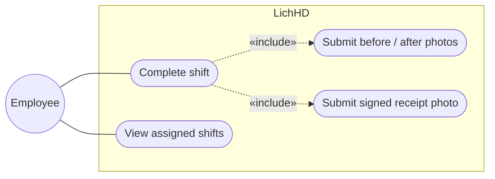

### Team Lead

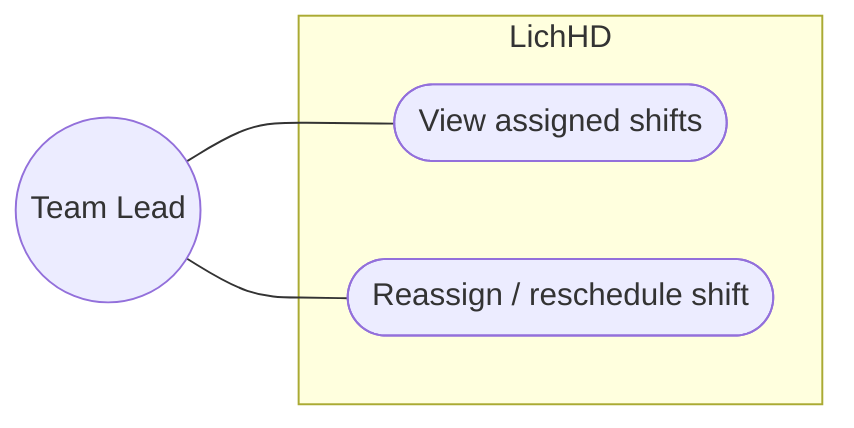

### Manager

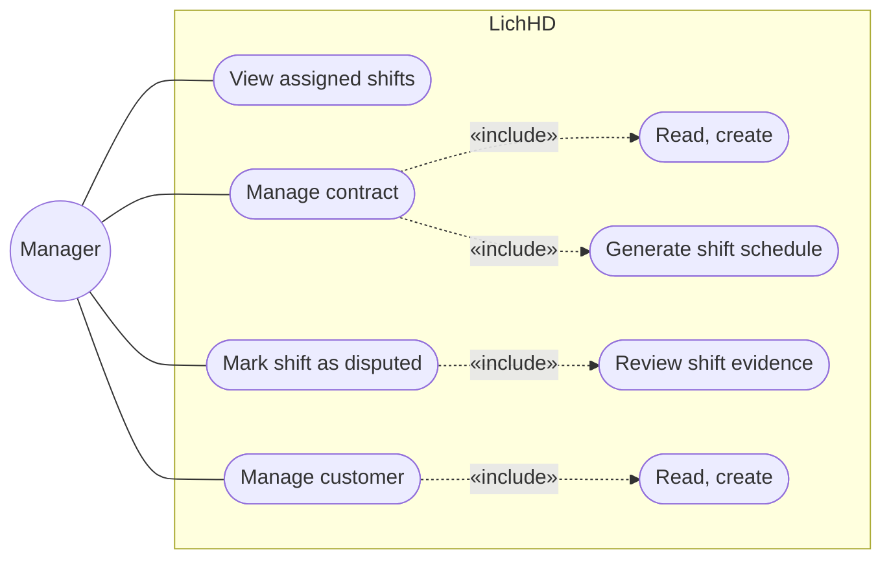

### Accountant

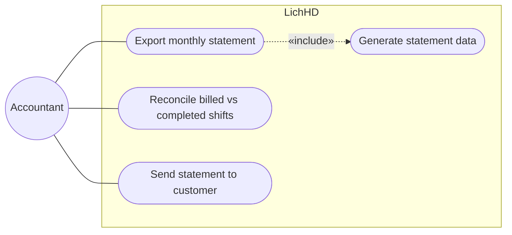

### Director

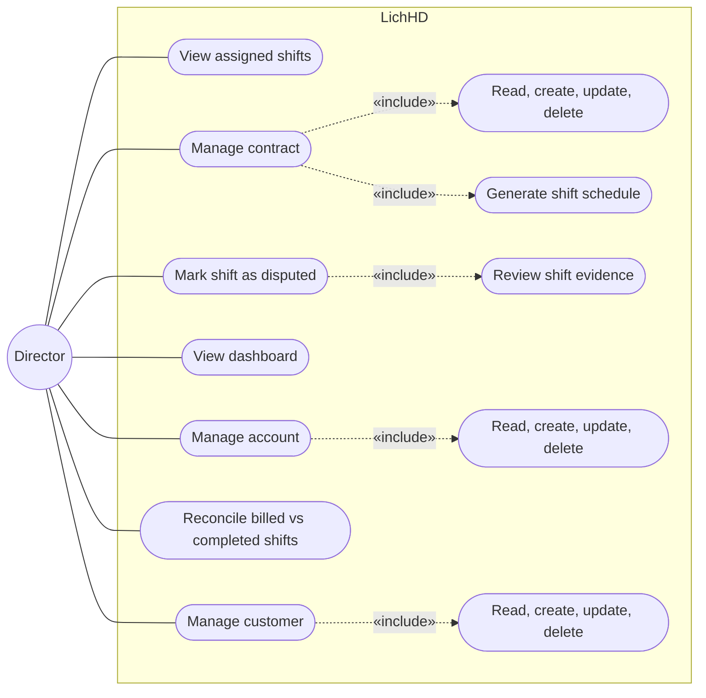

### Use Case Descriptions

| Use case | Actor | Description | Precondition |
|---|---|---|---|
| Complete shift | Employee | Submit before/after photos and the signed receipt photo for an assigned shift; system captures GPS and timestamp | Shift is scheduled and assigned to the employee |
| View assigned shifts | Employee, Team Lead, Manager, Director | View the shift list, scoped by role: Employee sees own shifts, Team Lead sees the team's, Manager sees their managed unit's, Director sees all | User is authenticated |
| Reassign / reschedule shift | Team Lead | Change the assignee or date of a shift when a conflict arises | Shift exists and is not yet completed |
| Manage contract | Manager, Director | Read, create, update or delete a contract and its sites/service items (customer, term, frequency, price). Director holds all four (read/create/update/delete); Manager holds read/create only | Customer and contract terms are agreed offline |
| Mark shift as disputed | Manager, Director | Manually record a shift as disputed, based on a customer complaint received by phone or in person | Customer has reported an issue outside the system |
| Export monthly statement | Accountant | Export the monthly statement for a contract as PDF | A statement's underlying data has been generated for the period |
| Send statement to customer | Accountant | Record that an exported statement was sent to the customer | Statement has been exported |
| Reconcile billed vs completed shifts | Accountant, Director | Compare what a statement bills against the shifts actually completed | A statement exists for the period |
| View dashboard | Director | View active/expiring/disputed contracts and projected revenue | User is authenticated as director |
| Manage account | Director | Read, create, update or delete an employee account, including its role and manager assignment | User is authenticated as director |
| Manage customer | Manager, Director | Read, create, update or delete a customer record (name, contact, address, segment). Director holds all four; Manager holds read/create only | Deleting requires no non-terminated contract references the customer |

---

## III: Class Diagram

Design-level: attributes are private with a type, methods are public with parameter and
return types. Trivial getters are omitted by convention — a field with no listed accessor
is read through the object that owns it, not exposed for direct mutation.

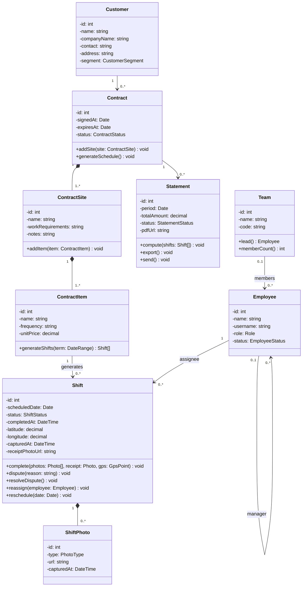
---

## IV: Activity Diagrams

### 1. Create contract with sites and service items 

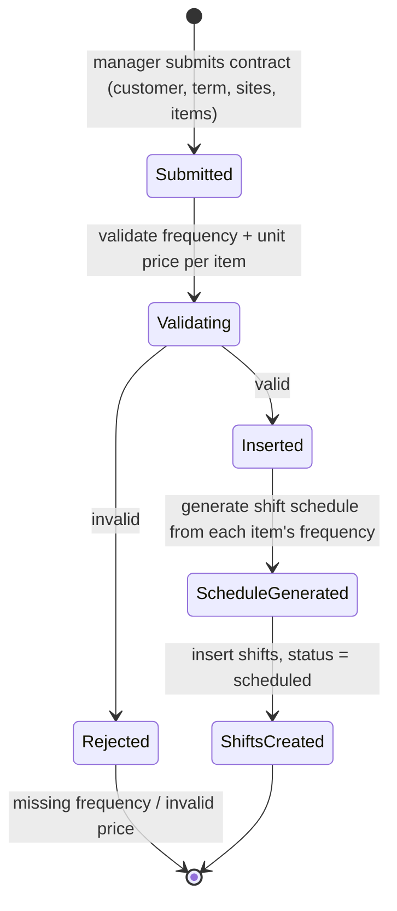

### 2. Weekly dispatch and field shift execution 

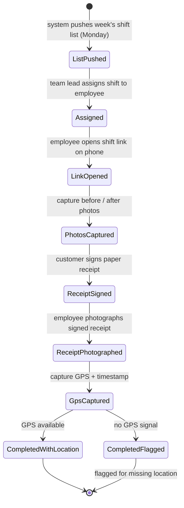

### 3. Dispute a shift 

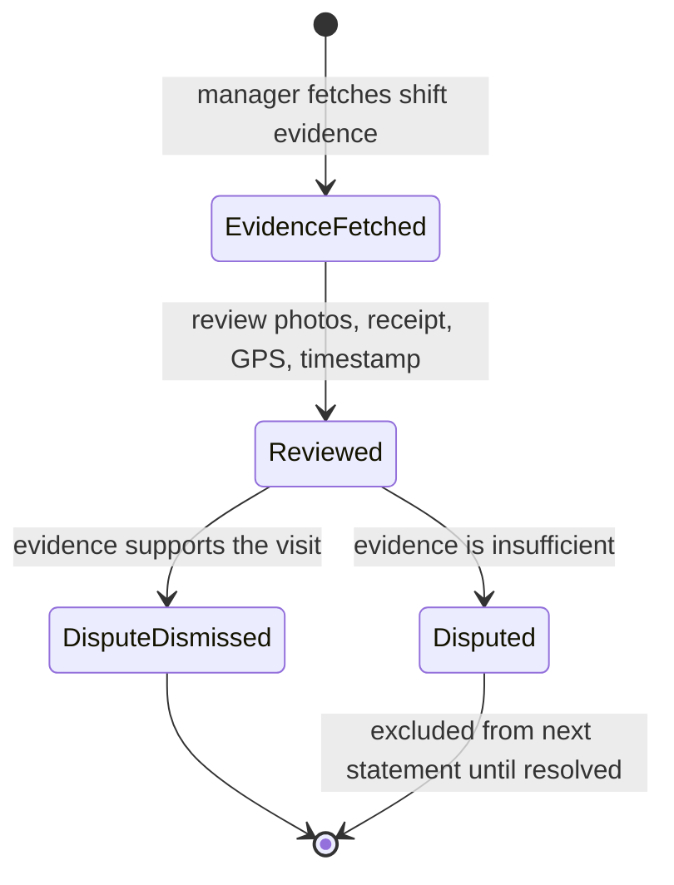

### 4. Alerts: expiring contract and missed shift 

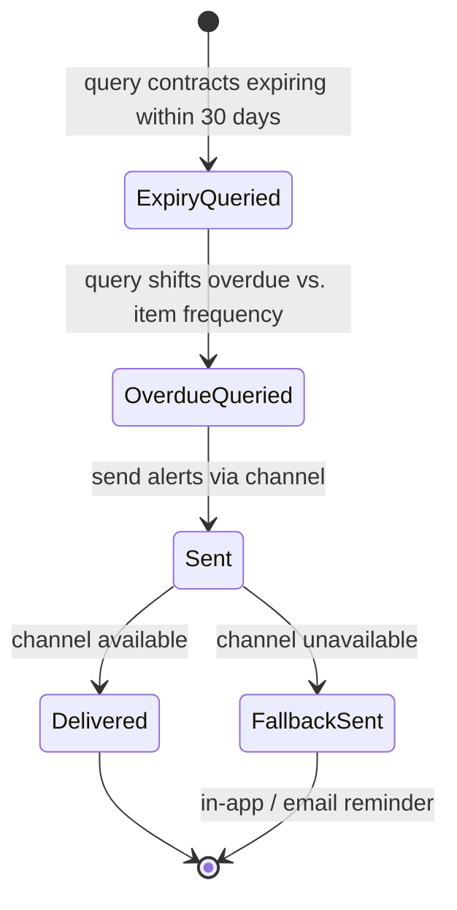

### 5. Month-end statement export 

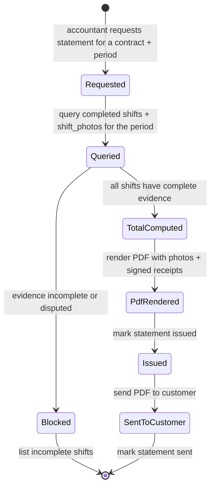

---

## V: Sequence Diagrams

### 1. Create contract with sites and service items

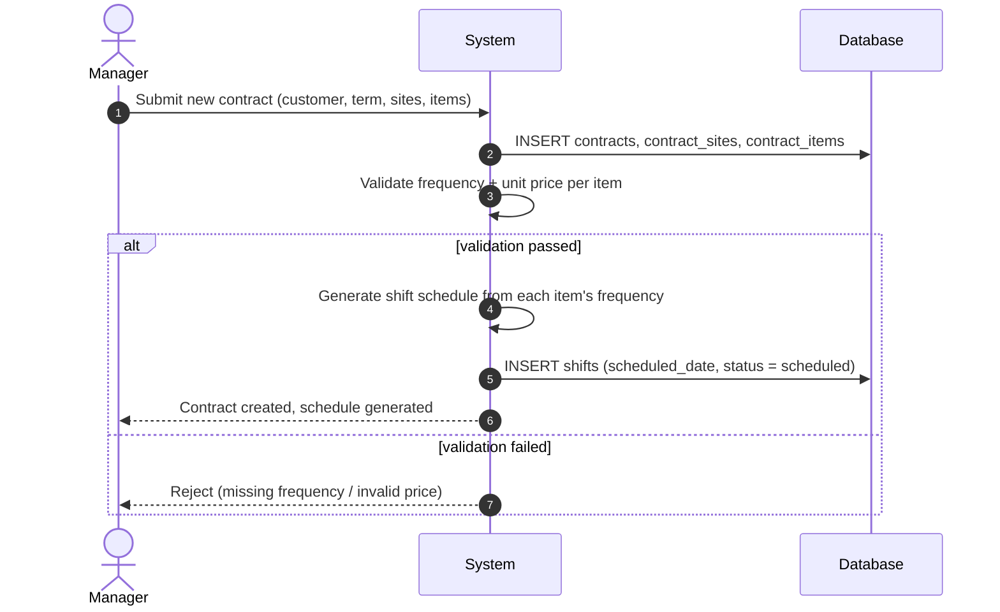

### 2. Weekly dispatch and field shift execution

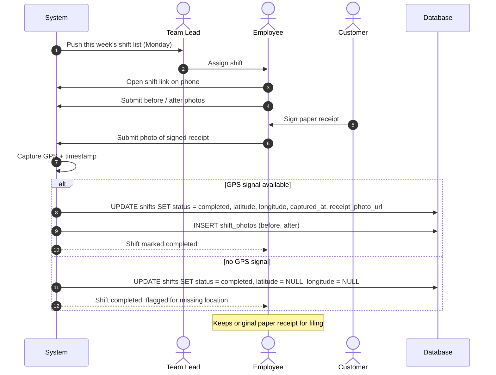

### 3. Dispute a shift

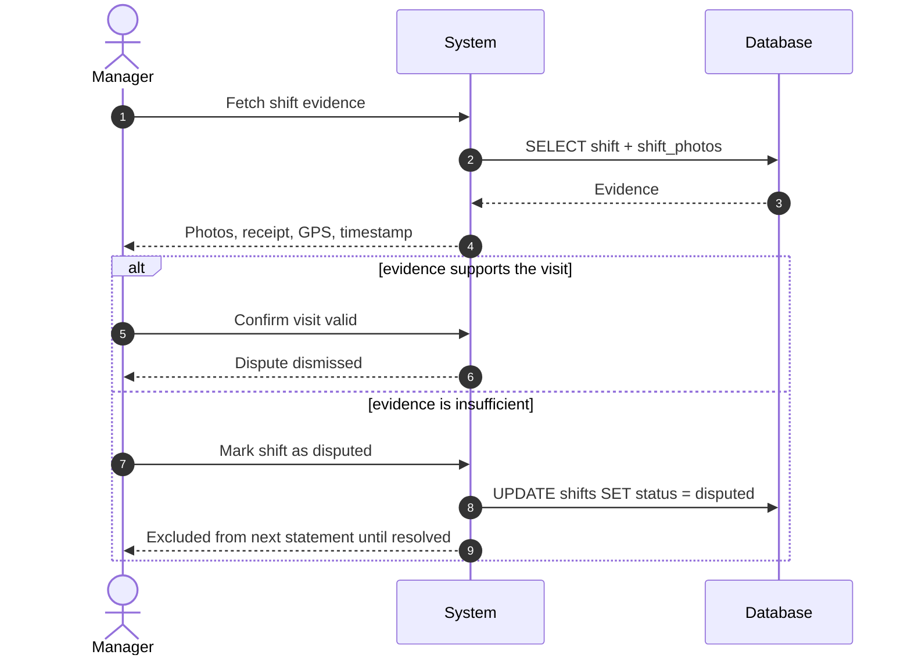

### 4. Alerts: expiring contract and missed shift

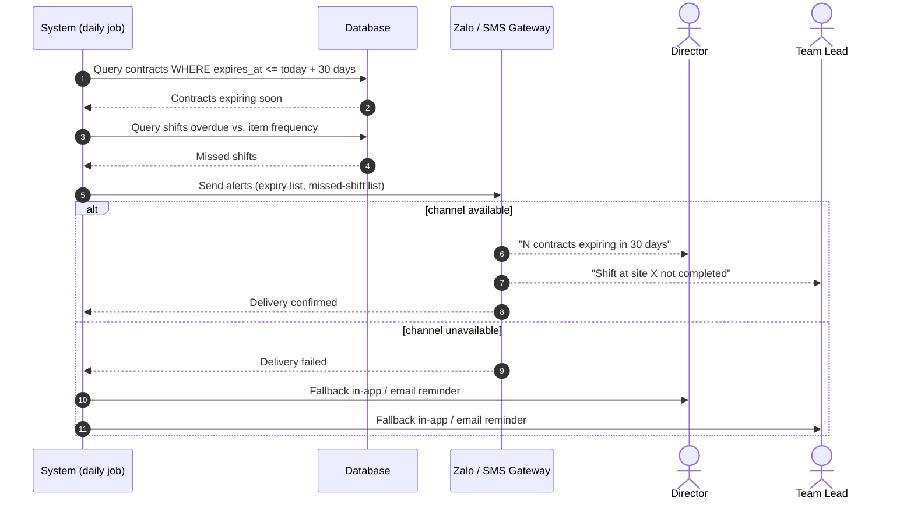

### 5. Month-end statement export 

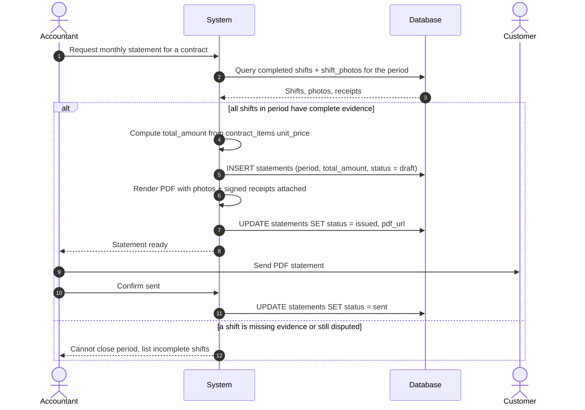

---

## VI: System Design

Subsystem decomposition, deployment, persistent data, concurrency, external integrations:
[`04-architecture.md`](04-architecture.md).

---
