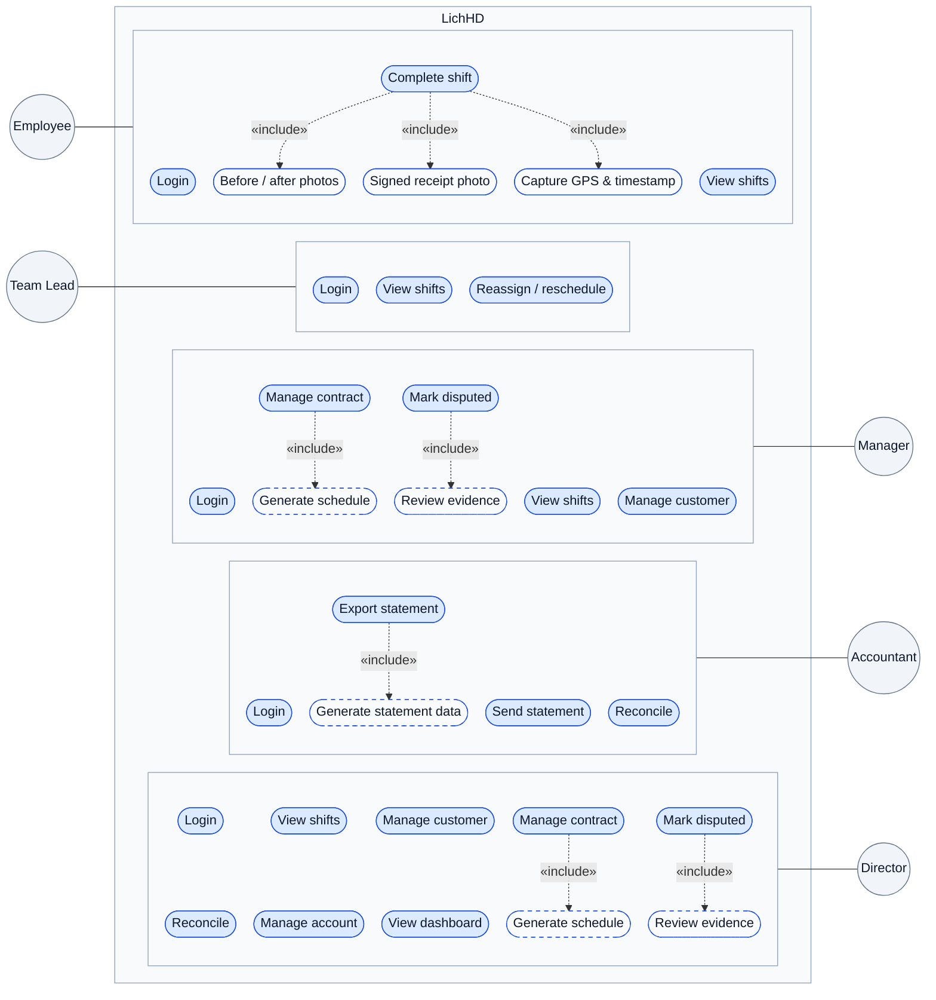
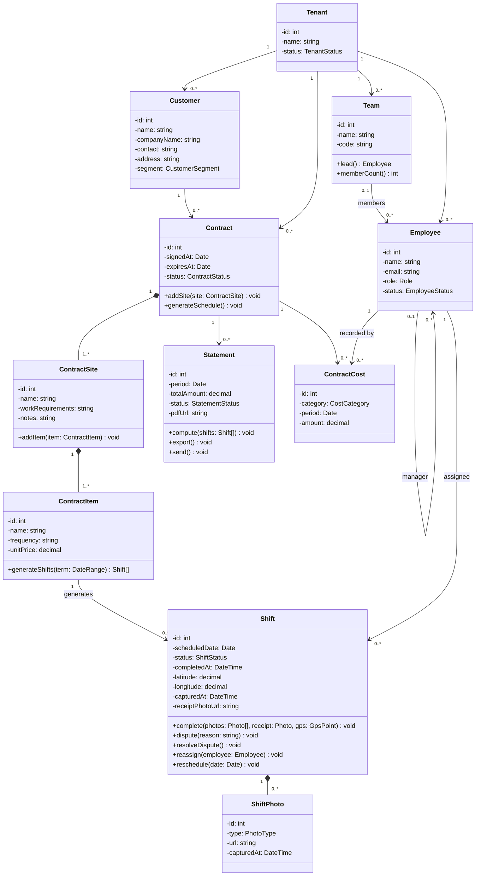
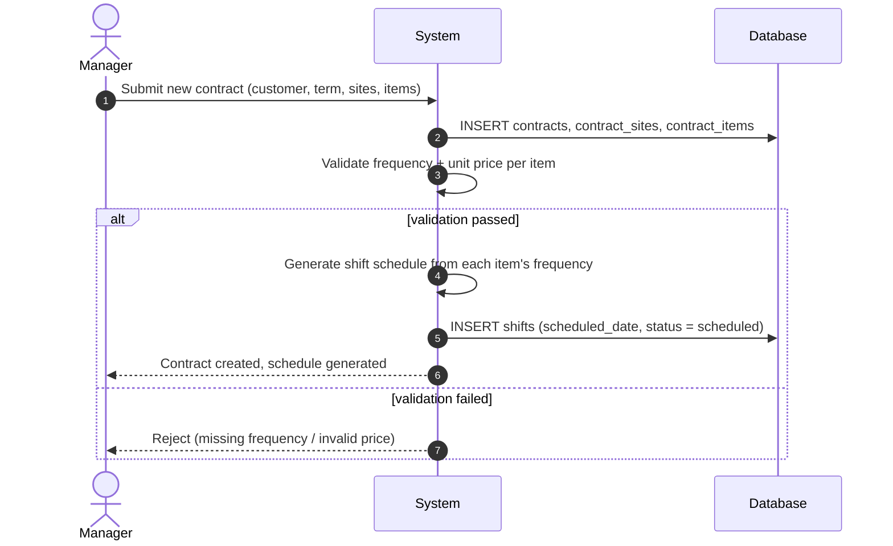
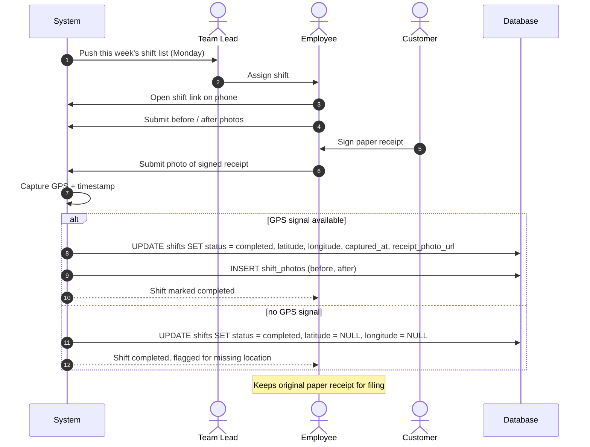
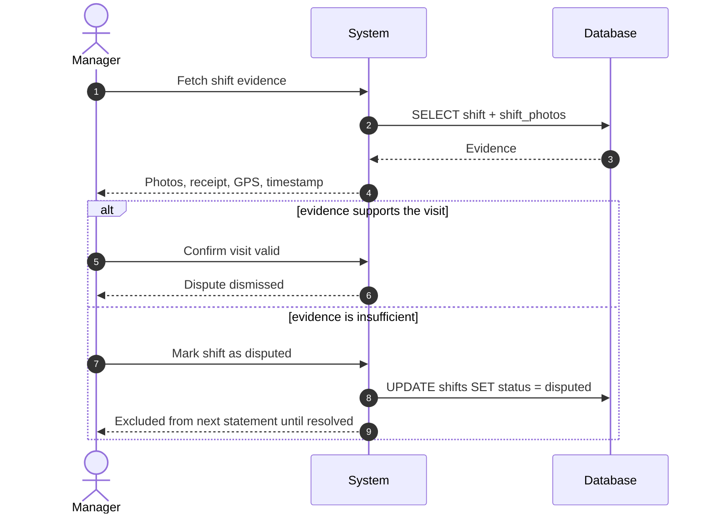
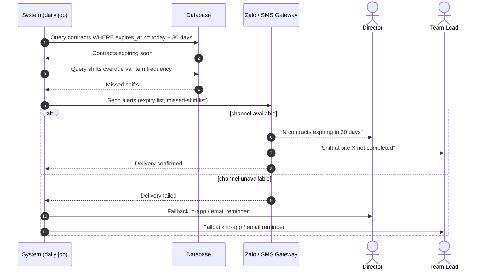
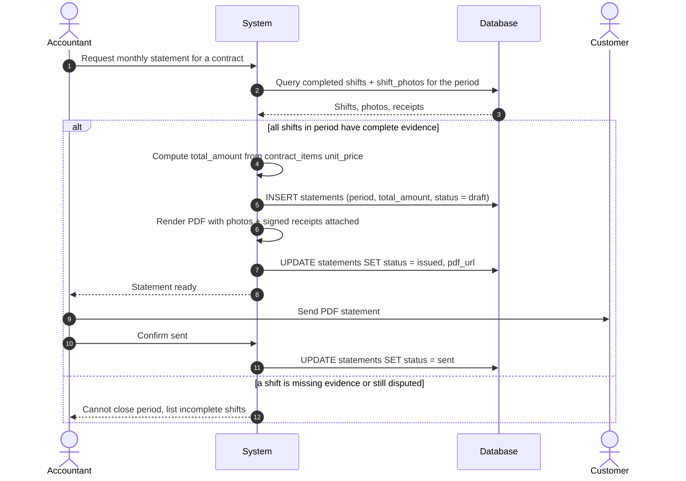

# LichHD — Design Analysis

## I: Requirements Analysis

### User Stories
| As a... | I want to... | So that... | Acceptance criteria |
|---|---|---|---|
| Team lead | know which shifts my team owes this week without chasing anyone for it | I can assign work the moment the week starts | The week's shift list reaches the team lead by Monday morning, scoped to their own team |
| Employee | leave proof that I actually did the visit | I'm protected if a customer disputes it later | A shift only reaches `completed` once before/after photos and the signed receipt are submitted, with location and time recorded |
| Manager | know a contract is about to expire before it does | I can start the renewal conversation in time | Alert fires once per contract, 30 days before expiry |
| Manager | know a visit was missed before the customer tells me | I can fix it before it becomes a complaint | Alert fires the moment a shift passes its due date uncompleted |
| Accountant | close a contract's month without reassembling evidence by hand | I can send the customer a statement in minutes, not days | One action produces the full PDF; a period with incomplete evidence is blocked and lists exactly which shifts are missing it |
| Director | see the state of every contract without asking staff for a status update | I catch a revenue or delivery problem myself, before it reaches me as a complaint | One view shows active, expiring and disputed contract counts plus projected revenue, current as of the underlying data |
| Manager | set up a new contract with its sites and service items in one pass | the shift schedule generates itself instead of me building a calendar by hand | Saving a contract with at least one site and one service item immediately produces the full set of scheduled shifts |
| Team lead | swap the assignee or date on a shift when someone's out or a site asks to move | the week still gets covered without waiting on a manager | Reassign/reschedule succeeds on any shift not yet completed and is rejected once it is |
| Manager | flag a shift as disputed the moment a customer complains | the complaint is tied to the actual evidence instead of living in someone's memory | A disputed shift keeps its photos/receipt/GPS and shows a reason, separate from a normal completed shift |
| Director | manage employee accounts, roles and manager assignment myself | access always matches who's actually on staff, without waiting on IT | Creating, editing or deactivating an employee takes effect on their next request, no redeploy needed |
| Director | see what's billed against what actually got done, per contract and period | I catch billing drift before it reaches the customer as a dispute | Reconciliation view lists shifts due by frequency next to shifts with complete evidence, per contract per period |
| Director | know which contracts are profitable and which are losing money, without waiting on the Accountant to close the month | I catch a bad contract before renewing it, and the dashboard never shows a gap | Profit/loss per contract, per month, is revenue from `contract_items` minus that month's recorded labor/materials/other costs — or, before the Accountant records them, an estimate clearly marked as such |
| Accountant | record labor and materials costs against a contract each month | the Director's profit/loss numbers are accurate, not guessed | Saving a cost entry (category, month, amount) updates that contract's profit/loss for that month immediately |
| Platform Admin | onboard a new operating company with its first Director account | a new customer of LichHD itself can start working without me touching the database | Creating a tenant immediately produces one active Director login, scoped to that tenant only |

### Functional Requirements

| # | Role | Requirement |
|---|---|---|
| FR1 | Manager, Director | Create a contract for a customer with a signed date and expiry date. Update/delete: Director only |
| FR2 | Manager, Director | Add one or more sites to a contract. Update/delete: Director only |
| FR3 | Manager, Director | Add service items to a site (name, frequency, unit price). Update/delete: Director only |
| FR4 | System | Auto-generate the shift schedule from each service item's frequency |
| FR5 | System | Auto-push the current week's shifts to each team lead |
| FR6 | Team Lead | Reassign or reschedule a shift when a conflict arises |
| FR7 | Employee | Open an assigned shift via a phone link, no app install |
| FR8 | Employee | Submit before/after photos for a shift |
| FR9 | Employee | Submit the signed paper receipt photo as evidence |
| FR10 | System | Capture GPS coordinates and timestamp automatically on submission |
| FR11 | Manager, Director | Mark a shift as disputed and record the reason |
| FR12 | System | Alert when a contract is within 30 days of expiry |
| FR13 | System | Alert when a shift has not been completed at the contract's required frequency |
| FR14 | System | Send alerts via Zalo (ZNS) and/or SMS |
| FR15 | Accountant | Generate a monthly statement per contract from its completed shifts |
| FR16 | Accountant | Export a statement as PDF with photos and receipts attached |
| FR17 | Director | View dashboard: active/expiring/disputed contract counts, projected revenue, late/missed shifts by month, on-time renewal rate, cancellation rate, new contracts signed by month, profit/loss trend — filterable by month |
| FR18 | Director | Read, create, update or delete employee accounts, including role and manager assignment |
| FR19 | Accountant | Send an exported statement to the customer, marking it sent |
| FR20 | Accountant, Director | View reconciliation: shifts due by frequency vs. shifts with complete evidence, per contract per period |
| FR21 | Manager, Director | Create or update a customer record (name, contact, address, segment). Delete: Director only, blocked while the customer holds a non-terminated contract |
| FR22 | Director, Accountant, Manager, Team Lead, Employee | Sign in with an email and password; the session carries the account's tenant, role and row scope for every later request |
| FR23 | Platform Admin | Create a new tenant (operating company) with its first Director account | 
| FR24 | Platform Admin | Suspend or reactivate a tenant; a suspended tenant's accounts can't sign in |
| FR25 | Platform Admin | View platform dashboard: tenant counts by status, recent onboarding activity, tenant growth trend |
| FR26 | Accountant | Record or update a contract's monthly cost (category: labor, materials, other) |
| FR27 | Director, Accountant | View profit/loss per contract per month: revenue from `contract_items` minus that month's recorded or estimated cost |
| FR28 | System | Estimate a contract's month cost when the Accountant hasn't recorded it yet — trailing 3-month average of that contract's own recorded costs, or the tenant's average cost-to-revenue ratio if the contract has no recorded cost history — so FR17/FR27 never show a gap for an unclosed month |

### Non-Functional Requirements

| # | Category | Requirement |
|---|---|---|
| NFR1 | Performance | Field pages (photo capture) must load on weak 3G/4G connections at job sites |
| NFR2 | Integrity | Evidence data (photos, GPS, timestamp) is non-editable once captured |
| NFR3 | Security | Role-based access control: director, accountant, manager, team lead, employee |
| NFR4 | Retention | Photos and signed receipts retained at least 12 months |
| NFR5 | Portability | Statements exportable as PDF; raw data exportable as CSV/Excel |
| NFR6 | Scalability | Multi-tenant deployment — one shared deployment serves many operating companies (tenants); a tenant's data is never readable or writable by another tenant |
| NFR7 | Usability | No native app install; access via a shared web link on any phone |

---

## II: Use Cases

---
## III: Class Diagram

Design-level: attributes are private with a type, methods are public with parameter and
return types. Trivial getters are omitted by convention — a field with no listed accessor
is read through the object that owns it, not exposed for direct mutation.

---

## IV: Sequence Diagrams

### 1. Create contract with sites and service items

### 2. Weekly dispatch and field shift execution

### 3. Dispute a shift

### 4. Alerts: expiring contract and missed shift

### 5. Month-end statement export 

---

## V: System Design

Subsystem decomposition, deployment, persistent data, concurrency, external integrations:
[`04-architecture.md`](04-architecture.md).

---
