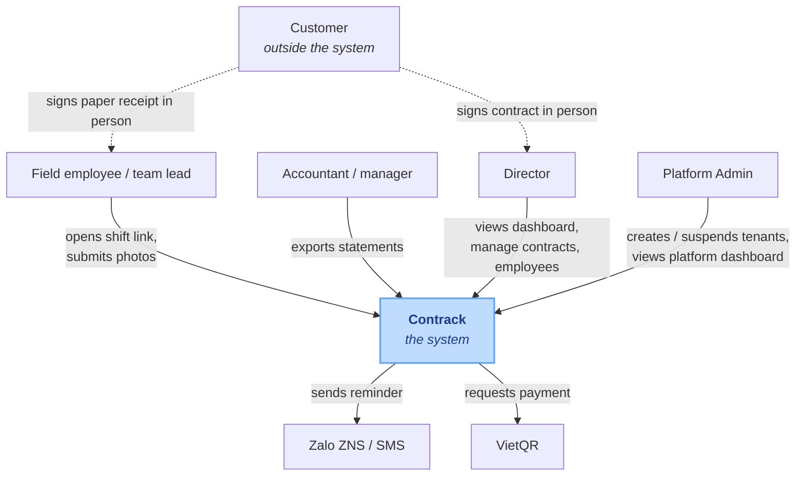
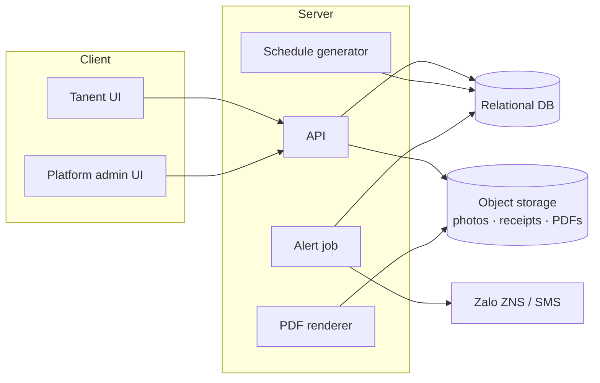
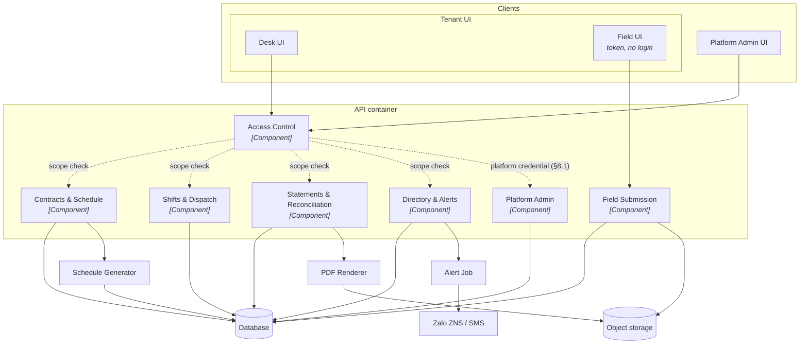
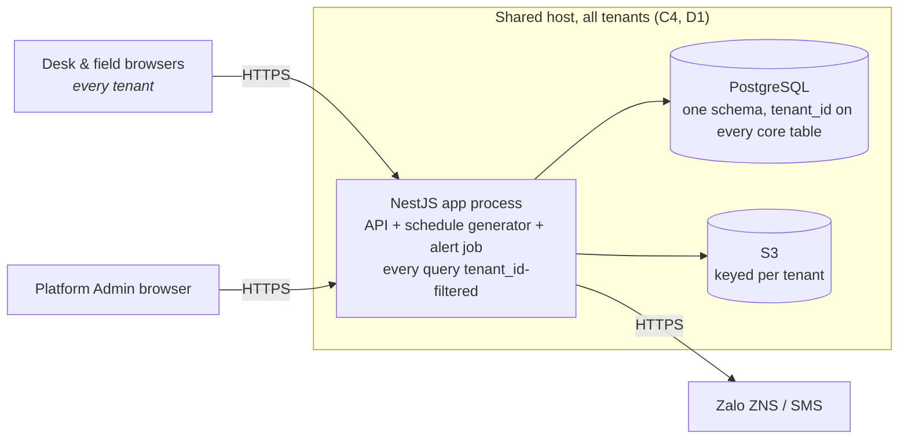

# Contrack — Architecture (arc42)

## 1. Introduction and Goals

### 1.1 Requirements overview

Contrack manages recurring service contracts end to end: a contract is entered once,
shifts are generated from each service item's frequency, field staff submit
evidence per shift from a phone, and monthly statements are computed from
completed shifts. Full scope and personas: [`01-requirements-analysis.md`](01-requirements-analysis.md#overview).

### 1.2 Quality goals

| # | Quality goal | Why it matters here | Priority |
|---|---|---|---|
| G1 | **Evidence integrity** | A statement, and a dispute's resolution, both rest on evidence nobody — including Contrack's own staff — can alter after capture (NFR2) | 1 |
| G2 | **Field usability with no login** | The one workflow reached with no training and the worst network is the one a new hire executes on day one (NFR7, NFR1) | 1 |
| G3 | **Correct row-scoped access** | Five roles share one system; a manager seeing another manager's team, or an employee seeing another's shift, is a trust failure, not a bug report (NFR3) | 1 |
| G4 | **Correct tenant isolation** | One shared deployment serves many operating companies (tenants); one tenant reading or writing another's row is a trust failure worse than a role/scope bug — it leaks between paying customers of Contrack itself (NFR6) | 1 |
| G5 | **Evidence retained and exportable** | Reconciliation and disputes reach back months; a photo or a statement that cannot be produced later defeats the point of capturing it (NFR4, NFR5) | 2 |

G1–G4 are architecture-defining: a design choice that trades one of them away
needs a decision recorded in §9, not a silent shortcut.

### 1.3 Stakeholders

| Role | Concern |
|---|---|
| Director | Portfolio visibility — revenue, expiring contracts, disputes — without chasing staff |
| Manager | Dispatch shifts and resolve disputes without re-keying what the field already reported |
| Accountant | A statement that closes only when every shift in it is backed by evidence |
| Team lead | See and reassign the team's own shifts, nothing wider |
| Employee | Submit a shift's evidence from a personal phone in one visit, no install, no password |
| Platform Admin | Onboard a new tenant company in one step; suspend one without touching any other tenant's data |
| Customer *(outside the system, §3.1)* | Evidence trustworthy enough to settle a dispute without a site revisit |

---

## 2. Architecture Constraints

| # | Constraint | Type | Implication |
|---|---|---|---|
| C1 | Budget and team are scoped to the 5 Must-have modules only | Organisational | Should/Could-have items (VietQR, ERP integration) are named but not designed for here |
| C2 | No ERP/accounting integration in the MVP | Organisational | The accountant enters costs manually; no accounting-system interface is designed |
| C3 | Must run [`04-schema.sql`](04-schema.sql) unmodified | Technical | Rules out an engine without ANSI SQL, identity columns and `NUMERIC` |
| C4 | Many 10–80 staff operator companies share one Contrack deployment | Business | Multi-tenant from day one; drives D1 |
| C5 | No native app install (NFR7) | Technical | Browser-only client; field access cannot depend on app-store distribution |
| C6 | Stack is fixed: NestJS (API), ReactJS (client), PostgreSQL (database), S3 (object storage) | Organisational | §5.1 states the chosen stack; C3's ANSI SQL / `NUMERIC` requirement, resolved as PostgreSQL |
| C7 | Design phase only — no implementation phase follows this plan | Organisational | §7's deployment view describes an intended shape, not a provisioned environment; the backend skeleton under `backend/` (NestJS + TypeORM, [`06-repo-layout.md`](06-repo-layout.md)) is the one exception already underway |

---

## 3. Context and Scope

### 3.1 Business context (C4 - level 1)

### 3.2 External interfaces

| Interface | Direction | Protocol | Contract owner | Failure mode |
|---|---|---|---|---|
| Zalo ZNS / SMS | out | provider HTTP API | Alert job | delivery failure falls back to in-app (§8.3) |
| VietQR | out | provider HTTP API | Billing (Could-have) | not built in MVP |
| Object storage | both | S3 API | API server | upload retried; an unresolvable upload blocks shift completion |

---

## 4. Solution Strategy

| Quality goal | Strategy | Where |
|---|---|---|
| G1 evidence integrity | Write-once evidence, enforced in the API rather than by database permission | D7, §8.2 |
| G2 field usability | Per-shift signed token, no login; the field page is the lightest page in the system | D3, §8.4 |
| G3 row-scoped access | One authorisation model — role plus own/team/unit/all scope, evaluated inside a tenant — reused by every screen and endpoint | §8.1, `05-api.yaml` §8 |
| G4 tenant isolation | `tenant_id` on every core table (`04-schema.sql`); every repository method takes the caller's `tenant_id` as a mandatory first filter, not an optional one | D1, §8.1 |
| G5 retention and export | Object storage with a lifecycle rule (§8.2); PDF and CSV/Excel export stated as a technology criterion (§5.1) | D2 |

**The one-sentence strategy:** *enforce every irreversible fact — captured evidence,
a closed statement, which tenant a row belongs to — once at the API boundary, and
keep the one path with no login and the worst network the lightest thing in the
system.*

---

## 5. Building Block View

### 5.1 Containers (C4 - level 2)

| Layer | Choice | Meets |
|---|---|---|
| API | NestJS (Node.js) | Server-side PDF rendering with embedded images (FR11); scheduled job execution (FR22, FR25, FR26) via Nest's scheduler |
| Client | ReactJS | Responsive web, no native app install (NFR7, FR16); desk and field UI as one SPA (§5.1 client subgraph) |
| Database | PostgreSQL | Runs [`04-schema.sql`](04-schema.sql) unmodified — ANSI SQL, identity columns, `NUMERIC` (C3) |
| Object storage | S3 | S3 object storage client (§9 D2) |

### 5.2 Components (C4 - level 3)

C4 Level 3, zoomed into the one container worth decomposing — the API groups
five responsibilities that `05-api.yaml` already separates by section, and
`SCREEN_ROLES` in [`prototype.html`](ui/prototype.html) depends on the same split.
`Access Control` is cross-cutting (§8.1): every other component calls it, not the
reverse.

`Field Submission` is the one component `Access Control` does not gate — D3's
per-shift token is its own authorisation, resolved inside the component rather
than by the shared scope check.

---

## 6. Runtime View

The five scenarios, each with its failure branch, are diagrammed in
[sequence-diagram.md](08-sequence-diagram.md): [create
contract](08-sequence-diagram.md#3-create-contract-with-sites-and-service-items),
[field submission](08-sequence-diagram.md#4-weekly-dispatch-and-field-shift-execution),
[dispute](08-sequence-diagram.md#5-dispute-a-shift),
[alerts](08-sequence-diagram.md#6-alerts-expiring-contract-and-missed-shift),
[month-end close](08-sequence-diagram.md#7-month-end-statement-export).
Login and Access Control are diagrams
[1](08-sequence-diagram.md#1-login) and
[2](08-sequence-diagram.md#2-access-control--a-protected-request).

---

## 7. Deployment View

A target shape stated for estimating cost and operational surface, not a
provisioned environment — C7 keeps this a shape rather than a provisioned
environment, but C6 now fixes the products named below.

| Environment | Node | Runs | Note |
|---|---|---|---|
| Production, shared | App host | NestJS API, schedule generator, alert job | One shared host serves every tenant (C4, D1); scales by adding hosts behind a load balancer, not one host per tenant |
| Production, shared | Database | PostgreSQL, the relational model in [`04-schema.sql`](04-schema.sql), one schema | Every core table's `tenant_id` is the isolation boundary — no per-tenant schema or database |
| Production, shared | Object storage | S3 bucket | Object keys are prefixed by `tenant_id`; a bucket policy denies cross-prefix reads |

---

## 8. Crosscutting Concepts

### 8.1 Authorisation

Three distinct mechanisms, checked in order:

- **Tenant** is the outermost boundary and is checked first, before role or row scope even loads:
  every desk credential's token carries `tenant_id`, and every repository method takes it as a
  mandatory filter — there is no code path that queries `contracts`, `shifts`, `employees` or any
  other core table without one. A row belonging to a different tenant is not a `403`, it does not
  exist — same non-disclosure rule as §8's `404` for out-of-scope rows, one level up.
- **Desk roles**, inside that tenant, authenticate with `employees.email` / `password_hash`
  (unique globally, not per tenant — `04-schema.sql`'s `uq_employees_email`; login resolves the
  tenant from the matched employee, so the client never sends a `tenant_id`) and are authorised
  by role plus a row scope — own, team, managed unit, or all. The full matrix is in `05-api.yaml` §8.
- **Field access** carries a per-shift token (D3) and can reach exactly one shift; the token's
  `shift_id` already pins a `tenant_id` transitively, so no separate tenant check is needed there.

**Platform Admin** is a fourth credential, resolved by the same Access Control component (§5.2) on the
same shared server as every desk and field request: `platform_admins` is not `employees`, carries no
`tenant_id`, and its credential can only reach `05-api.yaml`'s Platform tag (login, dashboard, create
tenant, suspend/reactivate tenant) — it cannot present a token that resolves to any tenant's contracts,
shifts or statements. Its dashboard (FR21) is bound by the same rule: the aggregate it reads is computed
from the `tenants` table alone and never joins into any tenant-scoped table. There is no role that spans
both worlds — one component resolves both credential spaces, but the spaces themselves stay separate.

The two desk scopes rest on different columns: `team` resolves through `employees.team_id`, so a team
lead sees the shifts of the team they belong to; `unit` resolves through `employees.manager_id`, so a
manager sees everyone reporting to them. A director sees everything **inside their own tenant** — `all`
scope is still tenant-filtered, never cross-tenant. Desk staff have a `manager_id`
but no `team_id`, which is why they hold `unit` or `all` scope and never `team` — the small-company
target has field teams, not departments.

### 8.2 Evidence integrity and retention

Photos, GPS and timestamps are written once (D7). Server time is authoritative for `captured_at`; the
client clock is not trusted. Objects are retained at least 12 months (NFR4) via a bucket lifecycle
rule, which must outlive the statement that cites them.

### 8.3 Alert delivery and fallback

Channel reliability is a medium risk and requires a
fallback. Delivery is attempted on the configured channel (Zalo ZNS, SMS, or both); on failure the
alert is recorded in-app so it is visible on the Cảnh báo screen rather than silently dropped.

### 8.4 Weak-network behaviour

NFR1 requires the field page to work on 3G/4G at job sites and in basements. The design commitment is
that the field page is the lightest page in the system and images are downscaled in the browser
before upload. The remaining mechanics — resumable upload, offline queue — are open (§11 R4).

---

## 9. Architecture Decisions

| # | Decision | Context and options | Consequence | Revisit when |
|---|---|---|---|---|
| D1 | **Multi-tenant, shared schema, `tenant_id` row-level isolation** | Contrack is sold to many operating companies. Alternatives: a database per tenant, or a schema per tenant. Both isolate more strongly but multiply migration and backup work per tenant at a scale where that cost dominates; shared-schema with a mandatory `tenant_id` filter is the standard SaaS default at this profile. | Every core table carries `tenant_id` (`04-schema.sql`); every repository method requires it, not accepts it optionally. `employees.email` is unique globally (login resolves the tenant from the matched employee), while `teams.code` stays unique per tenant. A leak is a code-review-catchable bug (missing filter), not a schema question. (NFR6, G4) | Tenant count or per-tenant data volume grows enough that noisy-neighbor query load, not isolation, becomes the bottleneck — revisit toward schema-per-tenant or per-tenant read replicas then. |
| D2 | **Evidence in S3 object storage** | Alternatives: blobs in the database, or a directory on the app server. Photos are the bulk of the data and are retained ≥ 12 months. | DB stays small and easy to back up; retention (NFR4) becomes a bucket lifecycle rule; the app talks to S3 through an `ObjectStorageClient` abstraction ([`06-repo-layout.md`](06-repo-layout.md)) rather than the filesystem. | Cost at scale, or a requirement to self-host, makes a self-managed S3-compatible service (e.g. MinIO) worth revisiting. |
| D3 | **Per-shift signed token for field access** | FR16 and NFR7 require a link that opens and works on a phone with no install. Alternatives: employee login, or a magic link per employee. | No password at a job site. The token names one shift, expires, and authorises only that shift's submission. Whoever holds the link can submit — acceptable because the evidence itself carries GPS and time. | A forwarded link is found to have been used by someone other than the assignee, or the business needs to know *who* submitted rather than only *that* the assigned shift was submitted. |
| D4 | **Photographed paper receipt, not on-screen signature** | The customer already signs paper today and the original is filed. | No signature-capture component; the evidence is an image like any other. The paper original remains the legal artifact. | A customer disputes a photographed receipt as illegible or fraudulent often enough that an on-screen signature becomes worth building. |
| D5 | **Customer is not a system actor** | The customer signs in person and complains by phone. | No customer login, no portal, no notification to customers in MVP. A manager records disputes manually (FR8). | Customers ask for self-service visibility into schedule or statements — a Should/Could-have already named in the PRD roadmap. |
| D6 | **Statements exclude disputed and evidence-less shifts** | A period cannot close while a shift is unresolved. | The accountant sees a blocked close with the offending shifts listed rather than an understated total. (FR10, seq. 5) | A customer needs a statement issued before every shift's dispute is resolved, which would require partial statements — not currently a use case. |
| D7 | **Evidence is write-once** | NFR2. Enforced in the API, not by database permissions. | A completed shift rejects a second submission; evidence columns and `shift_photos` rows are never updated after insert. Deletion follows contract cascade only. | A legitimate need for correction surfaces (wrong photo attached to the wrong shift) with no path but re-doing the whole shift. |
| D8 | **`shifts.assignee_id` is nullable** | FR22 generates a shift's full schedule at contract creation, before anyone is assigned; assignment is a separate act (FR15, Team Lead, dispatch). Alternative: require an assignee at generation time — rejected, nothing in FR5–FR7/FR22 names who that would be. | A generated shift starts unassigned; `GET /shifts` and the dispatch view must handle `assignee_id: null` as a normal, expected state, not an error. | Dispatch design lands with a default-assignee rule (e.g. site's team lead) that makes an unassigned shift avoidable — revisit whether NOT NULL becomes enforceable again. |

---

## 10. Quality Requirements

Each NFR restated as a concrete scenario with a pass/fail measure, so acceptance is
checkable rather than a matter of opinion. `02-requirements-analysis.md` states the NFRs;
this table states how each is tested.

| # | Source NFR | Scenario | Required response | Measure |
|---|---|---|---|---|
| QR1 | NFR1 | Employee opens the field page over a throttled 3G connection at a basement job site | Page becomes usable — photo capture available | Time to interactive ≤ 5 s on a 3G profile (~400 kbps, 400 ms RTT); page payload excluding photos ≤ 200 KB |
| QR2 | NFR2 | A completed shift is submitted again with the same or different evidence | Second submission is rejected; original evidence is untouched | `409 shift.already_completed`; no row in `shifts` or `shift_photos` for that shift changes after first completion |
| QR3 | NFR3 | An account of role X requests a resource or row outside its role/scope in `05-api.yaml` §8 | Request is refused | `403` for a wrong role, `404` for a right role but wrong scope — zero exceptions found against the matrix |
| QR4 | NFR4 | 12 months pass after a shift's evidence is captured | Photos remain retrievable | Bucket lifecycle rule confirms no object is deleted before `captured_at + 12 months` |
| QR5 | NFR5 | Accountant exports a statement, then exports contract data | Both formats open in their target tool | PDF renders with photos and receipt embedded; CSV/Excel opens with every `contract_items` and `shifts` column named in `04-schema.sql` |
| QR6 | NFR6 | An authenticated account of tenant A requests, by id, a resource belonging to tenant B (contract, shift, employee, statement, customer) | Request is refused exactly like an out-of-scope row | `404` for every core resource type, zero exceptions — automated per-endpoint sweep with two seeded tenants |
| QR7 | NFR7 | A newly hired field employee receives a shift link on a personal phone, no prior app install | Employee completes the shift | Zero installs, zero passwords entered, shift reaches `completed` |

QR4 is measurable now that the stack (R1) is fixed — an S3 bucket lifecycle rule. QR1
still cannot be measured until R4 (weak-network mechanics) in §11 is resolved — it is
stated now so the target is fixed before the mechanism is chosen.

---

## 11. Risks and Technical Debt

| # | Risk | Impact | Likelihood | Mitigation |
|---|---|---|---|---|
| R1 | **Resolved.** Stack fixed: NestJS, ReactJS, PostgreSQL, S3 (C6, §5.1). | — | — | Backend skeleton already scaffolded under `backend/` ([`06-repo-layout.md`](06-repo-layout.md)) |
| R2 | **Resolved.** `contract_items.frequency` (`VARCHAR(100)` free text) is split into `frequency_count` (integer) and `frequency_unit_id` (FK to a `frequency_units` lookup) — both structured, so FR22's generator schedules off them directly with no parsing. A separate `frequency_rule` stays free text for the exact agreed placement when one exists (e.g. "thứ 7 hàng tuần"); real contracts negotiate placements too varied to fix into a grammar, so it is kept as a staff-facing note only and is never parsed — a director moves individual shifts by hand to match it. | — | — | Implemented in [`04-schema.sql`](04-schema.sql) |
| R3 | **Schedule generation timing undecided** — eager on contract creation, or a rolling job that keeps a horizon filled | Medium — affects term-change cost and initial contract-creation latency | Medium | Default to eager, as seq. 1 implies; revisit if term changes prove frequent |
| R4 | **Weak-network mechanics undecided** — resumable upload, offline queue, retry policy | High — QR1 cannot be verified without this | Medium | Design before the field page is built; §8.4 states the goal only |
| R5 | **ZNS sender identity, template registration and fallback order undecided** | Medium — blocks FR27; ZNS templates need registration lead time | Medium | Register ZNS templates early — an external dependency, independent of the stack decision |
| R6 | **Token lifetime and reissue policy for D3 undecided** | Low–Medium — too short breaks a delayed shift, too long keeps a forwarded link live | Low | Pick a conservative default; revisit after pilot feedback |
| R7 | **A single missing `tenant_id` filter in one repository method leaks one tenant's rows to another** | High — a cross-tenant data leak is a trust failure with every tenant at once, not one customer | Medium until enforced structurally | Make the filter structural, not a per-query habit — a base repository class or ORM global scope that every query inherits automatically; QR6's sweep is the regression test |
| R8 | **Noisy-neighbor load: one large-chain tenant's query volume degrades another tenant's response time** | Medium — grows with tenant count and size spread (C4) | Low at MVP tenant counts | Index every `tenant_id` column (done, `04-schema.sql`); revisit connection pooling / read replicas if a pilot tenant's chain scale shows contention |

**Accepted for this design phase:** no customer-facing portal (D5), no on-screen
signature (D4), no ERP integration (C2) — each is a named non-goal, not an
oversight.

---

## 12. Glossary

| Term | Definition |
|---|---|
| Tenant | One operating company using Contrack (`tenants`) — the isolation boundary. Not to be confused with `Customer`, which is a tenant's own client |
| Platform Admin | Contrack's own operator identity (`platform_admins`), outside every tenant; creates and suspends `tenants` rows and nothing else |
| Contract | The recurring service agreement between a tenant and one of its customer companies; the entity sites, items, shifts and statements derive from |
| Contract site | One physical location covered by a contract |
| Contract item | One billable service line at a site, carrying a frequency and unit price |
| Shift | One scheduled occurrence of a contract item, generated from its frequency |
| Evidence | Before/after photos, GPS, timestamp and photographed signed receipt captured at a shift |
| Statement | The monthly PDF billing document computed from a period's completed shifts |
| Field token | The per-shift signed link that authorises evidence submission with no login (D3) |
| Row scope | The own/team/unit/all boundary that narrows which rows a role's operation applies to |
| Team | An explicit group of field staff (`teams`); membership is `employees.team_id`, separate from the reporting line `manager_id` |
| Dispute | A customer complaint recorded by staff on the customer's behalf; excludes the shift from the next statement until resolved |
| Reconciliation | The accountant's view comparing shifts due by frequency against shifts with complete evidence |

---

