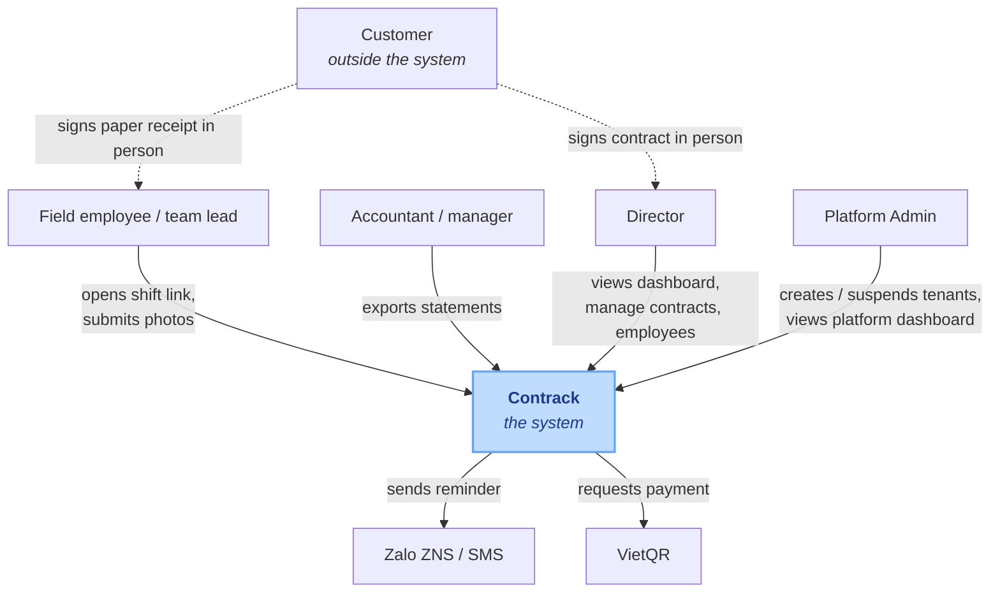
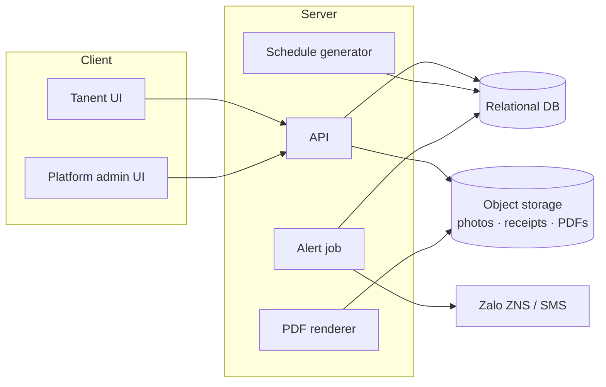
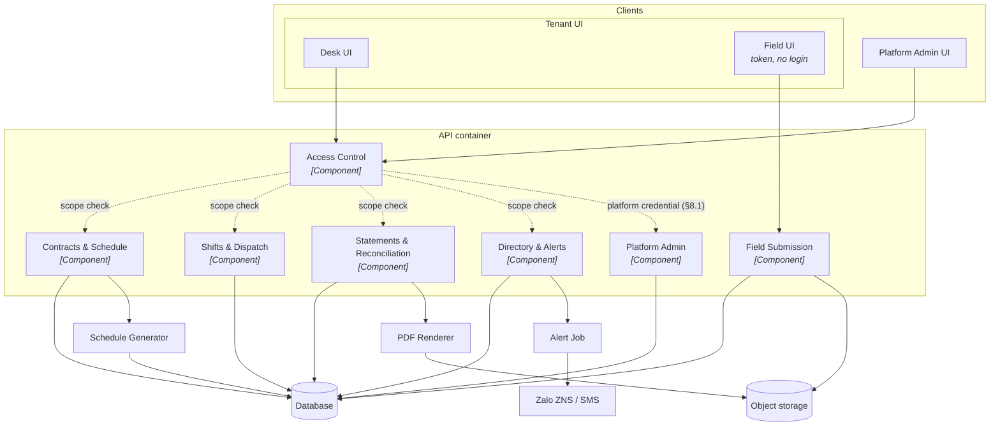
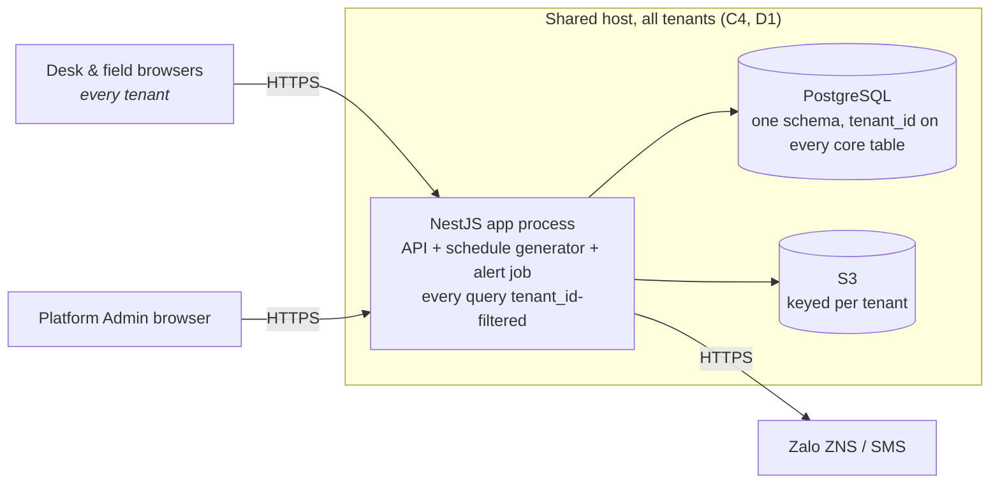

# Contrack — Architecture (arc42)

## 1. Introduction and Goals

### 1.1 Requirements overview

Contrack manages recurring service contracts end to end: a contract is entered once,
shifts are generated from each service item's frequency, field staff submit
evidence per shift from a phone, and monthly statements are computed from
completed shifts. Full scope and personas: [`01-requirements-analysis.md`](01-requirements-analysis.md#overview).

### 1.2 Quality goals

| # | Quality goal | Why it matters here | Priority |
|---|---|---|---|
| G1 | **Evidence integrity** | A statement, and a dispute's resolution, both rest on evidence nobody — including Contrack's own staff — can alter after capture (NFR2) | 1 |
| G2 | **Field usability with no login** | The one workflow reached with no training and the worst network is the one a new hire executes on day one (NFR7, NFR1) | 1 |
| G3 | **Correct row-scoped access** | Five roles share one system; a manager seeing another manager's team, or an employee seeing another's shift, is a trust failure, not a bug report (NFR3) | 1 |
| G4 | **Correct tenant isolation** | One shared deployment serves many operating companies (tenants); one tenant reading or writing another's row is a trust failure worse than a role/scope bug — it leaks between paying customers of Contrack itself (NFR6) | 1 |
| G5 | **Evidence retained and exportable** | Reconciliation and disputes reach back months; a photo or a statement that cannot be produced later defeats the point of capturing it (NFR4, NFR5) | 2 |

G1–G4 are architecture-defining: a design choice that trades one of them away
needs a decision recorded in §9, not a silent shortcut.

### 1.3 Stakeholders

| Role | Concern |
|---|---|
| Director | Portfolio visibility — revenue, expiring contracts, disputes — without chasing staff |
| Manager | Dispatch shifts and resolve disputes without re-keying what the field already reported |
| Accountant | A statement that closes only when every shift in it is backed by evidence |
| Team lead | See and reassign the team's own shifts, nothing wider |
| Employee | Submit a shift's evidence from a personal phone in one visit, no install, no password |
| Platform Admin | Onboard a new tenant company in one step; suspend one without touching any other tenant's data |
| Customer *(outside the system, §3.1)* | Evidence trustworthy enough to settle a dispute without a site revisit |

---

## 2. Architecture Constraints

| # | Constraint | Type | Implication |
|---|---|---|---|
| C1 | Budget and team are scoped to the 5 Must-have modules only | Organisational | Should/Could-have items (VietQR, ERP integration) are named but not designed for here |
| C2 | No ERP/accounting integration in the MVP | Organisational | The accountant enters costs manually; no accounting-system interface is designed |
| C3 | Must run [`04-schema.sql`](04-schema.sql) unmodified | Technical | Rules out an engine without ANSI SQL, identity columns and `NUMERIC` |
| C4 | Many 10–80 staff operator companies share one Contrack deployment | Business | Multi-tenant from day one; drives D1 |
| C5 | No native app install (NFR7) | Technical | Browser-only client; field access cannot depend on app-store distribution |
| C6 | Stack is fixed: NestJS (API), ReactJS (client), PostgreSQL (database), S3 (object storage) | Organisational | §5.1 states the chosen stack; C3's ANSI SQL / `NUMERIC` requirement, resolved as PostgreSQL |
| C7 | Design phase only — no implementation phase follows this plan | Organisational | §7's deployment view describes an intended shape, not a provisioned environment; the backend skeleton under `backend/` (NestJS + TypeORM, [`06-repo-layout.md`](06-repo-layout.md)) is the one exception already underway |

---

## 3. Context and Scope

### 3.1 Business context (C4 - level 1)

### 3.2 External interfaces

| Interface | Direction | Protocol | Contract owner | Failure mode |
|---|---|---|---|---|
| Zalo ZNS / SMS | out | provider HTTP API | Alert job | delivery failure falls back to in-app (§8.3) |
| VietQR | out | provider HTTP API | Billing (Could-have) | not built in MVP |
| Object storage | both | S3 API | API server | the API signs upload URLs and only reads keys back by shape — it never proxies bytes; with no bucket configured the upload route fails `storage.unavailable` (503) rather than issuing a key nothing will accept |

---

## 4. Solution Strategy

| Quality goal | Strategy | Where |
|---|---|---|
| G1 evidence integrity | Write-once evidence, enforced in the API rather than by database permission | D7, §8.2 |
| G2 field usability | Per-shift signed token, no login; the field page is the lightest page in the system | D3, §8.4 |
| G3 row-scoped access | One authorisation model — role plus own/team/unit/all scope, evaluated inside a tenant — reused by every screen and endpoint | §8.1, `05-api.yaml` §8 |
| G4 tenant isolation | `tenant_id` on every core table (`04-schema.sql`); every repository method takes the caller's `tenant_id` as a mandatory first filter, not an optional one | D1, §8.1 |
| G5 retention and export | Object storage with a lifecycle rule (§8.2); PDF and CSV/Excel export stated as a technology criterion (§5.1) | D2 |

**The one-sentence strategy:** *enforce every irreversible fact — captured evidence,
a closed statement, which tenant a row belongs to — once at the API boundary, and
keep the one path with no login and the worst network the lightest thing in the
system.*

---

## 5. Building Block View

### 5.1 Containers (C4 - level 2)

| Layer | Choice | Meets |
|---|---|---|
| API | NestJS (Node.js) | Server-side PDF rendering with embedded images (FR11); scheduled job execution (FR22, FR25, FR26) via Nest's scheduler |
| Client | ReactJS | Responsive web, no native app install (NFR7, FR16); desk and field UI as one SPA (§5.1 client subgraph) |
| Database | PostgreSQL | Runs [`04-schema.sql`](04-schema.sql) unmodified — ANSI SQL, identity columns, `NUMERIC` (C3) |
| Object storage | S3 | S3 object storage client (§9 D2) |

### 5.2 Components (C4 - level 3)

C4 Level 3, zoomed into the one container worth decomposing — the API groups
five responsibilities that `05-api.yaml` already separates by section, and
`SCREEN_ROLES` in [`prototype.html`](ui/prototype.html) depends on the same split.
`Access Control` is cross-cutting (§8.1): every other component calls it, not the
reverse.

`Field Submission` is the one component `Access Control` does not gate — D3's
per-shift token is its own authorisation, resolved inside the component rather
than by the shared scope check.

---

## 6. Runtime View

The five scenarios, each with its failure branch, are diagrammed in
[sequence-diagram.md](08-sequence-diagram.md): [create
contract](08-sequence-diagram.md#3-create-contract-with-sites-and-service-items),
[field submission](08-sequence-diagram.md#4-weekly-dispatch-and-field-shift-execution),
[dispute](08-sequence-diagram.md#5-dispute-a-shift),
[alerts](08-sequence-diagram.md#6-alerts-expiring-contract-and-missed-shift),
[month-end close](08-sequence-diagram.md#7-month-end-statement-export).
Login and Access Control are diagrams
[1](08-sequence-diagram.md#1-login) and
[2](08-sequence-diagram.md#2-access-control--a-protected-request).

---

## 7. Deployment View

A target shape stated for estimating cost and operational surface, not a
provisioned environment — C7 keeps this a shape rather than a provisioned
environment, but C6 now fixes the products named below.

| Environment | Node | Runs | Note |
|---|---|---|---|
| Production, shared | App host | NestJS API, schedule generator, alert job | One shared host serves every tenant (C4, D1); scales by adding hosts behind a load balancer, not one host per tenant |
| Production, shared | Database | PostgreSQL, the relational model in [`04-schema.sql`](04-schema.sql), one schema | Every core table's `tenant_id` is the isolation boundary — no per-tenant schema or database |
| Production, shared | Object storage | S3 bucket | Object keys are prefixed by `tenant_id`; a bucket policy denies cross-prefix reads |

---

## 8. Crosscutting Concepts

### 8.1 Authorisation

Three distinct mechanisms, checked in order:

- **Tenant** is the outermost boundary and is checked first, before role or row scope even loads:
  every desk credential's token carries `tenant_id`, and every repository method takes it as a
  mandatory filter — there is no code path that queries `contracts`, `shifts`, `employees` or any
  other core table without one. A row belonging to a different tenant is not a `403`, it does not
  exist — same non-disclosure rule as §8's `404` for out-of-scope rows, one level up.
- **Desk roles**, inside that tenant, authenticate with `employees.email` / `password_hash`
  (unique globally, not per tenant — `04-schema.sql`'s `uq_employees_email`; login resolves the
  tenant from the matched employee, so the client never sends a `tenant_id`) and are authorised
  by role plus a row scope — own, team, managed unit, or all. The full matrix is in `05-api.yaml` §8.
- **Field access** carries a per-shift token (D3) and can reach exactly one shift; the token's
  `shift_id` already pins a `tenant_id` transitively, so no separate tenant check is needed there.

**Platform Admin** is a fourth credential, resolved by the same Access Control component (§5.2) on the
same shared server as every desk and field request: `platform_admins` is not `employees`, carries no
`tenant_id`, and its credential can only reach `05-api.yaml`'s Platform tag (login, dashboard, create
tenant, suspend/reactivate tenant) — it cannot present a token that resolves to any tenant's contracts,
shifts or statements. Its dashboard (FR21) is bound by the same rule: the aggregate it reads is computed
from the `tenants` table alone and never joins into any tenant-scoped table. There is no role that spans
both worlds — one component resolves both credential spaces, but the spaces themselves stay separate.

The two desk scopes rest on different columns: `team` resolves through `employees.team_id`, so a team
lead sees the shifts of the team they belong to; `unit` resolves through `employees.manager_id`, so a
manager sees everyone reporting to them. A director sees everything **inside their own tenant** — `all`
scope is still tenant-filtered, never cross-tenant. Desk staff have a `manager_id`
but no `team_id`, which is why they hold `unit` or `all` scope and never `team` — the small-company
target has field teams, not departments.

### 8.2 Evidence integrity and retention

Photos, GPS and timestamps are written once (D7). Server time is authoritative for `captured_at`; the
client clock is not trusted. Objects are retained at least 12 months (NFR4) via a bucket lifecycle
rule, which must outlive the statement that cites them.

### 8.3 Alert delivery and fallback

Channel reliability is a medium risk and requires a
fallback. Delivery is attempted on the configured channel (Zalo ZNS, SMS, or both); on failure the
alert is recorded in-app so it is visible on the Cảnh báo screen rather than silently dropped.

### 8.4 Weak-network behaviour

NFR1 requires the field page to work on 3G/4G at job sites and in basements. The design commitment is
that the field page is the lightest page in the system and images are downscaled in the browser
before upload. The remaining mechanics — resumable upload, offline queue — are open (§11 R4).

---

## 9. Architecture Decisions

| # | Decision | Context and options | Consequence | Revisit when |
|---|---|---|---|---|
| D1 | **Multi-tenant, shared schema, `tenant_id` row-level isolation** | Contrack is sold to many operating companies. Alternatives: a database per tenant, or a schema per tenant. Both isolate more strongly but multiply migration and backup work per tenant at a scale where that cost dominates; shared-schema with a mandatory `tenant_id` filter is the standard SaaS default at this profile. | Isolation is a code-review-catchable discipline (every table, every query filters by tenant), not a schema-level guarantee — cheaper to operate at this scale, but a missing filter is a leak, not a rejected query. (NFR6, G4) | Tenant count or per-tenant data volume grows enough that noisy-neighbor query load, not isolation, becomes the bottleneck — revisit toward schema-per-tenant or per-tenant read replicas then. |
| D2 | **Evidence in object storage, not the database** | Alternatives: blobs in the database, or a directory on the app server. Photos are the bulk of the data and are retained ≥ 12 months. | The database stays small and easy to back up; retention (NFR4) becomes a storage lifecycle policy rather than a database concern. | Cost at scale, or a requirement to self-host, makes a self-managed object-storage service worth revisiting. |
| D3 | **Per-shift signed token for field access** | FR16 and NFR7 require a link that opens and works on a phone with no install. Alternatives: employee login, or a magic link per employee. | No password required at a job site. The link names one shift, expires, and authorises only that shift's submission — whoever holds it can submit, acceptable because the evidence itself carries GPS and time. | A forwarded link is found to have been used by someone other than the assignee, or the business needs to know *who* submitted rather than only *that* the assigned shift was submitted. |
| D4 | **Photographed paper receipt, not on-screen signature** | The customer already signs paper today and the original is filed. | No signature-capture component; the evidence is an image like any other. The paper original remains the legal artifact. | A customer disputes a photographed receipt as illegible or fraudulent often enough that an on-screen signature becomes worth building. |
| D5 | **Customer is not a system actor** | The customer signs in person and complains by phone. | No customer login, no portal, no notification to customers in MVP. A manager records disputes manually (FR8). | Customers ask for self-service visibility into schedule or statements — a Should/Could-have already named in the PRD roadmap. |
| D6 | **Statements exclude disputed and evidence-less shifts** | A period cannot close while a shift is unresolved. | The accountant sees a blocked close with the offending shifts listed rather than an understated total. (FR10, seq. 5) | A customer needs a statement issued before every shift's dispute is resolved, which would require partial statements — not currently a use case. |
| D7 | **Evidence is write-once** | NFR2. Enforced by the application, not by database permissions. | A completed shift rejects a second submission outright; evidence is never edited after capture, only ever recorded once. | A legitimate need for correction surfaces (wrong photo attached to the wrong shift) with no path but re-doing the whole shift. |
| D8 | **A shift can exist unassigned** | FR22 generates a shift's full schedule at contract creation, before anyone is assigned; assignment is a separate act (FR15, Team Lead, dispatch). Alternative: require an assignee at generation time — rejected, nothing in FR5–FR7/FR22 names who that would be. | A generated shift starts unassigned; every view of a shift must treat "unassigned" as a normal, expected state, not an error. | Dispatch design lands with a default-assignee rule (e.g. site's team lead) that makes an unassigned shift avoidable — revisit whether an assignee should become mandatory again. |
| D9 | **Alert de-duplication is a database guarantee, not application state** | US-12/US-13 require "never fires twice" for a given contract/shift. Alternative: an in-memory or job-level dedupe table the alert job consults before sending — rejected, it has to be reinvented correctly by every job runner and every retry path. | A second attempt to alert on the same contract/shift is rejected outright rather than sending a duplicate — deduplication can't be bypassed by a retry or a second job instance. | A kind needs to re-fire on a state change (e.g. re-alert if a shift stays overdue past a second threshold) — one-row-per-occurrence would need to become one-row-per-threshold to stay correct. |
| D10 | **Alert job runs in-process, fanned out over active tenants, guarded by a distributed lock** | FR25/FR26 need a daily trigger. Options: an external cron hitting an internal endpoint, or an in-process scheduler. In-process was chosen — one less deployable piece at this scale. Two running instances must never double-fire the same daily run, so the trigger takes a distributed lock first. A single-instance deployment falls back to a local lock, correct only because there is only one instance. | The daily run fires exactly once across however many instances are running; suspended tenants are never alerted; one tenant's failure doesn't block the rest. | A second deployment role (worker process) or a need for per-tenant schedules/catch-up runs appears — the fan-out moves behind a queue or external scheduler then. |
| D11 | **Per-tenant timezone, resolved only at the "instant → calendar date" boundary; storage and month arithmetic stay UTC** | The product runs in Vietnam (UTC+7); each tenant carries its own timezone, defaulting to it. Alternative: convert everything to local time at the storage layer — rejected, scheduled dates and billing periods are already timezone-free calendar concepts with nothing to convert; the only place a timezone was ever missing was turning the current instant into "today" or "this month" for a default or threshold. | Every "now" the system turns into a calendar boundary (today, this month, an overdue threshold) is computed in the tenant's own timezone; every other period computation already takes an explicit period and needed no timezone at all — it was never UTC-versus-local. | A screen needs to *display* times in the tenant's zone rather than just bucket dates by it — that's a presentation concern this ADR doesn't cover and would need its own seam. |
| D12 | **Token revocation shares infrastructure with the alert-job distributed lock, behind one seam** | Logout must invalidate a credential across every running instance, and the app already opens a connection for D10's distributed lock. Alternative: a second connection, or a separate revocation-only service — rejected, one connection serving two unrelated concerns is simpler to operate than two connections for one optional dependency. | Logout invalidates a credential everywhere, not just on the instance that handled the logout request; the revocation mechanism is swappable behind its own interface, independent of which backend is live. | A revocation needs to trigger a side effect (e.g. push a "signed out elsewhere" notice) — a plain expiring-key store can't carry that; would need a publish/subscribe mechanism on top. |
| D13 | **Field-link single-use enforced through the same revocation mechanism, not a dedicated "used" column** | A field token must not be replayable after a successful submit. The original proposal was a dedicated database column; rejected once the shared revocation mechanism existed (D12) — a column would duplicate logic already provided for free, for one extra write and one extra column with no other reader. | A field link can be used exactly once for a successful submission, tracked independently of the shift's own completion status (which already blocks *repeat* submission through a different route). | A field token needs to be revocable *before* its natural expiry for a reason other than use (e.g. an admin invalidating an outstanding link) — the mechanism already supports revoking by identifier, so likely no revisit needed. |
| D14 | **Domain errors keep their own HTTP status rather than a central status lookup** | The domain layer (business error definitions) depending on the web framework was a genuine layering violation — a transport-specific concept leaking into every error class. The obvious alternative (a central error-code-to-status lookup living in the transport layer) was rejected: it would mean removing the status from every error definition and registering the same fact a second time elsewhere, two sources of truth for one value with no reader benefiting from the indirection. | The domain layer has no dependency on the web framework at all; each error still carries its own HTTP status, so nothing that catches and inspects an error needed to change. Only the "what status for an error the domain layer doesn't know about" decision lives in the transport layer, which is where it belongs. | A second consumer needs to know an error's status *before* it's raised (e.g. deciding retry behavior from a status class alone) — a per-instance status doesn't support that lookup without an instance in hand; a central registry would. Not needed today. |
| D15 | **Money is a value object end to end, not summation-only** | D15 confined the value object to application-level summation because the storage boundary was assumed out of reach. That assumption stopped holding once the storage layer needed the same review pass anyway, and a plain-number field at that boundary is exactly what let the original defect reappear undetected in the first place. Leaving storage as a bare number and hoping every future write remembers to convert was rejected as the same accepted risk under a new name. | Money has one representation from calculation through storage — nothing about it can silently regress to a plain number without a type error. The API boundary is unaffected; a money value is still a plain number to clients. | The API boundary itself needs the same precision guarantee (very large amounts), which would mean money crossing the wire as a string instead of a number. |
| D16 | **Redis becomes a required dependency in production, not an optional one** | The distributed lock and token revocation were designed to degrade to a single-process fallback when Redis isn't configured — correct for a single-instance environment, but indistinguishable from a production misconfiguration. Continuing to degrade silently in production was rejected: a missing dependency that only surfaces as a subtle multi-instance bug is worse than a failed deployment. | A production deployment without Redis configured now fails to start rather than running in a degraded mode nobody can observe. Non-production environments are unaffected. | A deployment target legitimately never runs more than one instance and the degraded mode is actually correct there — would need an explicit opt-out rather than an inferred one. |
| D17 | **Login reveals a suspended tenant only after the password is confirmed correct** | Checking tenant status before the password meant a wrong-password guess against a suspended tenant's account still confirmed the tenant was suspended — a caller learns something true about the account without ever proving they hold a valid credential. Checking status first is the simpler order, but it leaks status regardless of authentication outcome, which isn't an acceptable tradeoff on a login path already hardened against a similar leak. | A suspended tenant is now indistinguishable from a wrong password until the password is right. Breaking: a caller that relied on seeing suspended status pre-authentication no longer can. | Not expected — this closes an information leak with no functional tradeoff. |
| D18 | **A structured day-of-week/day-of-month constraint is honored by the generator; free text is not** — supersedes R2's "never parsed" | R2 kept `frequency_rule` free text and unparsed because real contracts negotiate placements too varied for a fixed grammar. That reasoning held for the general case but not for the two shapes that account for most of it — a fixed weekday within a weekly cadence, a fixed day-of-month within a monthly/quarterly/yearly one. Parsing the free text with NLP was rejected (unreliable over open Vietnamese phrasing, per the original audit); adding two structured, optional columns for exactly those two shapes was not. | The generator snaps to the structured constraint when one is set, clamping day-of-month to the target period's last day; `frequency_rule` remains free text for whatever a contract needs outside that shape, still unparsed, still requiring a manual shift move. | A third common shape emerges (e.g. "the Nth weekday of the month") frequent enough to justify its own column — same reasoning, evaluated fresh each time rather than generalized in advance. |
| D19 | **Composite tenant-scoped foreign keys and lookup-table seed rows are hand-maintained in migration files, not `migration:generate` output** | `migration:generate` diffs schema only, never data, and its FK diff can't be trusted to reproduce every composite-key shape reliably. Rejected alternative: trust `generate` blindly and let it silently skip these — a schema drift that only surfaces as a runtime constraint violation. | Every migration touching a composite FK or a lookup-table seed carries a manually verified block matching `04-schema.sql`; `generate` output is still the default for everything else. | `generate`'s FK diffing becomes reliable for every composite-key shape this schema uses — re-evaluate per TypeORM version bump rather than assumed fixed. |
| D20 | **A schedule-generation conflict (too many shifts, same day, tenant-wide, over the team count) is auto-resolved by moving the unconstrained shift, applied immediately, no approval step** | An item with a `day_of_week`/`day_of_month` constraint (D18) is a customer commitment and is never moved; an unconstrained item is fair game. The alternative — compute the same move but hold it for manager approval before applying — was considered and rejected for the first cut: the move is scoped tightly enough (only the contract just created, only within its own term) that the extra approval step was judged not worth the friction yet. | Most pile-ups self-resolve at contract creation with no human step; what's left after moving what it safely can still raises the existing overload alert for a human to finish by hand. | An auto-moved shift surprises a manager or customer often enough in practice — add the approval step then, or scope the mover further (§11 R9). |
| D23 | **Conflict capacity is "1 team, 1 job, 1 day" — no per-team capacity number, no skill/category matching, checked tenant-wide, not per site** | A team can only be reliably known once a human assigns work to it (D8), and requiring a work category on every contract item at entry would slow down the one workflow meant to stay fast (free text now, OCR later — D18's same reasoning). Assuming every team can do any job removes the need for that category entirely; assuming a team covers at most one job a day removes the need for a per-team capacity number — the ceiling is simply how many teams the tenant has. Site-level counting was replaced with tenant-wide counting because a team isn't tied to one site — the real ceiling is how many jobs can be staffed anywhere that day, not how many land at one address. | The schedule-generation conflict check (D20) compares same-day shift count against total team count, tenant-wide; `Team` carries no capacity field and no skill/category link to `ContractItem`. This is deliberately the simplest model that's still correct for the stated assumption, not a partial implementation of a richer one. | A team is shown to legitimately run more than one job a day, or teams turn out to specialize (not every team can do every job) — both break an assumption this decision depends on and would need a real capacity number and/or a category model, not a bigger constant. |
| D21 | **Logout revokes an optional refresh token best-effort; failure there doesn't fail logout** | The caller's access token is already revoked by the time the refresh token is checked; a refresh token that's already expired or invalid has nothing left to revoke, and logout's job is done regardless. | A logout call always succeeds once the access token is revoked, even if the refresh token was already stale. | Not expected — this is a terminal, low-stakes best-effort step with no further state depending on its outcome. |
| D22 | **Photo uploads go straight from the phone to the bucket on a server-signed URL; a submitted key is trusted on its shape alone, not verified against a record** | Proxying every image through the API was rejected — it burns API bandwidth on 3G for no benefit over a signed URL. Recording every issued key so a submission could be verified against it was rejected too, for now — it's a schema change and a write on every single photo, to guard against an abuse case not yet seen. | The API stays thin; nothing proves an uploaded key's object actually exists or how big it is until a key record exists (§11 R10). | Real abuse shows shape-checking isn't enough, or a per-image size cap has to be enforced by the API — record issued keys then. |
| D24 | **A per-route role restriction finer than a resource's coarse grant is enforced inside the service, not by widening the guard framework** | `role-resolver.ts`'s grants are one `Operation` per resource per role — enough for most routes, but not for reassign/dispute/resolve, which all read as `Shifts` + `Update` yet need three different role sets (05-api.yaml: reassign is team-lead-only, dispute/resolve are manager/director-only). Splitting `Operation.Update` into per-action operations, or adding a parallel per-route roles mechanism, was rejected as premature for two call sites — `DispatchService` already had exactly this shape of extra check for team-scope (`assertAssigneeAllowed`), so the same pattern extends naturally. | `DispatchService.reassign` and `DisputeService.mark`/`resolve` each assert their own allowed roles before doing anything else, throwing the same `auth.forbidden_role` the coarse guard would; the guard decorator alone no longer describes who can call these three routes — the service body does. | A third resource needs the same per-route split, or a second one appears on `Shifts` — generalizing into the guard framework stops being premature once there's a real second and third case to design against, not just this one. |
| D25 | **A dispute's reason and reporter details are stored on the shift row itself, overwritten per dispute rather than kept as history, and default their reported-at to server time** | The alternative — a separate append-only dispute-history table — was rejected as more than the current use case needs: `ShiftStatus` only ever tracks one dispute in flight at a time (`dispute()`/`resolveDispute()` toggle the same row), so a second table would record events nothing today reads back per-event. Client-supplied `reported_at` is accepted but not trusted as authoritative on its own — it defaults to server time when omitted, the same reasoning as D11 turning "now" into a fact the server, not the caller, is responsible for. | `shifts.dispute_reason`/`dispute_reported_via`/`dispute_reported_by`/`dispute_reported_at`/`dispute_description` are nullable columns that get overwritten if a shift is disputed again after a resolution; resolving a dispute does not clear them, so the last dispute's details stay visible on the shift afterward. | A shift needs to show more than its most recent dispute — every past occurrence, not just the last — which is exactly what an append-only history table would be for. |
| D26 | **Shift row-scope (own/team/unit/all) is translated to SQL for the list endpoint, but reuses the existing single-row `ScopeResolver.allows()` check for the single-shift endpoint** | `ScopeResolver.allows()` already existed for exactly this per-row decision but had no caller yet; reusing it for `GET /shifts/{id}` needed no new logic, just a query that returns the assignee's manager alongside the shift. A list endpoint can't reuse a per-row check without fetching every candidate row first, so it needs the same scope conditions expressed as SQL instead — necessary duplication of the same rule in two shapes, not two different rules. | `ShiftsService.get` fetches a shift plus its assignee's manager and defers to `ScopeResolver.allows`; `ShiftsService.list`/`ShiftRepository.list` translate the same scope into a `WHERE` clause. Team scope matches on `shifts.team_id` directly (D27) since D26 was first written; Unit scope still matches the assignee's manager, since Unit is about who manages the *person*, not the team. | A third row-scope endpoint needs the same rule and the duplication becomes a real maintenance cost — worth a shared translator then, not before. |
| D27 | **`Shift.teamId` is a Manager/Director-only field, set independently of `assignee_id`, and a `TeamLead` can only reassign a shift once their own team has been assigned to it** | D26 shipped with Team-scope visibility derived from the *assignee's* team — meaning an unassigned shift was invisible to every TeamLead, with no way for one to discover work before someone already picked an employee for it. The two-step model discussed but not built when D26 was written (§11.1) closes that gap: a Manager/Director assigns a shift to a team (`DispatchService.assignTeam`), which makes it visible to that team's `TeamLead` (D26's scope now reads `shifts.team_id`), who then assigns a person within it (`DispatchService.reassign`, unchanged role restriction, D24) — but only once `shift.teamId` matches their own team. A `TeamLead` reassigning a shift with no team, or another team's, gets the same `auth.out_of_scope` a `GET` outside their scope would. | New nullable `shifts.team_id` (composite tenant-scoped FK to `teams`), `Shift.assignTeam()`, `PATCH /shifts/{id}/team` (Manager/Director). No capacity check exists yet — a Manager can assign a team as many shifts as they like; that's D23/R9's territory, not this one. | A `TeamLead` needs to see or claim unassigned-to-any-team work directly (skipping the Manager step) — would need a different, wider default scope for that specific view. |
| D28 | **Contract sub-resource CRUD (`PATCH /contracts/{id}`, sites, items) never touches the shift schedule; `schedule:regenerate` deferred** | Roles already matched the existing coarse `Contracts` grants, no `role-resolver.ts` change needed. `regenerateSchedule` needs a real per-item date-diff algorithm (new dates unassigned, dropped dates removed unless completed/disputed, unchanged dates untouched) — separate work from CRUD, not done this pass. | `schedule:regenerate` is implemented per that design. |
| D29 | **Dashboard trend arrays size their buckets to `bucket_unit`; `profit_trend` is always calendar months regardless** | `contract_costs.period` is DB-constrained to month starts, so cost has no finer grain to report at — `profit_trend`/`comparison`'s margin_pct fall back to FR28's per-contract estimate rather than degrade in day/week mode. | A trend needs true week-grain cost data — would need the `period` column's month-start constraint dropped. |
| D30 | **FR23 is satisfied by `GET /shifts` (Team scope), not an auto-push job** | FR23's "auto-push" wording read as a background job; the actual product need is a team lead pulling their team's schedule from a page. `RowScope.Team` on `GET /shifts` (D26/D27) already does this. | Product asks for a real proactive notification (e.g. Zalo/SMS ping on a new shift) — a distinct feature, not a re-read of FR23. |

---

## 10. Quality Requirements

Each NFR restated as a concrete scenario with a pass/fail measure, so acceptance is
checkable rather than a matter of opinion. `02-requirements-analysis.md` states the NFRs;
this table states how each is tested.

| # | Source NFR | Scenario | Required response | Measure |
|---|---|---|---|---|
| QR1 | NFR1 | Employee opens the field page over a throttled 3G connection at a basement job site | Page becomes usable — photo capture available | Time to interactive ≤ 5 s on a 3G profile (~400 kbps, 400 ms RTT); page payload excluding photos ≤ 200 KB |
| QR2 | NFR2 | A completed shift is submitted again with the same or different evidence | Second submission is rejected; original evidence is untouched | `409 shift.already_completed`; no row in `shifts` or `shift_photos` for that shift changes after first completion |
| QR3 | NFR3 | An account of role X requests a resource or row outside its role/scope in `05-api.yaml` §8 | Request is refused | `403` for a wrong role, `404` for a right role but wrong scope — zero exceptions found against the matrix |
| QR4 | NFR4 | 12 months pass after a shift's evidence is captured | Photos remain retrievable | Bucket lifecycle rule confirms no object is deleted before `captured_at + 12 months` |
| QR5 | NFR5 | Accountant exports a statement, then exports contract data | Both formats open in their target tool | PDF renders with photos and receipt embedded; CSV/Excel opens with every `contract_items` and `shifts` column named in `04-schema.sql` |
| QR6 | NFR6 | An authenticated account of tenant A requests, by id, a resource belonging to tenant B (contract, shift, employee, statement, customer) | Request is refused exactly like an out-of-scope row | `404` for every core resource type, zero exceptions — automated per-endpoint sweep with two seeded tenants |
| QR7 | NFR7 | A newly hired field employee receives a shift link on a personal phone, no prior app install | Employee completes the shift | Zero installs, zero passwords entered, shift reaches `completed` |

QR4 is measurable now that the stack (R1) is fixed — an S3 bucket lifecycle rule. QR1
still cannot be measured until R4 (weak-network mechanics) in §11 is resolved — it is
stated now so the target is fixed before the mechanism is chosen.

---

## 11. Risks and Technical Debt

| # | Risk | Impact | Likelihood | Mitigation |
|---|---|---|---|---|
| R1 | **Resolved.** Stack fixed: NestJS, ReactJS, PostgreSQL, S3 (C6, §5.1). | — | — | Backend skeleton already scaffolded under `backend/` ([`06-repo-layout.md`](06-repo-layout.md)) |
| R2 | **Resolved.** `contract_items.frequency` (`VARCHAR(100)` free text) is split into `frequency_count` (integer) and `frequency_unit_id` (FK to a `frequency_units` lookup) — both structured, so FR22's generator schedules off them directly with no parsing. `day_of_week`/`day_of_month` (§9 D18) additionally cover the two most common placement shapes structurally; `frequency_rule` stays free text, unparsed, for whatever falls outside them. | — | — | Implemented in [`04-schema.sql`](04-schema.sql) |
| R3 | **Resolved.** Eager generation at contract creation — no rolling/horizon job exists or is planned; `schedule:regenerate` (D28, not yet built) will be the reconciliation path when items/term change later, not a horizon-filling job. | — | — | `ContractService.create` generates the full term's shifts synchronously |
| R4 | **Weak-network mechanics undecided** — resumable upload, offline queue, retry policy | High — QR1 cannot be verified without this | Medium | Design before the field page is built; §8.4 states the goal only |
| R5 | **ZNS sender identity, template registration and fallback order undecided** | Medium — blocks FR27; ZNS templates need registration lead time | Medium | Register ZNS templates early — an external dependency, independent of the stack decision |
| R6 | **Resolved.** TTL is a configured value (`fieldTtlSeconds`); reissue policy is "call `issue()` again" — a new token, old one still live until its own expiry, no revocation of the superseded one. | — | — | `FieldTokenService`/`FieldLinkService.issue` |
| R7 | **Resolved.** Every tenant-scoped repository extends `TenantScopedRepository`, whose `scopedTo`/`scopedQuery` bake the `tenant_id` filter into the query builder rather than leaving it to be remembered per call. | — | — | `repositories/tenant-scoped.repository.ts`; `tests/unit/repositories/cross-tenant-lookup.test.ts` is the regression sweep |
| R8 | **Noisy-neighbor load: one large-chain tenant's query volume degrades another tenant's response time** | Medium — grows with tenant count and size spread (C4) | Low at MVP tenant counts | Index every `tenant_id` column (done, `04-schema.sql`); revisit connection pooling / read replicas if a pilot tenant's chain scale shows contention |
| R9 | **Cross-contract schedule conflict handling auto-resolves the case D20/D23 were scoped for, and no further.** A same-day, tenant-wide pile-up over the team count moves an unconstrained shift to a nearby free date automatically (D20); a `day_of_week`/`day_of_month`-constrained item (D18) is never moved, and whatever stays overloaded still relies on a human via the existing alert. No per-team capacity number, no skill/category matching, no cross-contract priority, no approval step before a move is applied — each is a deliberate scope cut (D23), not an oversight. See §11.1 for what's decided and what's still open. | Medium — affects operational trust in the schedule once tenants run many concurrent contracts | Medium, grows with tenant scale | Revisit once real usage breaks one of D23's assumptions (a team legitimately runs more than one job a day, or teams turn out to specialize) — that's what would justify a real capacity number or a category model |
| R10 | **Resolved.** `Resource.Alerts`/`Role.Manager` was declared `RowScope.Unit` in `role-resolver.ts` with no enforcement anywhere to back it (`ScopeResolver`'s only caller is `ShiftsService`) — the grant over-promised a restriction `AlertService` never applied. Downgraded to `RowScope.All`, matching what was actually enforced all along. | — | — | `role-resolver.ts`; a real per-manager restriction on Alerts is future work, not a revert of this fix |

### 11.1 R9 — decided scope, and what was left out

**Decided (D20 + D23):** a schedule-generation conflict is "more shifts land on one day,
tenant-wide, than there are teams to cover them." An unconstrained shift is auto-moved to the
nearest free date within a window; a date-constrained one never moves. Every team is assumed
capable of any job (no category/skill matching) and capable of at most one job a day (no
per-team capacity number) — the ceiling is simply the tenant's team count. This was chosen over
three richer alternatives, kept here as options not taken:

- **Capacity-aware packing at generation time.** Assign every contract's dates around actual
  team capacity so overload is never created. Solves the problem structurally but is a much
  larger change, and still needs a real per-team capacity number (not just a count) to mean
  anything.
- **Priority-based rebalance.** Same as the chosen option, but a priority rule (contract value,
  customer tier, etc.) decides who yields instead of creation order. Needs a product decision
  on what "priority" means before it's buildable.
- **Propose, don't auto-apply.** Compute a move but require manager approval before it takes
  effect. Lowest risk, but keeps a human in the loop for every conflict — the exact toil this
  risk is meant to reduce.

**Explicitly out of scope, not partially built:**

- A per-team capacity number, and the skill/category matching that would make routing to a
  *specific* team meaningful — rejected for now because either one requires tagging work at
  contract entry (or inferring it), which competes with keeping that entry fast (D18's same
  reasoning). An LLM-based suggestion layer was discussed as a lower-risk way to get routing
  without manual tagging, but only worth building once manual team selection is shown to be a
  real bottleneck.
- **Built since this was written**: the two-step ownership model — `Shift.teamId` (nullable),
  `DispatchService.assignTeam` (Manager/Director-only) sets it, `DispatchService.reassign`
  (TeamLead-only) now additionally requires `shift.teamId` to equal the caller's own team before
  picking a person within it. See D27. What's still missing is the *capacity* half — nothing
  stops a Manager from assigning more shifts to a team than it can cover; that's still the
  per-team capacity number named above, unrelated to whether the team is known at all.
- A single job spanning more than one calendar day is out of scope — a multi-day job is
  represented as several single-day shifts on the same item today, with no shared identity
  tying them together.
- Team capacity, however it's eventually measured, is a nominal ceiling — nothing models
  day-specific availability (leave, part-time, already committed elsewhere), so a nominally
  fine day can still be short a team the system doesn't know about. This can only under-count
  real conflicts, never invent one, so it's a reason to keep a human in the loop, not a reason
  to hold off on D23's simpler model.

| R10 | **A submitted photo key is checked for shape only — nothing proves the object exists, and nothing caps its size.** A shift can read as fully evidenced while its photo is absent or unusable, and the gap only surfaces when someone opens the evidence later, at dispute time. | Medium — trust in evidence completeness | Medium — a flaky 3G upload needs no malice to produce it | Record issued keys so existence and size can be verified against them; until then the bucket's own policy is the only ceiling |

**Accepted for this design phase:** no customer-facing portal (D5), no on-screen
signature (D4), no ERP integration (C2) — each is a named non-goal, not an
oversight.

---

## 12. Glossary

| Term | Definition |
|---|---|
| Tenant | One operating company using Contrack (`tenants`) — the isolation boundary. Not to be confused with `Customer`, which is a tenant's own client |
| Platform Admin | Contrack's own operator identity (`platform_admins`), outside every tenant; creates and suspends `tenants` rows and nothing else |
| Contract | The recurring service agreement between a tenant and one of its customer companies; the entity sites, items, shifts and statements derive from |
| Contract site | One physical location covered by a contract |
| Contract item | One billable service line at a site, carrying a frequency and unit price |
| Shift | One scheduled occurrence of a contract item, generated from its frequency |
| Evidence | Before/after photos, GPS, timestamp and photographed signed receipt captured at a shift |
| Statement | The monthly PDF billing document computed from a period's completed shifts |
| Field token | The per-shift signed link that authorises evidence submission with no login (D3) |
| Row scope | The own/team/unit/all boundary that narrows which rows a role's operation applies to |
| Team | An explicit group of field staff (`teams`); membership is `employees.team_id`, separate from the reporting line `manager_id` |
| Dispute | A customer complaint recorded by staff on the customer's behalf; excludes the shift from the next statement until resolved |
| Reconciliation | The accountant's view comparing shifts due by frequency against shifts with complete evidence |

---

