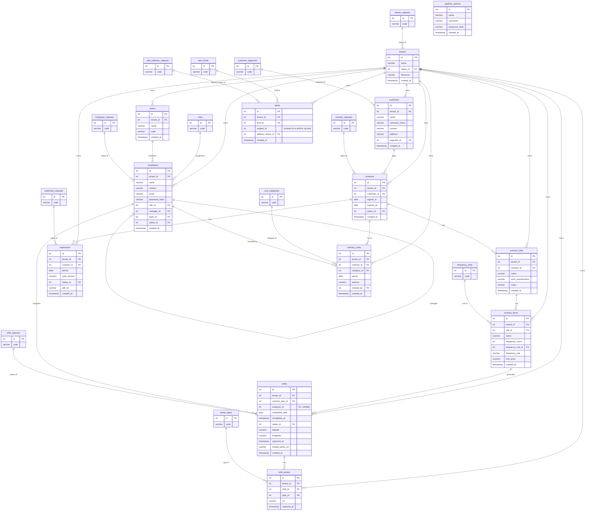

# ERD

```mermaid
erDiagram
    tenant_statuses ||--o{ tenants : "status of"
    tenants ||--o{ customers : "owns"
    tenants ||--o{ teams : "owns"
    tenants ||--o{ employees : "owns"
    tenants ||--o{ contracts : "owns"
    tenants ||--o{ contract_sites : "owns"
    tenants ||--o{ contract_items : "owns"
    tenants ||--o{ shifts : "owns"
    tenants ||--o{ shift_photos : "owns"
    tenants ||--o{ statements : "owns"
    roles ||--o{ employees : "assigned to"
    employees ||--o{ employees : "manages"
    teams ||--o{ employees : "members"
    employee_statuses ||--o{ employees : "status of"
    customer_segments ||--o{ customers : "segment of"
    customers ||--o{ contracts : "signs"
    contract_statuses ||--o{ contracts : "status of"
    contracts ||--o{ contract_sites : "has"
    contract_sites ||--o{ contract_items : "has"
    frequency_units ||--o{ contract_items : "unit of"
    contract_items ||--o{ shifts : "generates"
    employees ||--o{ shifts : "assigned"
    shift_statuses ||--o{ shifts : "status of"
    shifts ||--o{ shift_photos : "has"
    photo_types ||--o{ shift_photos : "type of"
    contracts ||--o{ statements : "has"
    statement_statuses ||--o{ statements : "status of"
    tenants ||--o{ contract_costs : "owns"
    contracts ||--o{ contract_costs : "incurs"
    cost_categories ||--o{ contract_costs : "category of"
    employees ||--o{ contract_costs : "recorded by"
    tenants ||--o{ alerts : "owns"
    alert_kinds ||--o{ alerts : "kind of"
    alert_delivery_statuses ||--o{ alerts : "delivery status of"

    tenant_statuses {
        int id PK
        varchar code
    }

    tenants {
        int id PK
        varchar name
        int status_id FK
        varchar timezone
        timestamp created_at
    }

    platform_admins {
        int id PK
        varchar name
        varchar username
        varchar password_hash
        timestamp created_at
    }

    roles {
        int id PK
        varchar code
    }

    customer_segments {
        int id PK
        varchar code
    }

    employee_statuses {
        int id PK
        varchar code
    }

    contract_statuses {
        int id PK
        varchar code
    }

    frequency_units {
        int id PK
        varchar code
    }

    shift_statuses {
        int id PK
        varchar code
    }

    photo_types {
        int id PK
        varchar code
    }

    statement_statuses {
        int id PK
        varchar code
    }

    customers {
        int id PK
        int tenant_id FK
        varchar name
        varchar company_name
        varchar contact
        varchar address
        int segment_id FK
        timestamp created_at
    }

    teams {
        int id PK
        int tenant_id FK
        varchar name
        varchar code
        timestamp created_at
    }

    employees {
        int id PK
        int tenant_id FK
        varchar name
        varchar contact
        varchar email
        varchar password_hash
        int role_id FK
        int manager_id FK
        int team_id FK
        int status_id FK
        timestamp created_at
    }

    contracts {
        int id PK
        int tenant_id FK
        int customer_id FK
        date signed_at
        date expires_at
        int status_id FK
        timestamp created_at
    }

    contract_sites {
        int id PK
        int tenant_id FK
        int contract_id FK
        varchar name
        varchar work_requirements
        varchar notes
        timestamp created_at
    }

    contract_items {
        int id PK
        int tenant_id FK
        int site_id FK
        varchar name
        int frequency_count
        int frequency_unit_id FK
        varchar frequency_rule
        numeric unit_price
        timestamp created_at
    }

    shifts {
        int id PK
        int tenant_id FK
        int contract_item_id FK
        int assignee_id "FK, nullable"
        date scheduled_date
        timestamp completed_at
        int status_id FK
        numeric latitude
        numeric longitude
        timestamp captured_at
        varchar receipt_photo_url
        timestamp created_at
    }

    shift_photos {
        int id PK
        int tenant_id FK
        int shift_id FK
        int type_id FK
        varchar url
        timestamp captured_at
    }

    statements {
        int id PK
        int tenant_id FK
        int contract_id FK
        date period
        numeric total_amount
        int status_id FK
        varchar pdf_url
        timestamp created_at
    }

    cost_categories {
        int id PK
        varchar code
    }

    contract_costs {
        int id PK
        int tenant_id FK
        int contract_id FK
        int category_id FK
        date period
        numeric amount
        int created_by FK
        timestamp created_at
    }
    alert_kinds {
        int id PK
        varchar code
    }
    alert_delivery_statuses {
        int id PK
        varchar code
    }
    alerts {
        int id PK
        int tenant_id FK
        int kind_id FK
        int subject_id "contract id or shift id, by kind"
        int delivery_status_id FK
        timestamp created_at
    }
```
