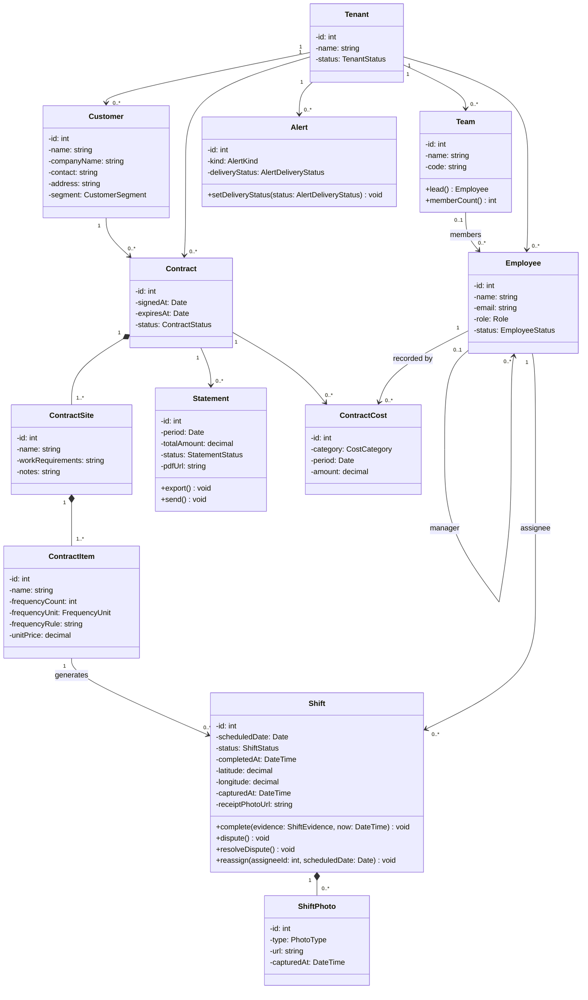

# Contrack — Class Diagram

Design-level: attributes are private with a type, methods are public with parameter and
return types. Trivial getters are omitted by convention — a field with no listed accessor
is read through the object that owns it, not exposed for direct mutation.

