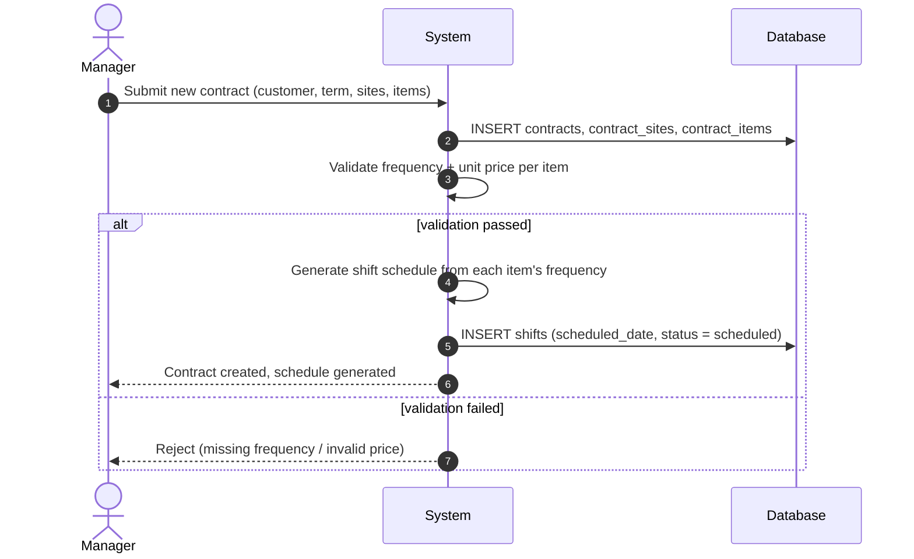
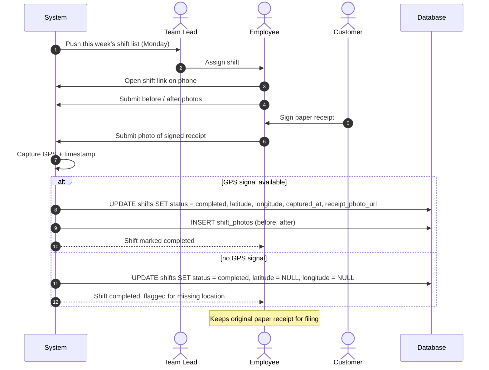
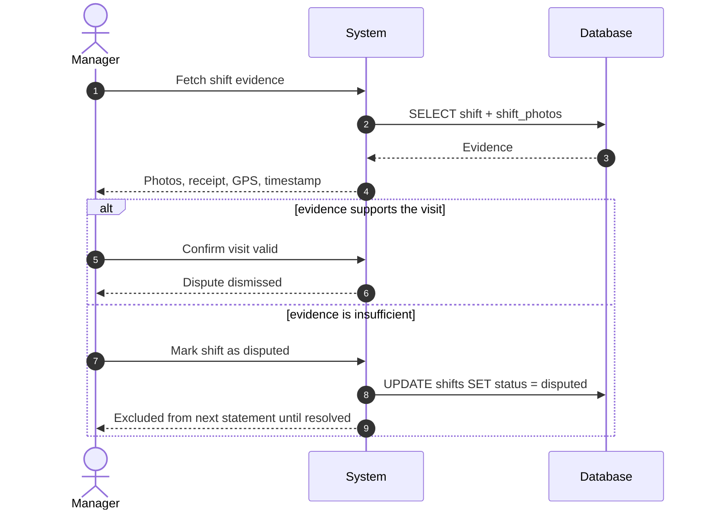
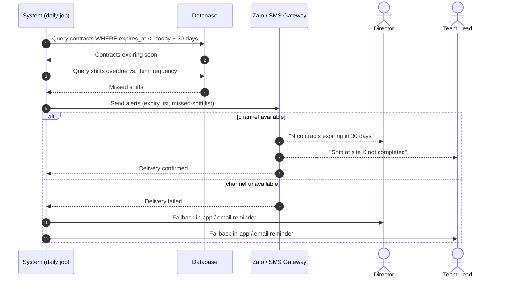
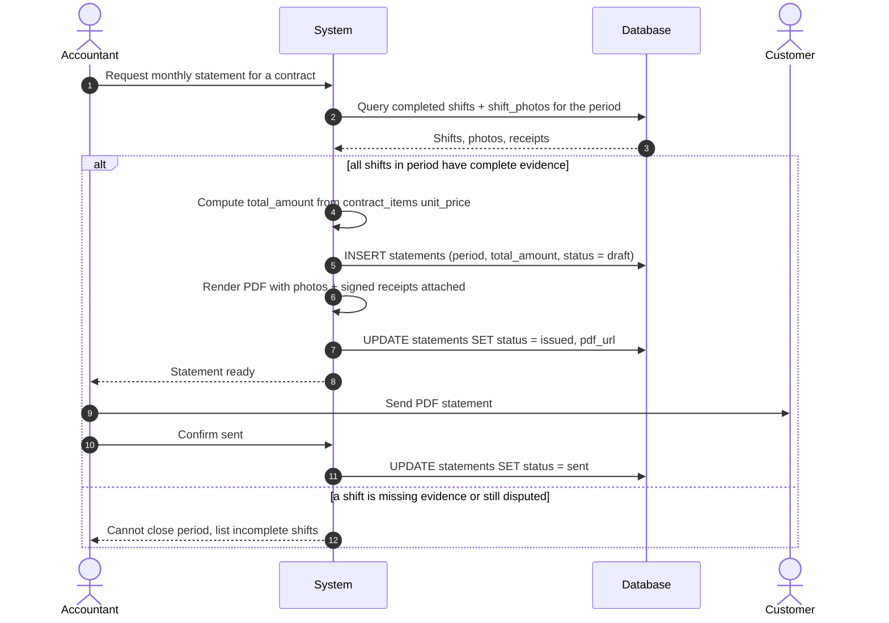

# Contrack — Sequence Diagrams

### 1. Create contract with sites and service items

### 2. Weekly dispatch and field shift execution

### 3. Dispute a shift

### 4. Alerts: expiring contract and missed shift

### 5. Month-end statement export 

