# Contrack — Sequence Diagrams
### 1. Login

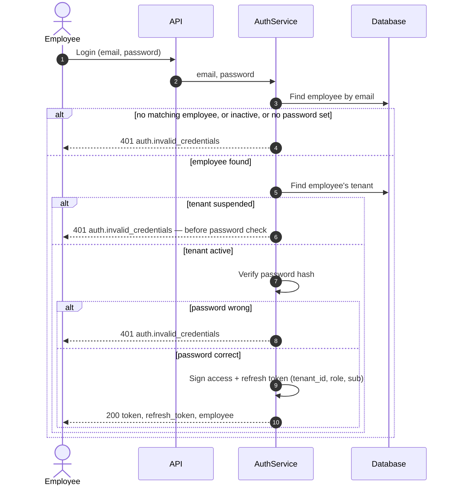

### 2. Access Control — a protected request

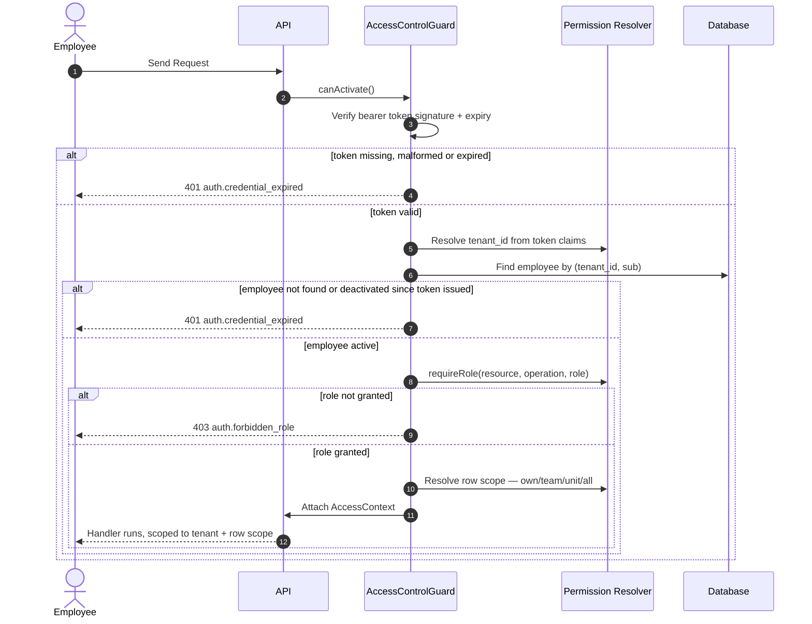

### 3. Create contract with sites and service items

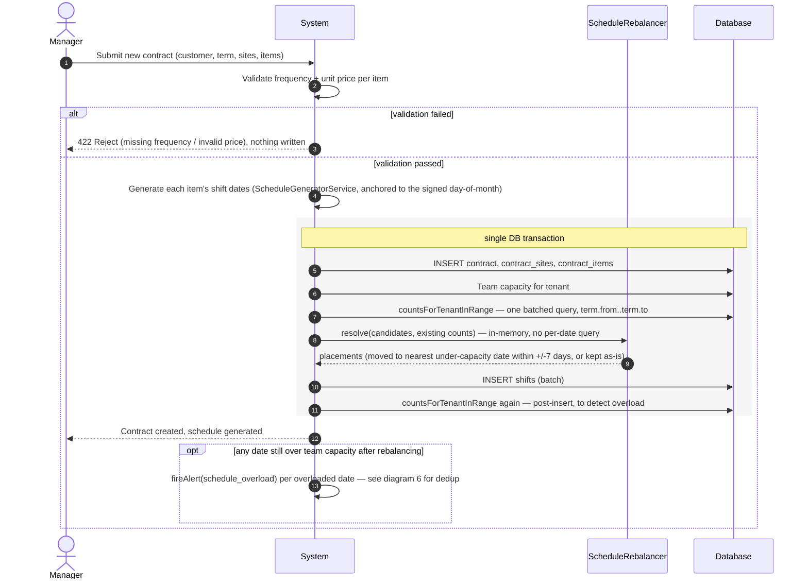

### 4. Dispatch (manager → team lead → employee) and field shift execution

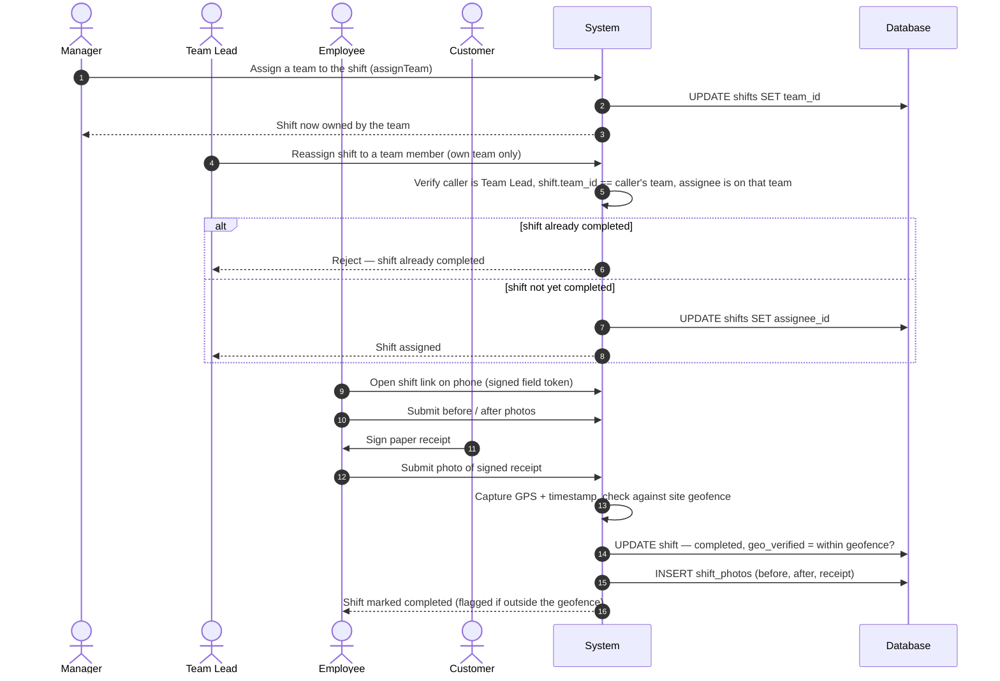

### 5. Dispute a shift

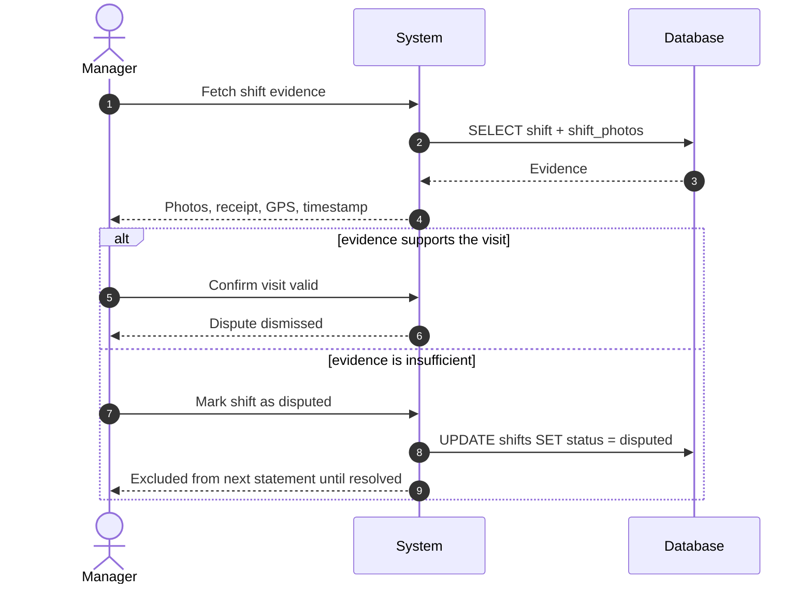

### 6. Alerts: expiring contract and missed shift (daily job, dedup-safe)

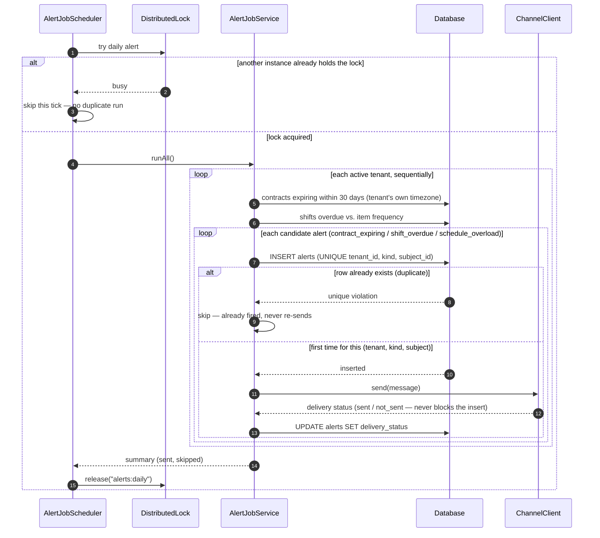

### 7. Month-end statement — compute, export, send (three separate actions)

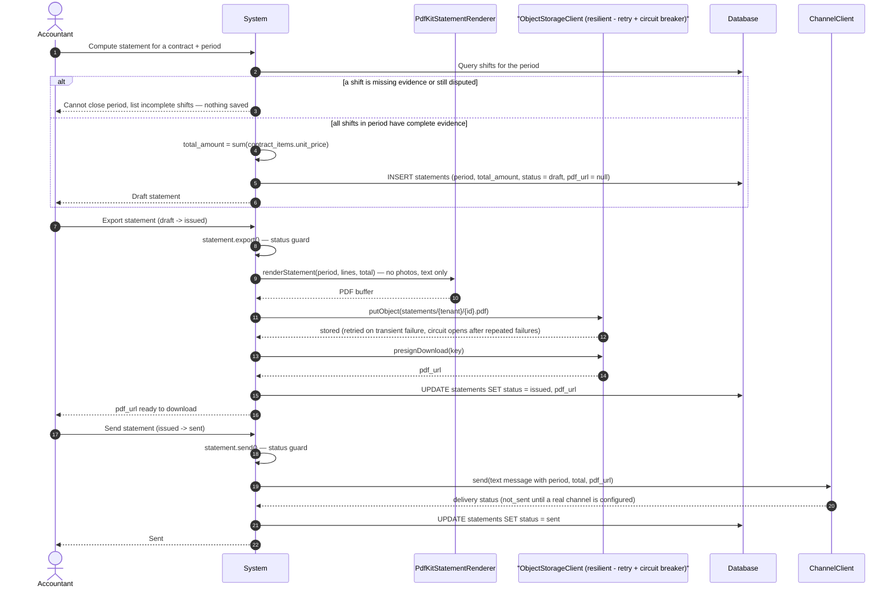

### 8. Platform Admin onboards a new tenant

### 9. Platform Admin suspends or reactivates a tenant

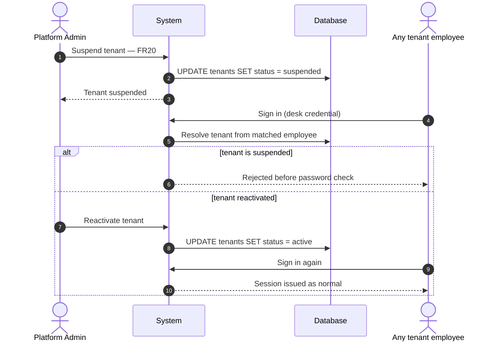

### 10. Reassign or reschedule a shift — role and team-scope checks

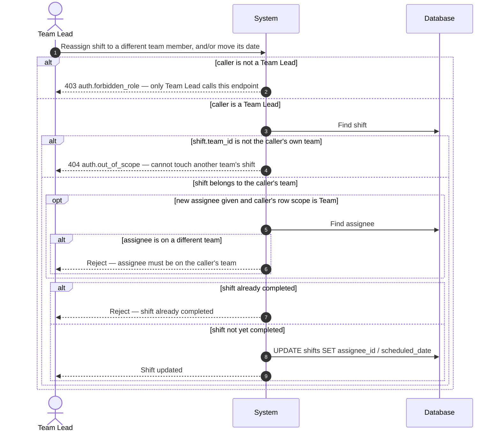

### 11. Accountant records a cost, profitability updates

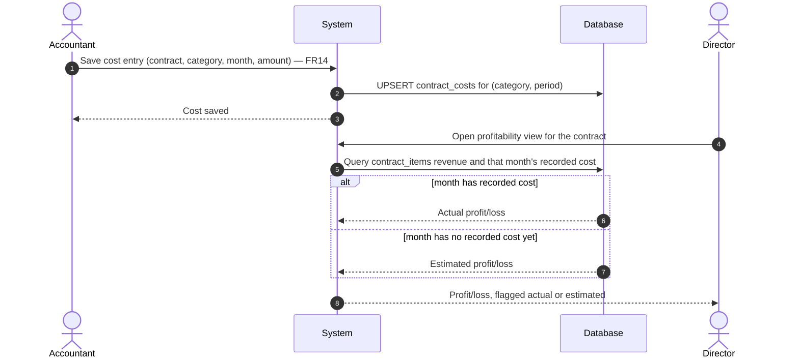

### 12. Reconciliation: shifts due vs. shifts with evidence

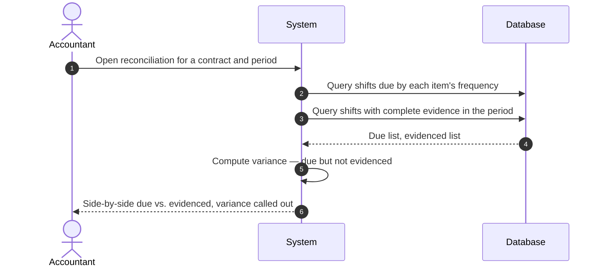
