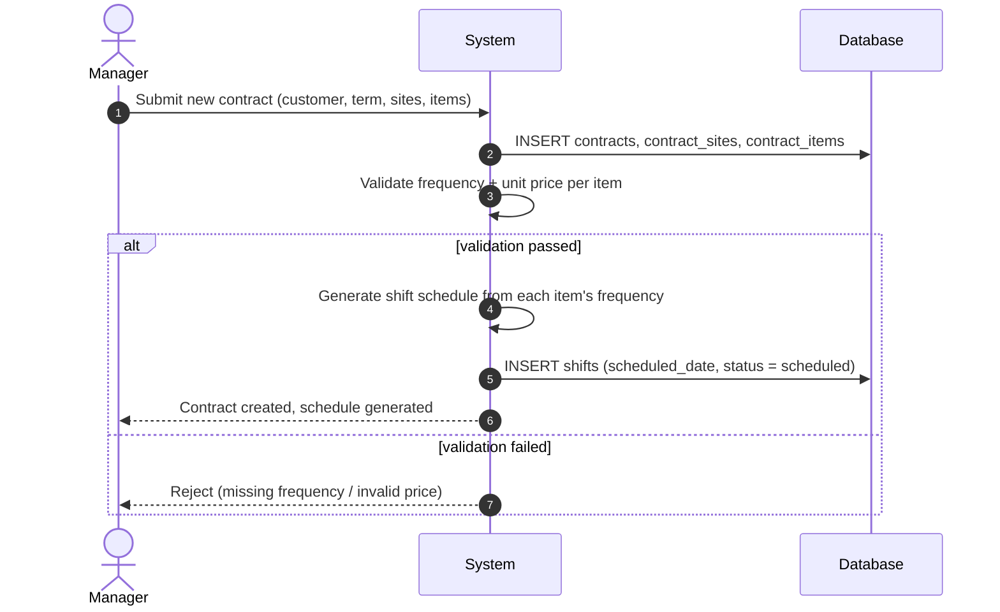
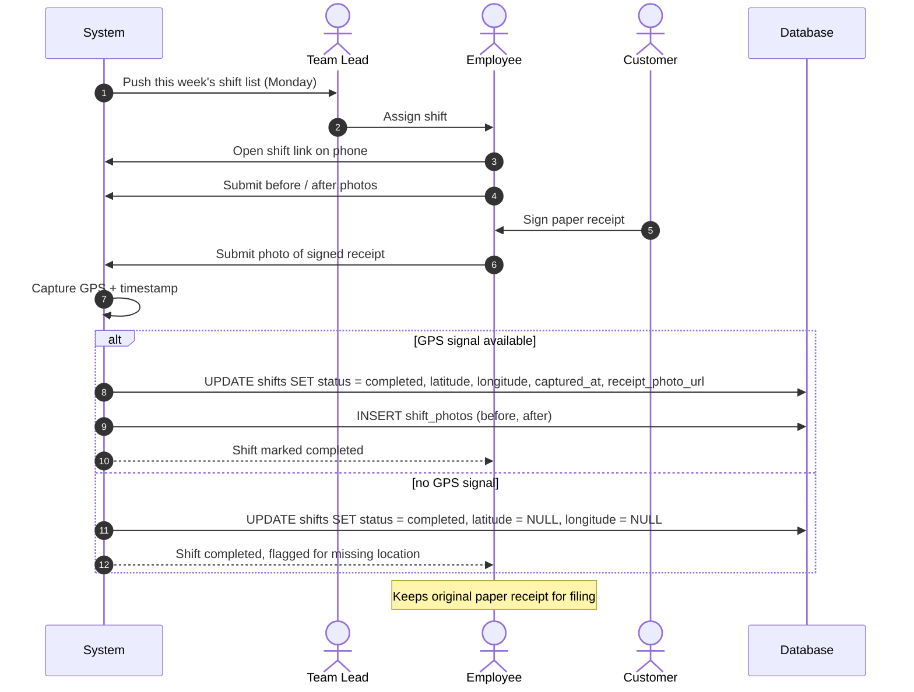
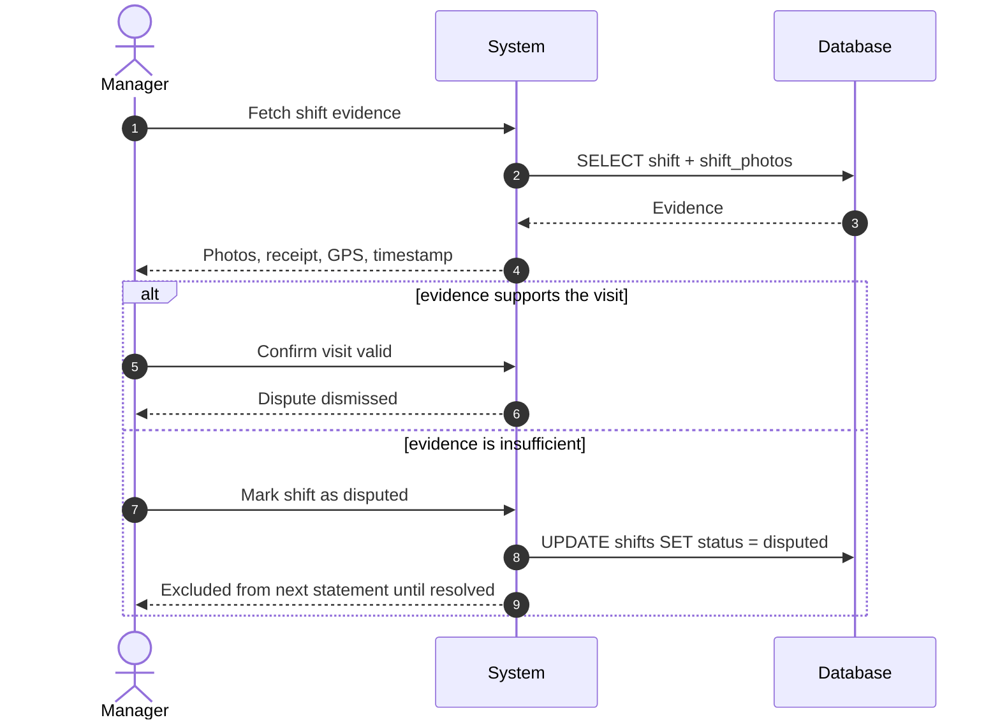
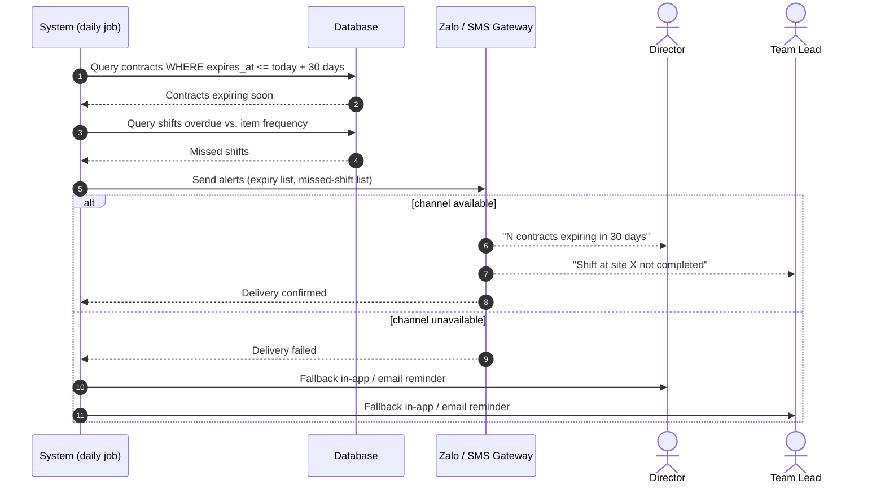
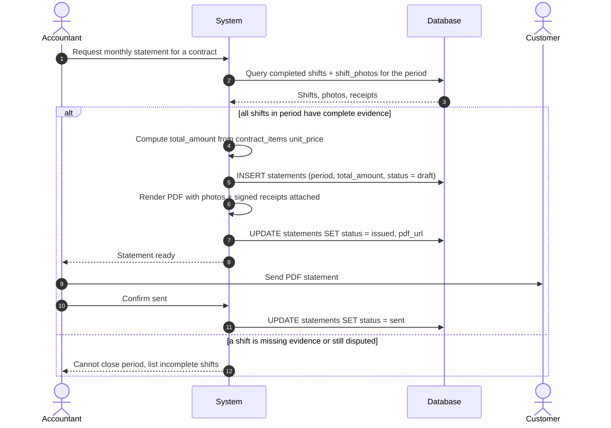
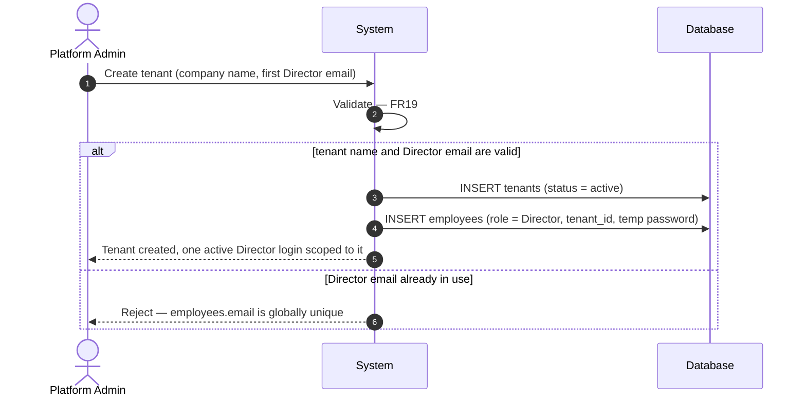
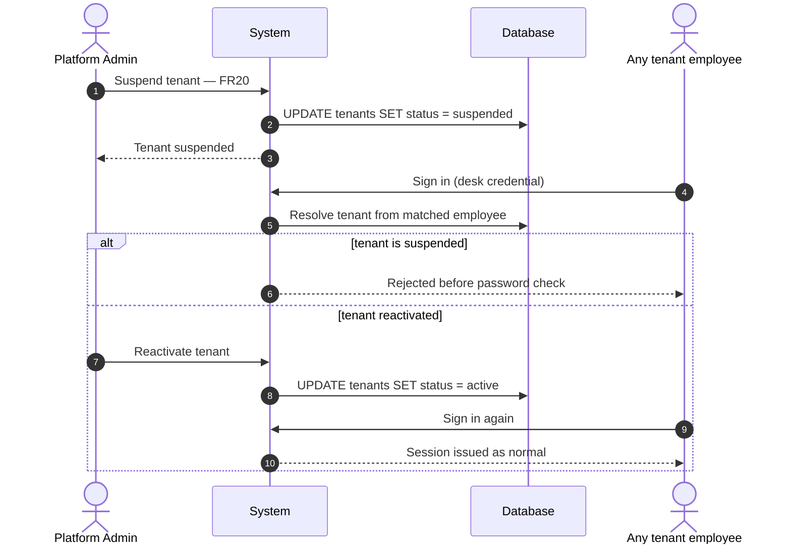
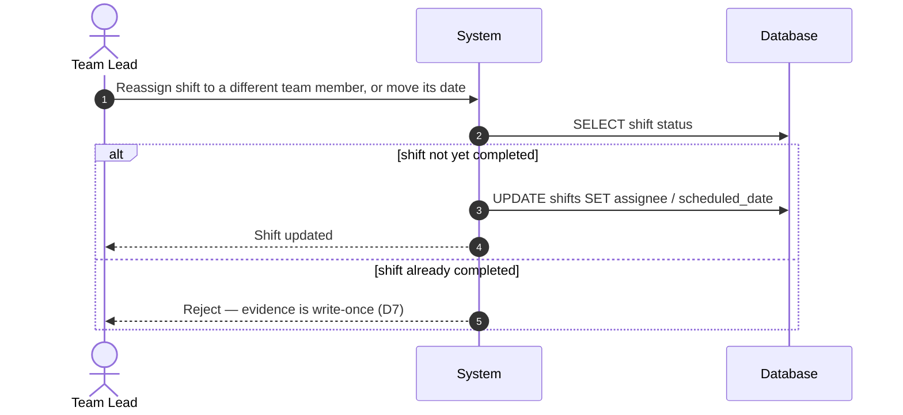
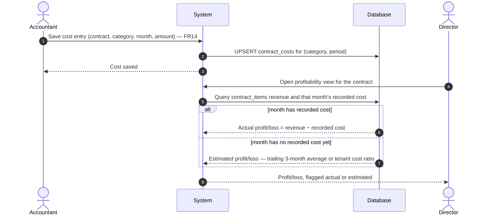
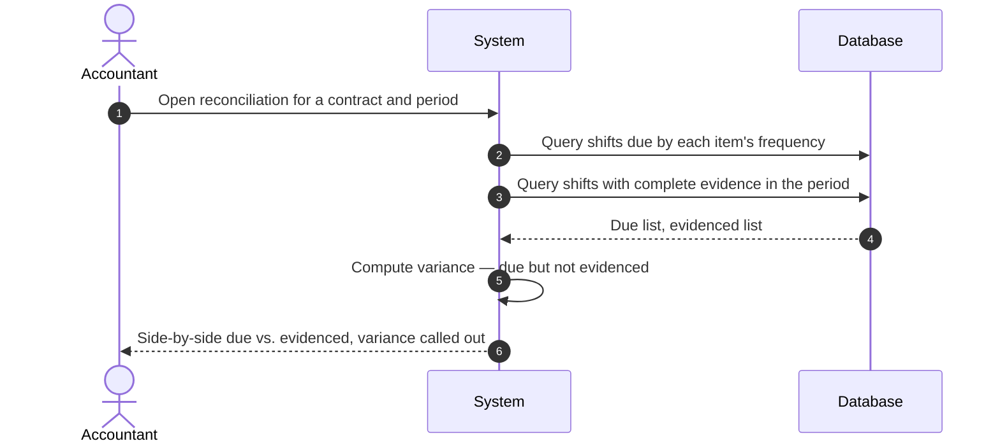

# Contrack — Sequence Diagrams
### 1. Create contract with sites and service items

### 2. Weekly dispatch and field shift execution

### 3. Dispute a shift

### 4. Alerts: expiring contract and missed shift

### 5. Month-end statement export 

### 6. Platform Admin onboards a new tenant

### 7. Platform Admin suspends or reactivates a tenant

### 8. Team lead reassigns or reschedules a shift

### 9. Accountant records a cost, profitability updates

### 10. Reconciliation: shifts due vs. shifts with evidence

