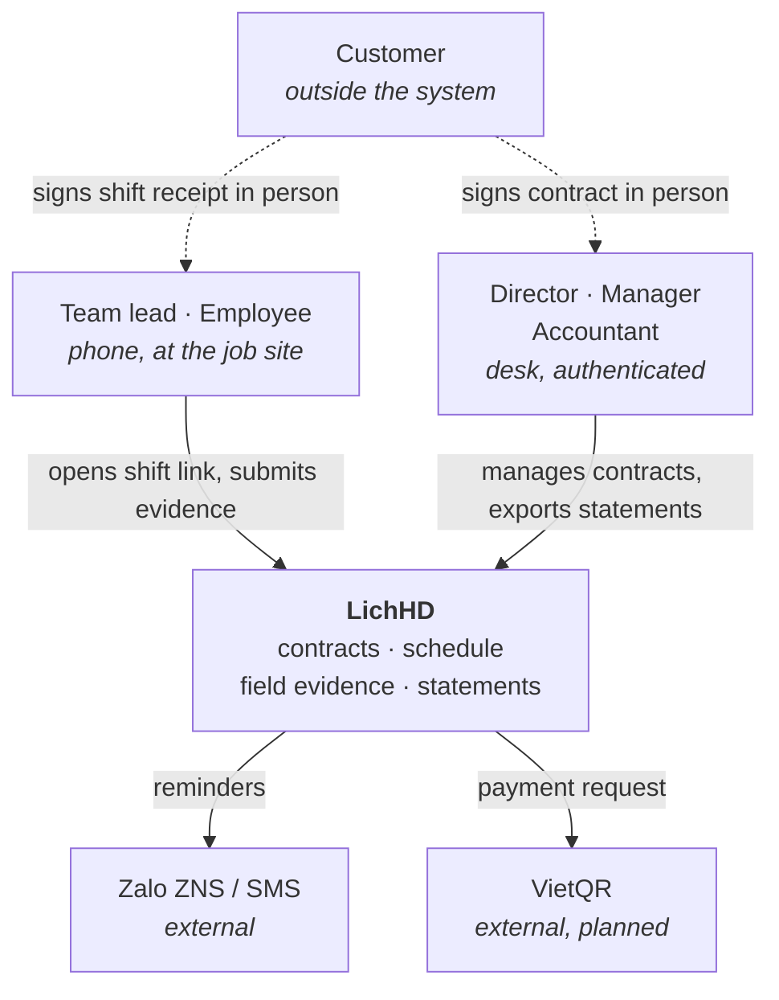
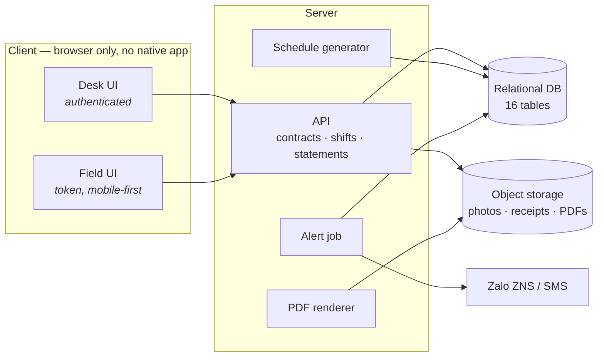

# LichHD — Architecture

## 1. Scope and context

LichHD manages recurring service contracts end to end: a contract is entered once, shifts are
generated from each service item's frequency, field staff submit evidence per shift from a phone, and
monthly statements are computed from completed shifts.

Five roles use the system — director, manager, accountant, team lead, employee. The **customer is
outside the system boundary**: they sign the contract and the paper receipt in person and raise
complaints by phone, all of which staff record on their behalf. Two external services are integrated:
Zalo ZNS and/or SMS for reminders (FR14), and VietQR for payment (Could-have, not in MVP).

## 2. Components and technology criteria

**The stack is not selected yet** (§6). Any candidate must meet:

| Criterion | Source |
|---|---|
| Responsive web, no native app install | NFR7, FR7 |
| Runs [`db/schema.sql`](../db/schema.sql) unmodified — ANSI SQL, identity columns, `NUMERIC` | existing schema |
| Server-side PDF rendering with embedded images | FR16 |
| S3-compatible object storage client | §4 D3 |
| Scheduled job execution | FR4, FR12, FR13 |
| Single-tenant deployment on one host | NFR6 |

## 3. Data and storage

The relational model is 16 tables — 7 lookup, 9 core — documented in [`../db/README.md`](../db/README.md)
with the diagram in [`../db/erd.md`](../db/erd.md). Ownership cascades from the contract: deleting one
removes its sites, items, shifts, photos and statements.

Binary evidence is **not** in the database. `shift_photos.url` and `shifts.receipt_photo_url` hold
object keys; `statements.pdf_url` holds the rendered statement. The database stores the facts about
evidence — who, where, when — and object storage stores the bytes.

## 4. Key decisions

| # | Decision | Context and options | Consequence |
|---|---|---|---|
| D1 | **Single-tenant deployment** | One customer company per deployment. Multi-tenant with a `company_id` on every table was considered and rejected for a 10–80 staff target. | No tenant column, no cross-tenant isolation logic. Serving a second company means a second deployment. (NFR6) |
| D2 | **Lookup tables, not SQL `ENUM`** | Statuses, roles, photo types. `ENUM` is not portable and altering one is a migration. | Seven small tables and a join for a label; new values are inserts, not migrations. |
| D3 | **Evidence in S3-compatible object storage (MinIO)** | Alternatives: blobs in the database, or a directory on the app server. Photos are the bulk of the data and are retained ≥ 12 months. | DB stays small and easy to back up; retention (NFR4) becomes a bucket lifecycle rule; a storage service must be operated alongside the database. |
| D4 | **Per-shift signed token for field access** | FR7 and NFR7 require a link that opens and works on a phone with no install. Alternatives: employee login, or a magic link per employee. | No password at a job site. The token names one shift, expires, and authorises only that shift's submission. Whoever holds the link can submit — acceptable because the evidence itself carries GPS and time. |
| D5 | **Photographed paper receipt, not on-screen signature** | The customer already signs paper today and the original is filed. | No signature-capture component; the evidence is an image like any other. The paper original remains the legal artifact. |
| D6 | **Customer is not a system actor** | The customer signs in person and complains by phone. | No customer login, no portal, no notification to customers in MVP. A manager records disputes manually (FR11). |
| D7 | **Statements exclude disputed and evidence-less shifts** | A period cannot close while a shift is unresolved. | The accountant sees a blocked close with the offending shifts listed rather than an understated total. (FR15, seq. 5) |
| D8 | **Evidence is write-once** | NFR2. Enforced in the API, not by database permissions. | A completed shift rejects a second submission; evidence columns and `shift_photos` rows are never updated after insert. Deletion follows contract cascade only. |
| D9 | **A team is an explicit `teams` row; membership is recorded once, on the employee** | The UI names teams and the `team` row scope depends on them, but a team was only the set of employees sharing a `manager_id`. Storing membership twice — as `employees.team_id` and again as `teams.lead_id` plus a reporting chain — lets the two disagree. | `teams` carries `id`, `name` and `code`. `employees.team_id` is the sole record of membership and is `NULL` for desk staff, who belong to no team. `manager_id` is the reporting line and is never read to resolve a team. The lead is the member holding the team-lead role, so `teams` has no `lead_id` to fall out of step. Cost: “exactly one lead per team” is an application rule, not a constraint. |

## 5. Cross-cutting concerns

### 5.1 Authorisation

Two distinct mechanisms:

- **Desk roles** authenticate with `employees.username` / `password_hash` and are authorised by role
  plus a row scope — own, team, managed unit, or all. The full matrix is in
  [`api.md`](api.md#8-access-control).
- **Field access** carries a per-shift token (D4) and can reach exactly one shift.

The two scopes rest on different columns (D9): `team` resolves through `employees.team_id`, so a team
lead sees the shifts of the team they belong to; `unit` resolves through `employees.manager_id`, so a
manager sees everyone reporting to them. A director sees everything. Desk staff have a `manager_id`
but no `team_id`, which is why they hold `unit` or `all` scope and never `team` — the small-company
target has field teams, not departments.

### 5.2 Evidence integrity and retention

Photos, GPS and timestamps are written once (D8). Server time is authoritative for `captured_at`; the
client clock is not trusted. Objects are retained at least 12 months (NFR4) via a bucket lifecycle
rule, which must outlive the statement that cites them.

### 5.3 Alert delivery and fallback

PRD §7 names channel reliability as a medium risk and requires a fallback. Delivery is attempted on
the configured channel (Zalo ZNS, SMS, or both); on failure the alert is recorded in-app so it is
visible on the Cảnh báo screen rather than silently dropped.

### 5.4 Weak-network behaviour

NFR1 requires the field page to work on 3G/4G at job sites and in basements. The design commitment is
that the field page is the lightest page in the system and images are downscaled in the browser
before upload. The remaining mechanics — resumable upload, offline queue — are open (§6).

## 6. Open questions

| # | Question | Why it matters |
|---|---|---|
| Q1 | **Stack selection** — language, framework, database engine | Everything in §2 is stated as criteria until this is answered. |
| Q2 | **`contract_items.frequency` has no grammar.** It is `VARCHAR(100)` free text, yet FR4's generator must parse it to produce shifts. | This is a **schema risk**, not only a documentation gap. Needs either a grammar (e.g. `2/month`) or a lookup table with an interval, before any generator can be written. |
| Q3 | Schedule generation timing — eager on contract creation, or a rolling job that keeps a horizon filled | Seq. 1 implies eager. Eager generation makes a 12-month contract's shifts immediately visible; rolling generation makes term changes cheaper. |
| Q4 | Weak-network mechanics — resumable upload, offline queue, retry policy | §5.4 states the goal; the mechanism decides whether a submission survives a dropped connection mid-upload. |
| Q5 | ZNS sender identity, template registration, and the Zalo → SMS → in-app fallback order | Required before FR14 can be built; ZNS templates need registration lead time. |
| Q6 | Token lifetime and reissue policy for D4 | Too short and a delayed shift breaks; too long and a forwarded link stays live. |

---

Related: [`design-analysis.md`](design-analysis.md) for requirements and use cases ·
[`api.md`](api.md) for the endpoint and access-control contract ·
[`../db/README.md`](../db/README.md) for the data model.
