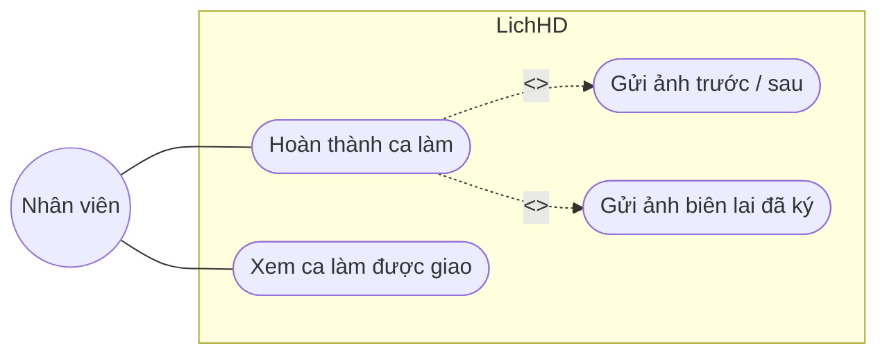
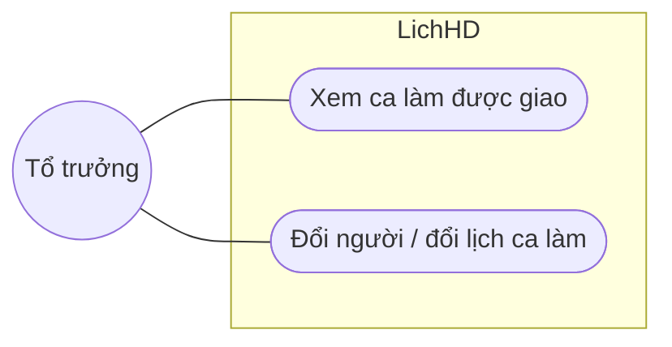
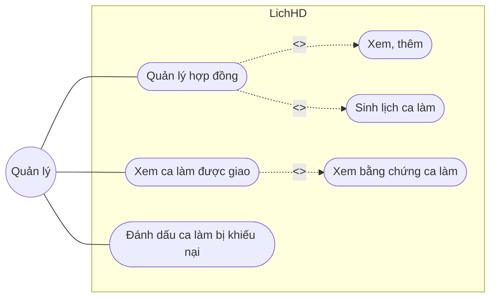
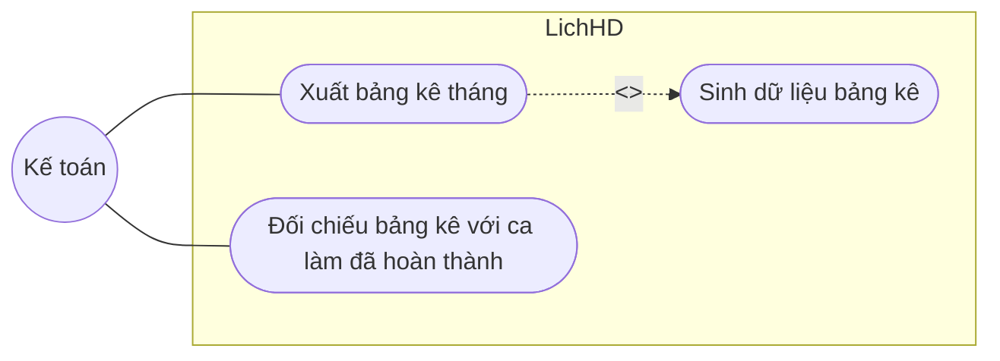
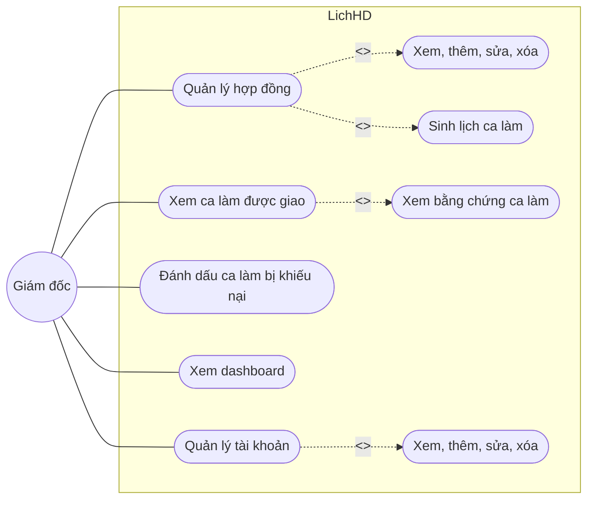
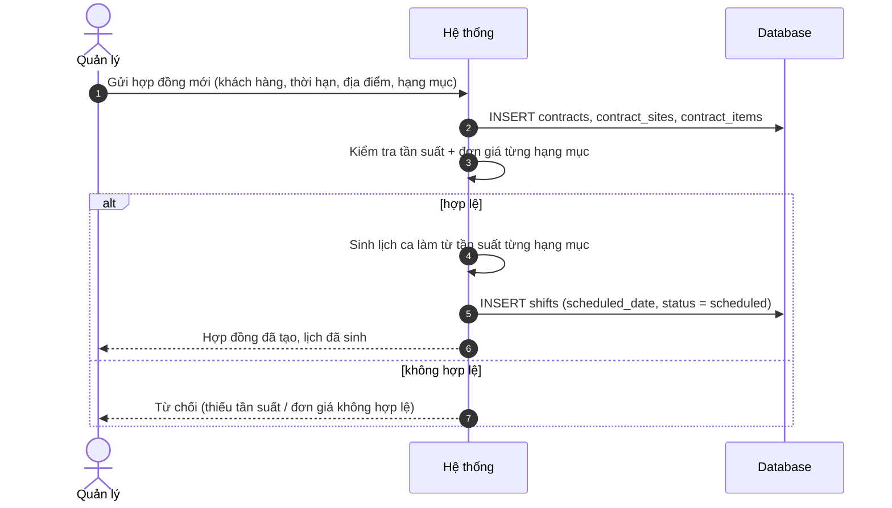
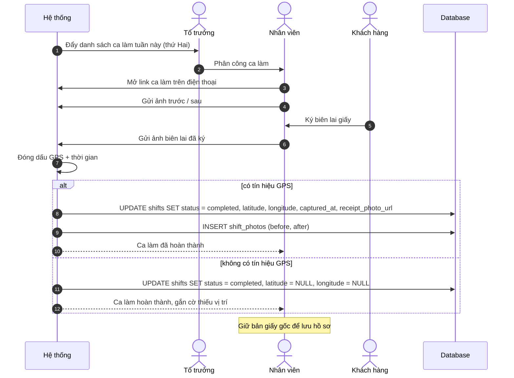
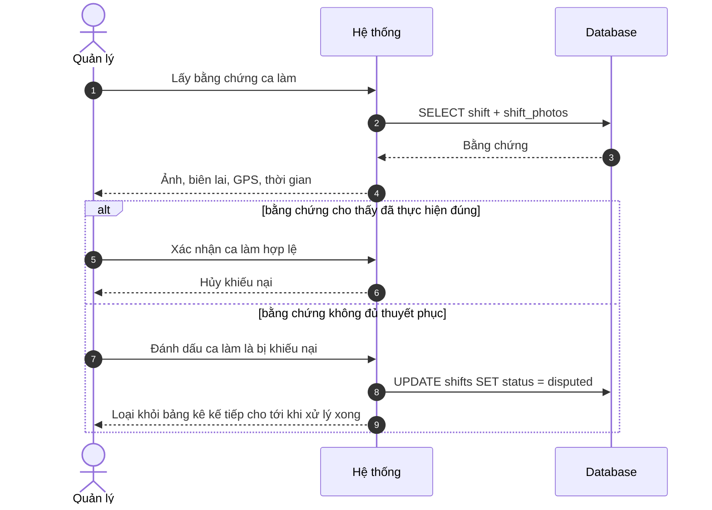
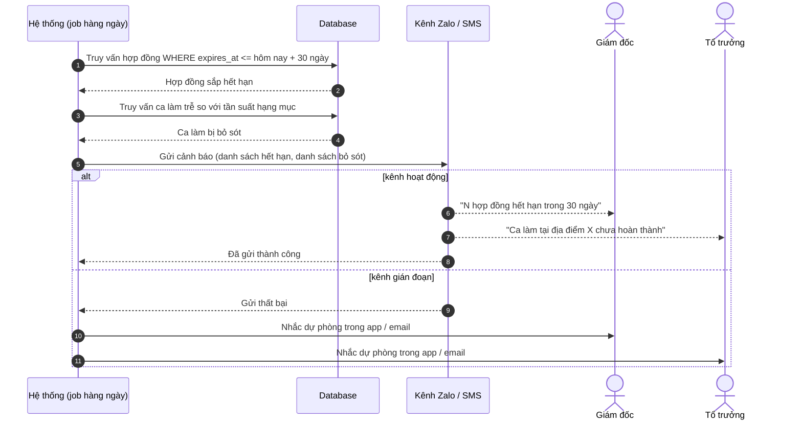
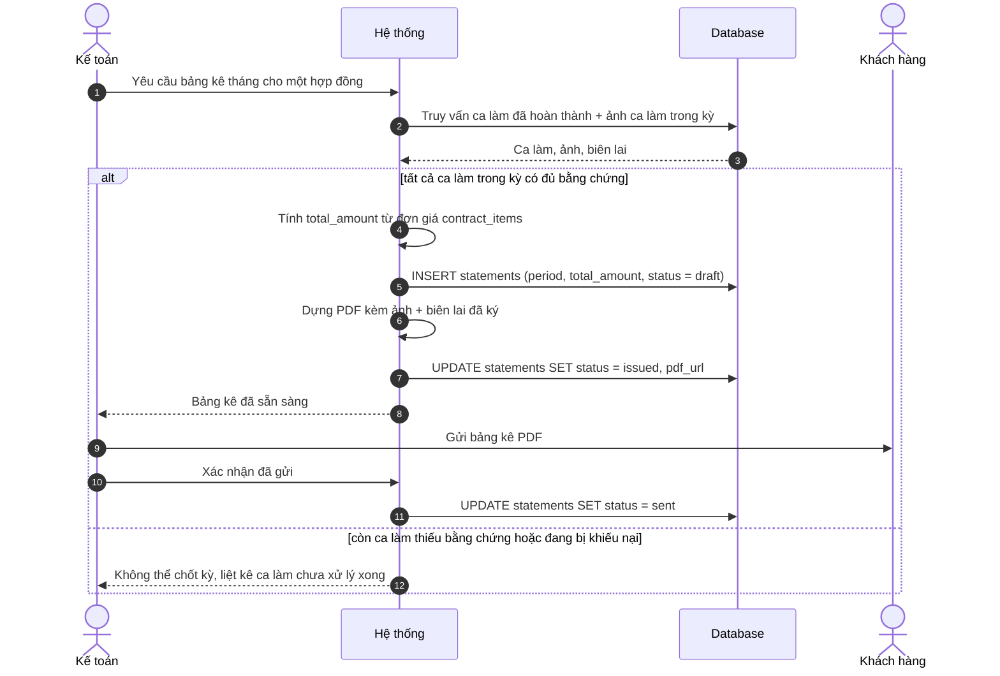

# LichHD — Phân tích Thiết kế

*[English version](design-analysis.md)*

## Giới thiệu tài liệu
Đây là tài liệu phân tích thiết kế cho **LichHD**, phần mềm quản lý hợp đồng dịch vụ định kỳ cho các công ty vệ sinh công nghiệp, bảo trì điều hòa/thang máy, diệt côn trùng, chăm sóc cây xanh, bảo trì PCCC. Thay thế việc lên lịch bằng Excel và điều phối qua Zalo bằng một hệ thống duy nhất cho hợp đồng, điều phối, bằng chứng hiện trường và bảng kê tháng.

Nguồn: [PRD](prd.vi.md) · [ERD](../db/erd.md) · [SQL schema](../db/schema.sql) · [Wireframe](wireframe.html)

---

## I: Phân tích Yêu cầu

### Yêu cầu chức năng

| # | Vai trò | Yêu cầu |
|---|---|---|
| FR1 | Quản lý, Giám đốc | Tạo hợp đồng cho khách hàng với ngày ký và ngày hết hạn. Sửa/xóa: chỉ Giám đốc |
| FR2 | Quản lý, Giám đốc | Thêm một hoặc nhiều địa điểm vào hợp đồng. Sửa/xóa: chỉ Giám đốc |
| FR3 | Quản lý, Giám đốc | Thêm hạng mục dịch vụ vào địa điểm (tên, tần suất, đơn giá). Sửa/xóa: chỉ Giám đốc |
| FR4 | Hệ thống | Tự sinh lịch ca làm từ tần suất của từng hạng mục dịch vụ |
| FR5 | Hệ thống | Tự đẩy danh sách ca làm tuần hiện tại cho từng tổ trưởng |
| FR6 | Tổ trưởng | Đổi người hoặc đổi lịch một ca làm khi có phát sinh |
| FR7 | Nhân viên | Mở ca làm được giao qua link trên điện thoại, không cần cài app |
| FR8 | Nhân viên | Gửi ảnh trước/sau cho một ca làm |
| FR9 | Nhân viên | Gửi ảnh biên lai giấy đã ký làm bằng chứng |
| FR10 | Hệ thống | Ghi nhận tọa độ GPS và thời gian tự động khi gửi |
| FR11 | Quản lý, Giám đốc | Đánh dấu một ca làm là bị khiếu nại và ghi lại lý do |
| FR12 | Hệ thống | Cảnh báo khi hợp đồng còn trong vòng 30 ngày trước khi hết hạn |
| FR13 | Hệ thống | Cảnh báo khi ca làm chưa được thực hiện đúng tần suất yêu cầu của hợp đồng |
| FR14 | Hệ thống | Gửi cảnh báo qua Zalo (ZNS) và/hoặc SMS |
| FR15 | Kế toán | Sinh bảng kê tháng cho mỗi hợp đồng từ các ca làm đã hoàn thành |
| FR16 | Kế toán | Xuất bảng kê dạng PDF kèm ảnh và biên lai |
| FR17 | Giám đốc | Xem dashboard: hợp đồng đang chạy, hợp đồng sắp hết hạn, hợp đồng có khiếu nại, doanh thu dự kiến |
| FR18 | Giám đốc | Xem, thêm, sửa, xóa tài khoản nhân viên, gồm cả vai trò và người quản lý trực tiếp |

### Yêu cầu phi chức năng

| # | Nhóm | Yêu cầu |
|---|---|---|
| NFR1 | Hiệu năng | Trang chụp ảnh hiện trường phải tải được trên mạng 3G/4G yếu tại công trường |
| NFR2 | Toàn vẹn dữ liệu | Dữ liệu bằng chứng (ảnh, GPS, thời gian) không thể chỉnh sửa sau khi ghi nhận |
| NFR3 | Bảo mật | Phân quyền theo vai trò: giám đốc, kế toán, quản lý, tổ trưởng, nhân viên |
| NFR4 | Lưu trữ | Ảnh và biên lai đã ký lưu tối thiểu 12 tháng |
| NFR5 | Khả năng xuất dữ liệu | Bảng kê xuất được dạng PDF; dữ liệu thô xuất được dạng CSV/Excel |
| NFR6 | Khả năng mở rộng | Triển khai single-tenant — không cần cách ly dữ liệu giữa nhiều công ty |
| NFR7 | Khả năng sử dụng | Không cần cài app; truy cập qua link web trên bất kỳ điện thoại nào |

---

## II: Use Case

Khách hàng và Hệ thống không được mô hình hóa thành actor — khách hàng không bao giờ chạm vào hệ thống (ký biên lai giấy, khiếu nại qua điện thoại/trực tiếp), còn việc lên lịch/cảnh báo là side effect nội bộ của use case khác, không phải use case độc lập. Cả hai vẫn xuất hiện như participant trong sequence diagram ở Chương IV, vì sequence diagram mô tả mọi bên tham gia tương tác, không chỉ actor UML của hệ thống.

### Nhân viên

### Tổ trưởng

### Quản lý

### Kế toán

### Giám đốc

### Mô tả Use Case

| Use case | Vai trò | Mô tả | Điều kiện tiên quyết |
|---|---|---|---|
| Hoàn thành ca làm | Nhân viên | Gửi ảnh trước/sau và ảnh biên lai đã ký cho một ca làm được giao; hệ thống ghi nhận GPS và thời gian | Ca làm đã được lên lịch và giao cho nhân viên |
| Xem ca làm được giao | Nhân viên, Tổ trưởng, Quản lý, Giám đốc | Xem danh sách ca làm, phạm vi theo vai trò: Nhân viên xem ca của mình, Tổ trưởng xem của tổ, Quản lý xem của đơn vị mình quản lý, Giám đốc xem toàn bộ | Người dùng đã đăng nhập |
| Đổi người / đổi lịch ca làm | Tổ trưởng | Đổi người được giao hoặc đổi ngày của một ca làm khi có phát sinh | Ca làm tồn tại và chưa hoàn thành |
| Quản lý hợp đồng | Quản lý, Giám đốc | Xem, thêm, sửa hoặc xóa hợp đồng cùng địa điểm/hạng mục dịch vụ (khách hàng, thời hạn, tần suất, đơn giá). Giám đốc có đủ 4 quyền (xem/thêm/sửa/xóa); Quản lý chỉ có xem/thêm | Khách hàng và điều khoản hợp đồng đã thống nhất ngoài hệ thống |
| Đánh dấu ca làm bị khiếu nại | Quản lý, Giám đốc | Nhập thủ công một ca làm là bị khiếu nại, dựa trên khiếu nại của khách qua điện thoại hoặc trực tiếp | Khách đã báo cáo vấn đề ngoài hệ thống |
| Xuất bảng kê tháng | Kế toán | Xuất bảng kê tháng cho một hợp đồng dạng PDF | Dữ liệu bảng kê của kỳ đã được sinh |
| Đối chiếu bảng kê với ca làm đã hoàn thành | Kế toán | So sánh những gì bảng kê tính tiền với các ca làm thực tế đã hoàn thành | Đã tồn tại một bảng kê cho kỳ đó |
| Xem dashboard | Giám đốc | Xem hợp đồng đang chạy/sắp hết hạn/có khiếu nại và doanh thu dự kiến | Người dùng đã đăng nhập với vai trò giám đốc |
| Quản lý tài khoản | Giám đốc | Xem, thêm, sửa hoặc xóa tài khoản nhân viên, gồm cả vai trò và người quản lý trực tiếp | Người dùng đã đăng nhập với vai trò giám đốc |

---

## III: Sequence Diagram

### 1. Tạo hợp đồng kèm địa điểm và hạng mục dịch vụ

### 2. Điều phối tuần và thực hiện ca làm hiện trường

### 3. Khiếu nại một ca làm

### 4. Cảnh báo: hợp đồng sắp hết hạn và ca làm bị bỏ sót

### 5. Xuất bảng kê cuối tháng

---

## IV: Thiết kế Hệ thống

### Kiến trúc kỹ thuật

Client chạy hoàn toàn trên trình duyệt — không có app native (NFR7) — làm việc với server quản lý hợp
đồng, sinh lịch, tiếp nhận bằng chứng, cảnh báo và kết xuất bảng kê. Hai hệ lưu trữ: cơ sở dữ liệu
quan hệ cho dữ liệu nghiệp vụ, và object storage tương thích S3 cho ảnh bằng chứng, biên lai đã ký và
file PDF bảng kê. Hai cơ chế phân quyền: phiên đăng nhập cho nhóm vai trò làm việc tại văn phòng, và
token ký số theo từng ca cho phần thực hiện hiện trường — nhân viên mở link tại công trường, không cài
app, không cần mật khẩu (FR7, NFR7).

Kiến trúc đầy đủ — phân rã thành phần, các quyết định thiết kế, vấn đề xuyên suốt và câu
hỏi còn mở: [`architecture.md`](architecture.md) *(tiếng Anh)*.

### Giao diện lập trình

Đặc tả endpoint theo từng yêu cầu, kèm ma trận phân quyền vai trò × tài nguyên × phạm vi dòng dữ liệu:
[`api.md`](api.md) *(tiếng Anh)*.

### Dữ liệu

[`db/schema.sql`](../db/schema.sql) — 16 bảng, ANSI SQL, single-tenant, dùng bảng lookup thay `ENUM`.
Sơ đồ: [`db/erd.md`](../db/erd.md). Quy ước: [`db/README.md`](../db/README.md).

### Giao diện người dùng

[`wireframe.html`](wireframe.html) — màn hình theo từng vai trò, điều hướng giới hạn theo use case của
vai trò đó ở mục II. Ảnh chụp: [`screenshots/`](screenshots/).

### Tích hợp

Zalo (ZNS) và/hoặc SMS để nhắc việc (FR14), có phương án dự phòng thông báo trong ứng dụng khi kênh gửi
lỗi; VietQR cho thanh toán (Could-have, không thuộc MVP).

---
